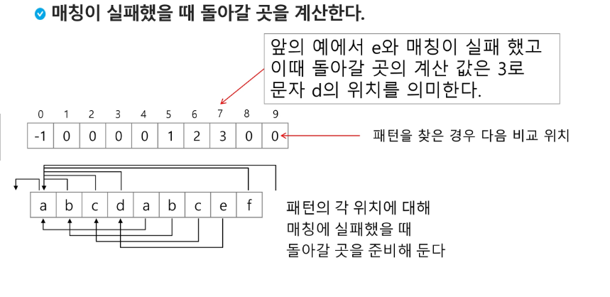
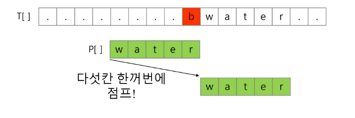
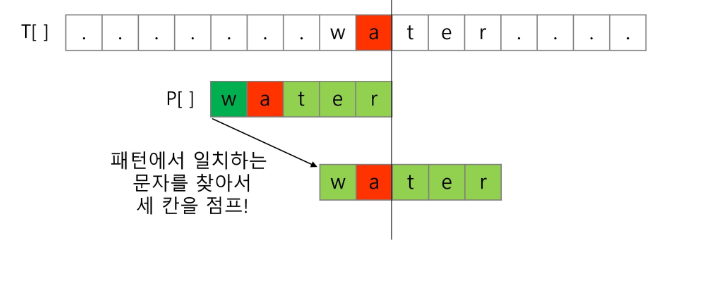

# String

* 각 문자에 대해서 대응되는 숫자를 정해 놓고 이것을 메모리에 저장하는 방법이 사용
* 1967년 미국에서 ASCII 인코딩 표준 제정
* 다국어 처리를 위한 표준 : 유니코드

## 문자열

* 파이썬에서의 문자열 처리 : char 타입 없음, 텍스트 데이터의 취급방법이 통일되어 있음
* 문자열은 시퀀스 자료형으로 분류되고, 시퀀스 자료형에서 사용할 수 있는 인덱싱, 슬라이싱 연산들을 사용할 수 있음
* C는 아스키코드로 저장, java는 유니코드(UTF-16. 2bytes)로 저장, 파이썬은 유니코드(UTF-8)

* is와 ==의 차이 : ==는 내용 비교, is는 참조를 비교

## 패턴 매칭

* 긴 텍스트에 짧은 텍스트 패턴 찾기

1. 고지식한 패턴 검색 알고리즘(Brute Force)

   * 본문 문자열을 처음부터 끝까지 차례대로 순회하면서 패턴 내의 문자들을 일일이 비교하는 방식으로 동작

   * 시간 복잡도 O(MN)이 됨

     ```python
     p = 'is' # 찾을 패턴
     t = 'This is a book~' # 전체 텍스트
     M = len(p)
     N = len(t)
     
     def BruteForce(p, t):
         i = 0
         j = 0
         while j < M and i < N:
             if t[i] != p[j]:
                 i = i - j # 이전 시작 위치로 (어짜피 더하니깐 다음위치가 됨)
                 j = -1 # 맨 앞 전 (어짜피 더하니깐 0이 됨)
             i = i + 1
             j = j + 1
         if j == M: return i - M # 검색 성공
         else: return -1 # 검색 실패
     ```

2. KMP 알고리즘

   * 불일치가 발생한 텍스트 스트링의 앞 부분에 어떤 문자가 있는지를 미리 알고 있으므로, 불일치가 발생한 앞부분에 대하여 다시 비교하지 않고 매칭을수행

   * 패턴을 전처리하여 배열 next[M]을 구해서 잘못된 시작을 최소화함

   * 시간복잡도 O(M+N)

     

     

   

3. 보이어-무어 알고리즘

   * 끝에서부터 처음으로 이동하며 비교

   * 끝 문자가 불일치하고 패턴 내에 존재하지 않을 경우

     

   * 끝 문자가 불일치하지만 패턴 내에 존재할 경우

     

     

   
   ```python
   T = int(input())
   for t in range(1, T+1):
       text = input()
       pattern = input()
       len_p = len(pattern)
       len_t = len(text)
       # 패턴의 마지막 문자와 비교하도록 처음 인덱스를 초기화시켜줌
       i = len_p - 1
       result = 0
       while i < len_t:
           count = 0
           skip = 0
           # 만약 패턴의 마지막과 찾을 문자와 비교하여 같으면
           if pattern[-1] == text[i]:
               # 카운트를 활용하여 끝까지 같으면 result에 값을 입력
               for j in range(1, len_p):
                   if pattern[-1-j] == text[i - j]:
                       count += 1
                   else:
                       break
               if count == len_p - 1:
                   result = i - (len_p - 1)
           # 만약 다른데
           else:
               # 문자가 패턴 안에 있으면
               # 스킵 값을 올려줌
               if pattern.find(text[i]) != -1:
                   skip = len_p - pattern.index(text[i]) - 2
           if result:
               break
           i += (1 + skip)
       print(f'#{t} {result}')
   ```
   
   

## 문자열 암호화

* 시저 암호
  * 평문에서 사용되고 있는 알파벳을 일정한 문자 수만큼 평행이동 시킴으로서 암호화를 행한다

* 문자 변환표를 이용한 암호화
* bit 열의 암호화
  * 배타적 논리 합(exclusive-or) 연산 사용

## 문자열 압축

* Run-length encoding 알고리즘
  * ABBBBA => A1B4A1
* 허프만 코딩 알고리즘