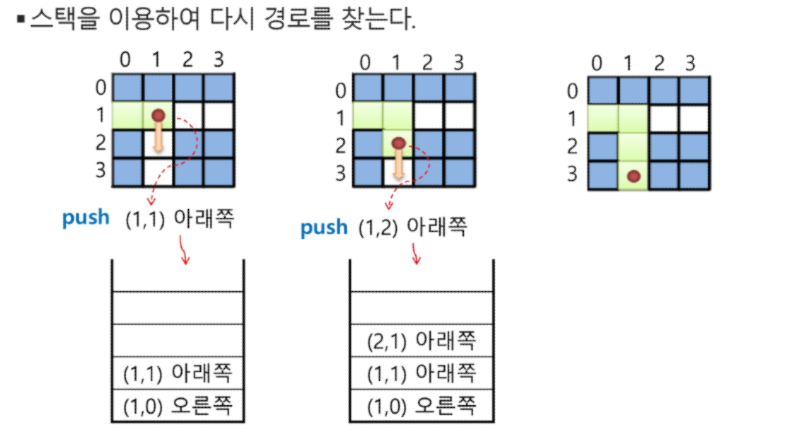
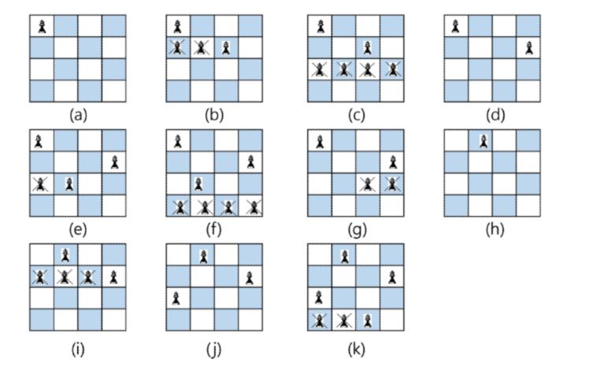
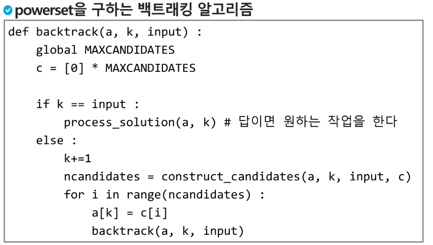
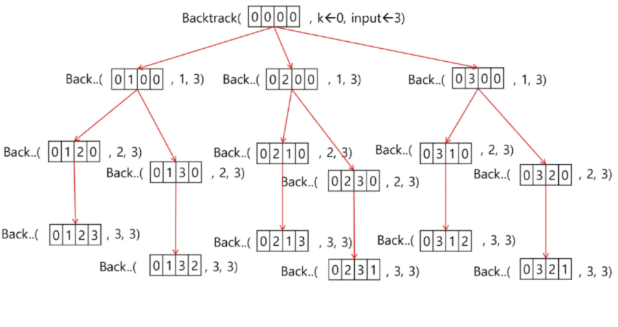
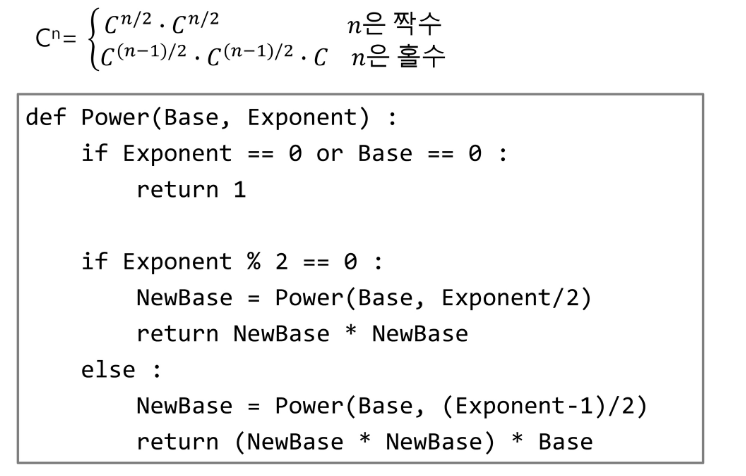
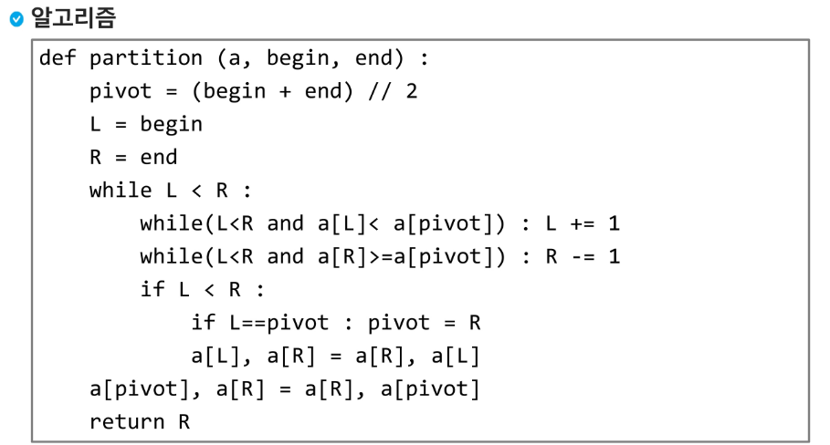

# Stack 2

## DFS(Depth First Search)

* 시작 정점의 한 방향으로 갈 수 있는 경로가 있는 곳까지 깊이 탐색해 가다가 더 이상 갈 곳이 없게 되면, 가장 마지막에 만났던 갈림길 간선이 있는 정점으로 되돌아와서 다른 방향의 정점으로 탐색을 계속 반복하여 모든 정점을 방문하는 순회 방법
* 재귀 혹은 반복(스택) 사용

1. 시작정점 v를 결정하여 방문
2. 정점 v에서 인접한 정점 중
   1. 방문하지 않은 정점w 가 있으면 정점v를 스택에 push하고 정점 w를 방분한다. 그리고 w를 v 로 하여 다시 2를 반복
   2. 방문하지 않은 정점이 없으면 탐색의 방향을 바꾸기 위해서 스택을 pop하여 받은 가장 마지막 방문 정점을 v로 하여 다시 2를 반복
3. 스택이 공백이 될 때까지 2를 반복

* 

## 계산기

* 스택을 이용하여 계산식의 값을 계산할 수 있다.

* 중위 표기식의 후위 표기식 변환 알고리즘
  * 입력받은 중위 표기식에서 토큰을 읽는다.
  * 토큰이 피연산자이면 토큰을 출력한다.
  * 토큰이 연산자이면 이 토큰이 스택의 top에 저장되어 있는 연산자보다 우선순위가 높으면 스택에 push하고, 아니면 스택 top의 연산자의 우선순위가 토큰의 우선순위보다 작을 때까지 스택에서 pop한 후 토큰의 연산자를 push, 만약 top에 연산자가 없으면 push
  * 토큰이 오른쪽괄호')'면 스택 top에 왼쪽괄호'(' 가 올때까지 스택에 pop연산을 수행하고 pop한 연산자를 출력한다. 왼쪽 괄호를 만나면 pop만 하고 출력하지는 않는다.
  * 중위 표기식에 더 읽을 것이 없다면 중지하고, 더 읽을것이 있다면 1부터 다시 반복
  * 스택에 남아 있는 연산자를 모두 pop하여 출력
  * 
* 후위 표기법의 수식을 스택을 이용하여 계산
  * 피연산자를 만나면 스택에 push
  * 연산자를 만나면 필요한 만큼의 피연산자를 스택에서 pop하여 연산하고, 연산결과를 다시 스택에 push
  * 수식이 끝나면 마지막으로 스택을 pop하여 출력
  * 

## 백트래킹

* 백트래킹 기법은 해를 찾는 도중에 막히면 되돌아가서 다시 해를 찾아가는 기법
* 최적화 문제와 결정 문제(해가 존재하는지 yes,no)를 해결 가능

* 미로찾기 
  * 
  * 
* 백트래킹과 DFS와의 차이
  * 어떤 노드에서 출발하는 경로가 해결책으로 이어지지 않으면 더이상 그 경로를 안가서 시도의 횟수를 줄임(가지치기)
  * 어떤 노드의 유망성을 점검한 후 유망(promising)하지 않으면 그 노드의 부모로 되돌아가(backtracking) 다음 자식 노드로 감 (모든 후보를 검사하지 않음)

* n queen
  * NxN N개의 queen을 놓는 알고리즘(가로세로에 하나, 주위 3x3에 하나)
  * 
  * 

* 부분집합 구하기
  * 어떤 집합의 공집합과 자기 자신을 포함한 모든 부분집합을 powerset 이라고 하며 구하고자 하는 어떤 집합의 원소 개수가 n일 경우 부분집합의 개수는 2**n개 이다.
  * n개의 원소가 들어있는 집합의 2**n개의 부분집합을 만들 때는 true false 값을 가지는 항목들로 구성된 n개의 배열을 만드는 방법을 이용
  * 여기서 배열의 i번째 항목은 i번째 원소가 부분집합의 값인지 아닌지를 나타내는 값
  * 
  * 
* 순열 만들기
  * 

## 분할 정복 알고리즘

* 해결할 문제를 여러개의 작은 부분으로 나눈 후 각각 해결하여 모음
* 

## 퀵 정렬

* 주어진 배열을 두 개로 분할하고, 각각을 정렬한다.
* 합병 정렬과 다른 점
  * 합병정렬은 그냥 두 부분으로 나누는 반면, 퀵정렬은 분할할 때 기준아이템(pivot item) 중심으로, 이보다 작은것은 왼편, 큰것은 오른편에 위치시킴
  * 각 부분 정렬이 끝난 후, 합병정렬은 합병이란 후처리 작업이 필요
* 
* 