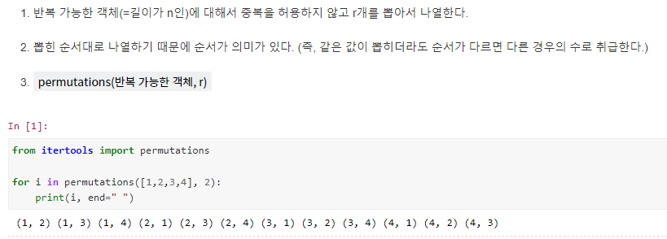
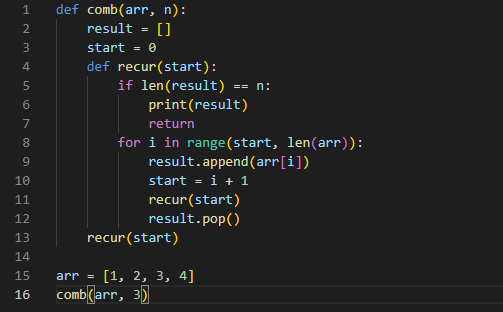
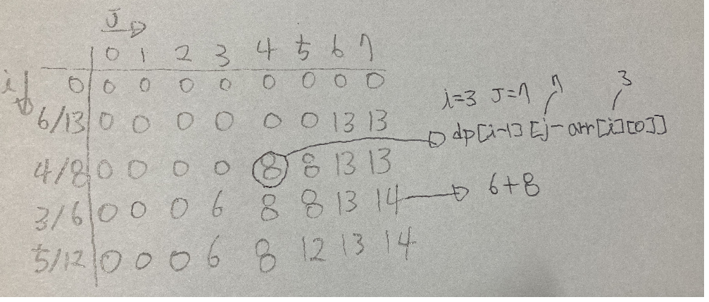
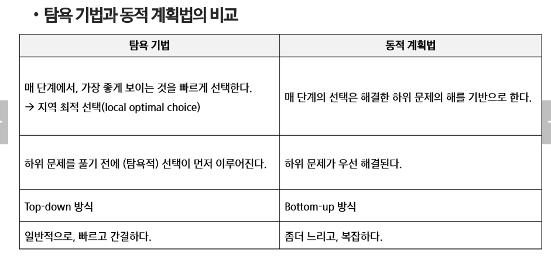

# 완전탐색

## 반복과 재귀

## 완전탐색

- 모든 경우의 수를 다 탐색

### 순열(**permutations**)

- 

- 

### 조합(**combinations**)

- 

- 

# 그리디

- 그리디는 그 순간마다 최적이라고 생각되는 것을 선택해가며 최적의 해답에 도달함
- 하지만 결과가 최적이라는 보장은 없음
- 그래서 문제가 제한적임(개어려움)
- 

## 그리디 가능 문제

- https://www.acmicpc.net/problem/2847
- 

## 그리디 불가능 문제(냅색)

- https://www.acmicpc.net/problem/12865
- 

- 

## 그리디 vs DP

