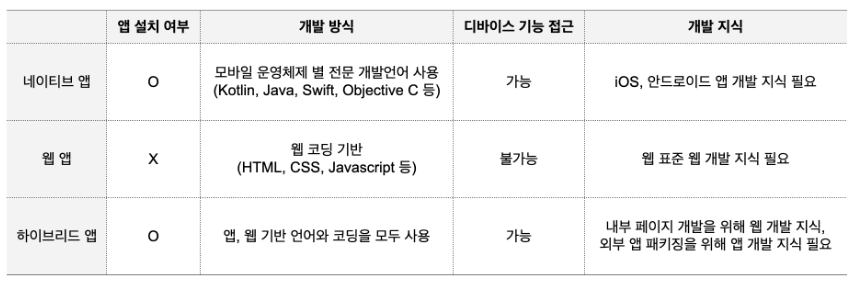

# PWA (Progressive Web App)

웹의 장점과 앱의 장점을 결합한 환경

-> 앱 수준과 같은 사용자 경험을 웹에서 제공하는 것이 목적

##### 특징

- 확장성이 좋고, 깊이 있는 앱같은 웹을 만드는 것을 지향한다.

- 웹 주소만 있다면 누구나 접근하여 사용이 가능하고, 스마트폰의 저장공간을 잡아 먹지 않음

- 서비스워커 API가 웹앱의 중요한 부분을 캐싱하여 다음에 열 때 빠르게 로딩하거나 오프라인 상태에서도 열 수 있게 함.

##### 제공 기능

- 프로그래시브 : 점진적 개선을 통해 작성되서 어떤 브라우저든 상관없이 모든 사용자에게 적합

- 반응형 : 데스크톱, 모바일, 테블릿 등 모든 폼 factor에 맞음

- 연결 독립적 : 서비스워커를 사용해 오프라인에서 동작 가능

- 안전 : HTTPS를 통해 제공이 되므로 스누핑이 차단되어 콘텐츠가 변조되지 않음

- 검색가능 : W3C 매니페스트 및 서비스워커 등록 범위 덕분에 앱으로 식별되어 검색이 가능함

- 재참여 가능 : 푸시알람과 같은 기능을 통해 쉽게 재참여가 가능

##### 단점

- 디바이스 접근 권한이 없어 음성 인식 등 기능 활용 불가

- 앱 설치 대신 url이나 링크 클릭을 해야 되서 번거로움

- 네이티브 앱에 비해 구동속도가 느리고 안정성이 떨어짐

##### 모바일 웹과 웹 앱의 차이

모바일 웹 : 화면의 일부분이 바뀔 때 전체를 서버에서 불러오는 풀 브라우저 방식

웹 앱 : 필요한 부분만 바꾸는 SPA 방식

웹 앱이 더 빠르다

# 네이티브 앱

모바일 기기에 최적화된 네이티브 언어로 개발된 앱

안드로이드 : 코틀린, 자바

iOS : 스위프트, 오브젝티브C

##### 장점

- 각 운영체제에 최적화된 방식으로 만들어져 앱 구동속도가 빠르다

- 높은 사양의 그래픽으로 원하는 디자인 구현 가능

- 디바이스 전체에 접근 권한을 가질 수 있음

##### 단점

- 다른 운영체제에 호환이 안되 안드로이드와 iOS 앱을 별도 개발

- 제작하는데 비용과 시간이 많이 듬

- 앱에 수정사항이 생기는 경우 앱 마켓의 심사를 거치고 전체 업데이트를 진행

# 하이브리드 앱

앱의 화면이나 기능 등 컨텐츠 영역은 웹 기반으로 제작하고, 겉모습은 앱 마켓 등록과 설치를 위해 네이티브 앱으로 포장함

##### 장점

- 웹 기술 기반이지만 모바일 API도 사용할 수 있으므로 디바이스 자체 기능 활용 가능

- 네이티브 앱에 비해 개발 비용, 시간 절약

- 한 번 개발하면 패키징을 바꾸는 방식으로 여러 플랫폼에 대응할 수 있다.

##### 단점

- 네이티브 앱 개발 지식이 필요(패키징)

- 브라우저의 성능이 떨어지면 앱 구동 속도가 저하됨

- 네이티브 앱에 비해 디자인의 자유도가 떨어짐



---

# 실제 프로젝트

1. public 안에 아이콘과 manifest.json 파일 생성


```javascript
{
    // 테마컬러가 안먹히는데 이유는 모르겠음
  "theme_color": "#467302",
  "background_color": "#467302",
  "display": "standalone",
  "scope": "/",
  "start_url": "/",
  "name": "독초도감",
  "short_name": "독초도감",
  "icons": [
    {
      "src": "icons/icon-192x192.png",
      "sizes": "192x192",
      "type": "image/png",
      "purpose": "any maskable"
    },
    {
      "src": "icons/icon-256x256.png",
      "sizes": "256x256",
      "type": "image/png"
    },
    {
      "src": "icons/icon-384x384.png",
      "sizes": "384x384",
      "type": "image/png"
    },
    {
      "src": "icons/icon-512x512.png",
      "sizes": "512x512",
      "type": "image/png"
    }
  ]
}
```

2. index.html에 추가

```javascript
<link rel="manifest" href="/manifest.json" />
<!-- 주소창 등의 웹 브라우저 UI를 표시하지 않기 -->
<meta name="apple-mobile-web-app-capable" content="yes" />
<!-- 상태 바의 스타일을 지정 -->
<meta
  name="apple-mobile-web-app-status-bar-style"
  content="black-translucent"
/>
<!-- 홈 화면에서 표시되는 앱 이름을 지정 -->
<meta name="apple-mobile-web-app-title" content="독초도감" />
<meta name="theme-color" content="#467302" />
<link
  rel="apple-touch-icon"
  sizes="192x192"
  href="/icons/icon-192x192.png"
/>
<link
  rel="apple-touch-icon"
  sizes="256x256"
  href="/icons/icon-256x256.png"
/>
<link
  rel="apple-touch-icon"
  sizes="384x384"
  href="/icons/icon-384x384.png"
/>
<link
  rel="apple-touch-icon"
  sizes="512x512"
  href="/icons/icon-512x512.png"
/>
```

3. npm 모듈 인스톨

```javascript
npm i register-service-worker
npm i @vue/cli-plugin-pwa
```

4. src 폴더에 registerServiceWorker.js 파일 생성

```javascript
import { register } from 'register-service-worker'

// if (process.env.NODE_ENV === 'development') {
register(`${process.env.BASE_URL}service-worker.js`, {
  ready() {
    console.log(
      'App is being served from cache by a service worker.\n' +
        'For more details, visit https://goo.gl/AFskqB'
    )
  },
  registered() {
    console.log('Service worker has been registered.')
  },
  cached() {
    console.log('Content has been cached for offline use.')
  },
  updatefound() {
    console.log('New content is downloading.')
  },
  updated() {
    console.log('New content is available; please refresh.')
  },
  offline() {
    console.log('No internet connection found. App is running in offline mode.')
  },
  error(error) {
    console.error('Error during service worker registration:', error)
  }
})
```

5. main.js (or .ts)에 import

```javascript
import './registerServiceWorker'
```
