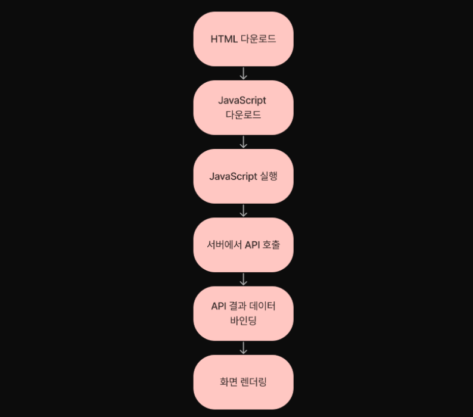
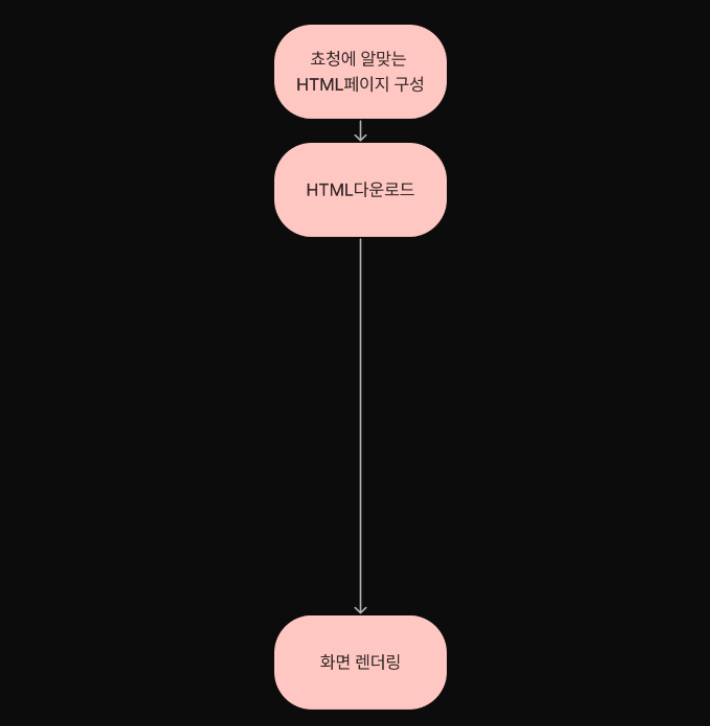

# CSR, SSR, SSG

## SPA, MPA

### SPA (Single Page Application)

하나의 페이지로 구성된 웹 어플리케이션.

필요한 모든 정적 리소스를 최초 한번에 다운로드하고, 그 후 새로운 페이지 요청이 있을 때 페이지 갱신에 필요한 데이터만 전달 받아서 페이지를 구성함.

필요한 부분만 갱신하기 때문에 화면 깜빡임이 없는 자연스러운 페이지 이동이 가능

### MPA (Multi Page Application)

새로운 페이지를 요청할 때마다 서버에서 랜더링된 정적 리소스가 다운되는 전통적 웹페이지 구성방식.

페이지를 이동하거나 새로고침하면 전체 페이지를 다시 랜더링하여 화면 깜빡임이 발생.

### CSR - SPA, SSR - MPA ?

일반적으로 SPA에서 랜더링 방식은 CSR, MPA에서는 SSR을 사용하게 된다.

SPA는 정적 리소스를 한번에 모두 다운로드 하고, 그 이후 새로운 페이지 요청이 있을 때 페이지 갱신에 필요한 데이터만 전달받기 때문에 자연스럽게 CSR을 사용한다.

MPA는 새로운 요청이 있을 때마다 서버에서 이미 랜더링된 정적 리소스를 받아오기 때문에 SSR을 사용하게 된다.

하지만, SPA가 CSR이고 MPA가 SSR인 것은 아니다. 두 개념은 페이지가 몇개냐, 랜더링을 어디서 하느냐에 따라 달라지는 개념.

## CSR (Client Side Rendering)

최초에 한번 서버에서 전체 페이지를 로딩하여 보여주고 이후에는 사용자의 요청이 올 때마다 리소스를 서버에서 제공한 후 클라이언트가 해석하고 랜더링을 하는 방식

#### 장점

- js 만으로 완전히 페이지를 만들 수 잇으며 js를 최대한도로 활용하여 HTML, CSS를 동적으로 생성할 수 있다.

- 컴포넌트 단위로 코드를 나누고 다양한 디자인 패턴을 적용하는 등, 클라이언트 개발 수준을 올릴 수 있다.

- Full Page Load 없이 라우팅이 가능하기 때문에 사용자 경험이 상승한다.

#### 단점

- SEO에 취약하다.

- 첫 진입시 로딩 속도가 길다.

#### 단점 보완법

- 모듈화 했던 파일들을 하나로 묶는 것을 번들링이라 하는데 번들링된 JS파일은 너무 커서 다운받는데 오래 걸릴 수 있다. 그래서 번들링된 JS파일을 페이지별로 필요한 JS파일로 분리한 것이 code splitting이고, 이를 통해 초기 DOM 생성속도를 줄일 수 있다.

- 라이브러리나 웹팩 플러그인을 통해 각 페이지에 대한 HTML파일을 미리 생성해 둔 뒤 서버에서 요청하는 자가 크롤러라면 미리 랜더링된 HTML버전 페이지를 보여주는 방식이 pre-rendering이고, 이를 통해 SEO를 개선할 수 있다.

- SPA에 SSR, SSG를 도입할 수 있다.
  
  1. 프레임워크 없이 도입하는 방법
     
     node.js, express.js, nest.js로 별도의 서버를 직접 운영하는 방법이다.
     
     하지만 이 방법은 서버환경 구성이나 빌드등의 작업이 필요해 진입장벽이 있다.
  
  2. 프레임워크로 도입
     
     react -> next.js, vue -> nuxt.js, angular -> angular universal, gatsby.js 등..++

## SSR (Server Side Rendering)

서버측에서 랜더링하는 방식이다.

사용자가 웹페이지에 접근할 때 서버에서 페이지에 대한 요청을 하며 서버에서는 HTML, view와 같은 리소스들을 어떻게 보여질지 해석하고 랜더링하여 사용자에게 반환한다.

#### 장점

- SEO 최적화에 유리함

- 빠른 초기 로딩

- 서버에서 랜더링 후 각각의 페이지를 넘겨받기 때문에 각 페이지에 대한 정보를 입력하기 쉬움

#### 단점

- 클릭할 때마다 깜빡임으로 사용자 경험이 안좋다.

- header, footer와 같이 중복되는 내용도 재 랜더링이 필요하여 페이지 이동이 느리다.

## SSG (Static Site Generation)

클라이언트에서 필요한 페이지들을 사전에 미리 준비해뒀다가 요청을 받으면 이미 완성된 파일을 단순히 반환하여 브라우저에서 뷰를 보여지게 된다.

#### SSR과 SSG의 차이점

서버에서 요청할 때 즉시 만드느냐, 미리 만들어 놓느냐에 따라 차이가 있다.

SSR은 요청시 즉시 HTML을 만들어서 응답하기 때문에 데이터가 달라져서 미리 만들어두기 어려운 페이지에 적합.

SSG는 미리 만들어두고 요청시 해당 페이지를 응답하기 때문에 바뀔일이 거의 없어 캐싱해두면 좋은 페이지에 사용.

## 무엇을 사용해야 할까?

###### CSR

유저와 상호작용이 많고, 고객의 개인정보를 기준으로 이루어지는 서비스라면 검색엔진 노출보다 데이터 보호가 더 중요할 수 있다.

###### SSR

회사 홈페이지로 상위 노출이 필요하고, 누구에게나 항상 같은 내용을 보여줘야하며, 매주 업데이트가 되어야한다.

###### SSG

회사 홈페이지로 상위 노출이 필요하고, 누구에게나 항상 같은 내용을 보여줘야하며, 업데이트를 거의 하지 않아도 된다.

###### CSR + SSR (Universal)

사용자에 따라 페이지 내용이 달라지며 화면깜빡임 없는 빠른 인터렉션이 필요하고 상위노출이 필요하다.

