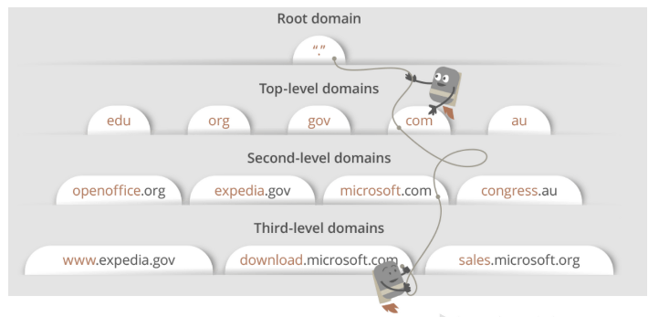
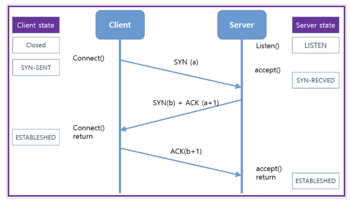
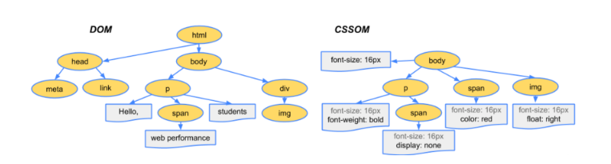
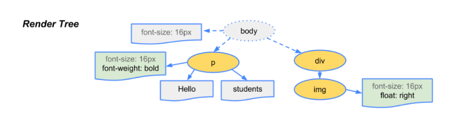
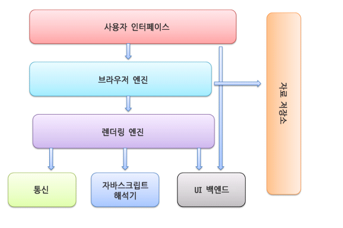
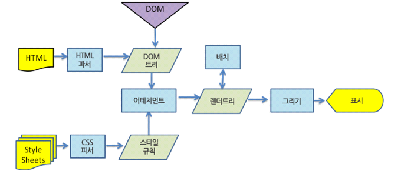

# 브라우저 동작 방식

### 요약

###### 리소스 받아오기

1. 브라우저 주소창에 접속 할 URL 입력

2. 현재 PC에 연결된 DNS 에 접속 할 URL의 IP 주소를 요청
   
   

3. DNS로부터 IP 확인이 완료되면 브라우저는 서버에 요청 할 HTTP 메시지 작성

4. HTTP 메시지(Request)를 패킷으로 나누어 서버로 전송 (TCP 3-handshaking)
   
   

5. 서버에서 패킷을 조립해 HTTP 메시지로 바꿈

6. 서버에서 클라이언트에게 보낼 리소스를 패킷으로 나누어 클라이언트에 전달 (Response)

7. 브라우저가 서버로부터 받은 패킷을 조립하여 화면에 띄움

###### 화면에 띄우기

1. 렌더링 엔진으로 HTML, CSS를 파싱한다

2. 우선 HTML 파싱 과정 시작. HTML 파서가 문서에 존재하는 어휘와 구문을 분석하며 DOM 트리를 구축

3. CSS 파싱 과정 시작. CSS 파서가 모든 CSS 정보를 스타일 구조체로 생성
   
   

4. 두 가지를 연결시켜 렌더 트리를 만듬. 렌더 트리를 통해 문서가 시각적 요소를 포함한 형태로 구성됨
   
   
   
   이 때, visibility : hidden 은 공간을 차지하고 보이지만 않기 때문에 렌더 트리에 포함
   
   display : none은 렌더 트리에서 제외 

5. 화면에 배치를 시작하고, UI 백엔드가 노드를 돌며 형상을 그림

6. 이때 빠른 브라우저 화면 표시를 위해 자원을 받으면 기다리는 동시에 일부분 먼저 진행하고 화면에 표시

### 브라우저의 구조

- 사용자 인터페이스
  
  요청한 페이지를 보여주는 창을 제외한 나머지 부분

- 브라우저 엔진
  
  사용자 인터페이스와 렌더링 엔진 사이의 동작 제어

- 렌더링 엔진
  
  요청한 컨텐츠 표시

- 통신
  
  http 요청과 같은 네트워크 호출에 사용 (플랫폼의 독립적인 인터페이스로 구성)

- UI 백엔드
  
  플랫폼에서 명시하지 않은 일반적 인터페이스, 콤보 박스 창같은 기본적 장치를 그림

- 자바스크립트 해석기
  
  자바스크립트 코드를 해석하고 실행

- 자료 저장소
  
  쿠키 등 모든 종류의 자원을 하드 디스크에 저장하는 계층

### 렌더링이란?

웹사이트 코드를 사용자가 보는 페이지로 바꾸는 절차

웹킷 (최초 리눅스 플랫폼에 동작하기 위한 오픈소스 엔진, 크롬과 사파리가 사용) 동작 과정

어태치먼트 : 웹킷이 렌더 트리를 생성하기 위해 DOM 노드와 스타일 정보를 연결하는 과정

### DOM이란?

Document Object Model

웹 페이지 소스의 태그들을 자바스크립트가 활용할 수 있는 객체로 만들면 문서 객체가 된다.

모델은 모듈화로 만들었다거나 객체를 인식한다 라고 해석

즉, DOM은 웹 브라우저가 html 페이지를 인식하는 방식을 말함(트리구조)

### 파싱

파싱은 브라우저가 코드를 이해하고 사용할 수 있는 구조로 변환하는 것

문서를 가지고, 어휘 분석과 구문 분석 과정을 거쳐 파싱트리를 구축한다.

어휘 분석기를 통해 언어의 구문 규칙에 따라 문서 구조를 분석한다. 이 과정에서 구문 규칙과 일치하는지 비교하고, 일치하는 노드만 파싱 트리에 추가시킨다.

다시 기계코드 문서로 변환시키는 과정까지 완료되면 최종 결과물이 나온다.

웹킷은 자동으로 생성해주는 파서 생성기인 플렉스나 바이슨을 이용하여 파싱을 한다.

이 과정을 거치며 서버로부터 받은 문서를 브라우저가 이해하고 사용할 수 있는 DOM 트리구조로 변환시켜준다.
