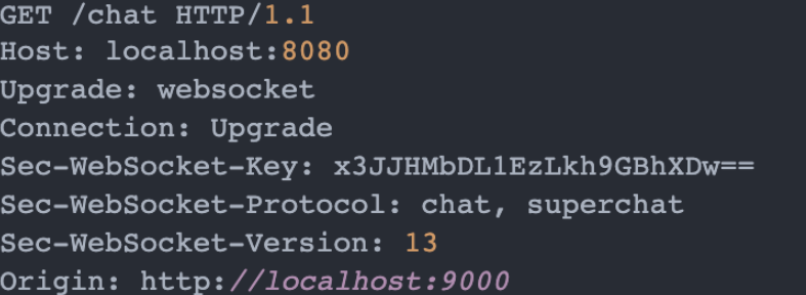
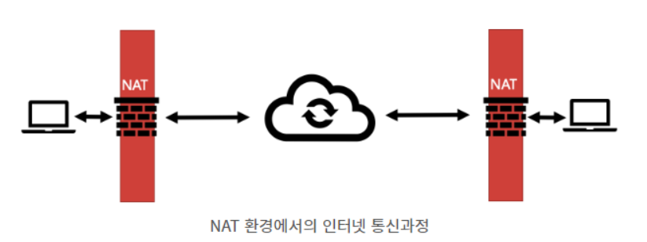
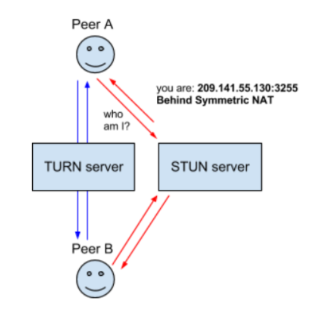

# 실시간 통신

# Http 통신

- 단방향 통신 : 클라이언트가 요청 시 서버가 응답을 한다. (request, response)

- 비연결성 : 클라이언트가 요청을 하고 서버가 응답을 한 후 연결을 끊는다.

### Http 실시간성 기술

- Polling
  
  - 서버로 일정한 주기마다 요청 송신 (n초 간격으로 계속 전송)
  
  - real time에서 언제 통신이 발생할지 몰라 불필요한 request와 connection을 발생 (서버에 부담)

- Long Polling
  
  - 서버에 요청을 보내고 이베트가 생기면 응답을 받을때 까지 연결을 유지한다. (Polling처럼 불필요한 요청을 계속 보내는게 아니기 때문에 비용 감소)
  
  - 응답을 받으면 끊고 재요청
  
  - 하지만 클라이언트가 많아지면 응답의 수가 증가하여 Polling과 비슷해짐

- Streaming
  
  - 클라이언트에서 서버에 요청을 보내고 끊기지 않은 상태에서 계속 데이터 수신
  
  - 커넥션의 유효성 관리가 어렵다.

세가지 방법 다 HTTP통신이기에 Header가 불필요하게 크다

# Web Socket

- 양방향 통신
  
  - 데이터 송수신을 동시에 할 수 있다.
  
  - 클라이언트와 서버가 서로 원할 때 데이터를 주고 받는다.

- 연결지향

- 실시간 네트워킹
  
  - 웹화면에서 연속된 데이터를 빠르게 노출
  
  - 여러 단말기에서 빠르게 data 교환

### 웹소켓 동작 원리

##### Open Handshake (빨간 박스)

- 연결 요청 헤더S

- HTTP 1.1 이상이어야 함

- Upgrade는 현재 프로토콜에서 다른 프로토콜로 변경할 때 사용. 이 값이 websocket이 아니면 웹소켓 접속을 중지(cross-protocol attack)

- Connection은 현재의 전송 완료 후 연결을 유지할 것인지에 대한 정보. 값이 없거나 다른값이면 웹 소켓 연결 중지

- 연결 응답 헤더

- Upgrade와 Connection은 동일하게 넣어줘야 한다.

##### Data Transfer (노란 박스)

- 웹소켓 연결 수립이 되면 데이터 전송이 시작

- 클라이언트와 서버가 메세지라는 개념으로 데이터를 주고 받음

- 한개 이상의 메세지는 프레임으로 구성

- 핸드 셰이크가 끝난 시점부터 서버와 클라이언트는 서로가 살아 있는지 확인하기 위해 주기적으로 ping을 보내 체크

##### Close Handshake (보라색 박스)

- 클라이언트나 서버가 커넥션 종료를 위한 컨트롤 프레임 전송

- 컨트롤 프레임은 closing hand shake를 시작하라는 데이터를 가지고 있고 응답으로 close 프레임 전송

- 연결 종료

### 웹소켓의 한계

- 서로 문자열만 주고 받음

- HTTP의 경우 형식을 정해 놓아서 모두가 따르기만 하면 해석이 쉽지만, 웹소켓은 형식이 없어 application에서 해독이 어렵다.

- 서버의 성능이 중요하고 서버에 부하가 생길 수 있음.

# WebRTC (Web Real Time Communication)

- 중간에 서버를 두지 않고 클라이언트들의 브라우저가 직접 연결되는 기술

- P2P(동등 계층간 통신 방식) 통신에 최적화 되어있음.

- 웹 브라우저 상에서는 어떠한 플러그인도 필요 없이 화상채팅, 데이터 교환까지 가능하게 한다.

### WebRTC 연결

##### NAT (Network Address Translation)

- 라우터는 공개 IP를 갖고 있고, 단말들은 비공개 IP 주소를 가지고 있는데 단말의 비공개 IP로 부터 라우터의 공개 IP로 매핑

##### STUN

- 해당 Peer의 공개 IP 주소를 보내는 역할을 함

##### TURN

- 몇몇 라우터는 NAT 보안 정책이 엄격해 STUN 만으로 연결이 안됨

- 각 단말들이 비공개IP 상에서 통신할 수 있게 하는 경유 서버

- STUN에 비해 리소스 낭비가 심해 최후의 수단으로 사용

