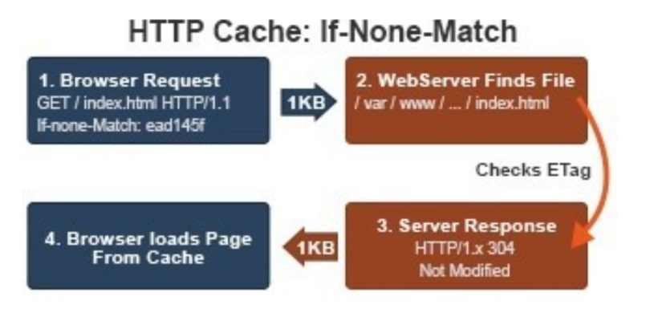

# 웹 캐시

### 캐시란?

데이터나 값을 미리 복사해 놓는 임시 장소

이미 가져온 데이터나 계산된 결과값의 복사본을 저장하여 처리속도를 향상시킴

### 웹 캐시란?

사용자가 웹사이트에 접속할 때, 정적 컨텐츠(이미지, css 등)를 특정 위치에 저장하여, 사이트 응답 시간을 줄이고 서버 트래픽을 감소시킬 수 있음.

##### 웹 캐시의 종류

1. Service Worker Cashes
   
   - 서비스 워커란 웹 어플리케이션 백그라운드에서 동작(클라이언트와 서버 사이의 미들웨어)하고 비동기적으로 실행되는 자바스크립트
   
   - 메인 스레드가 아닌 독립된 스레드에서 자바스크립트 코드를 실행함(https에서만 사용 가능)
   
   - 서비스워커는 모든 요청과 응답을 핸들링할 수 있어 요청 실패시 오프라인페이지를 띄우는 것을 할 수 있음.

2. Browser Cashes
   
   - 브라우저 또는 HTTP 요청을 하는 Client Application에 의해 내부 디스크에 캐시
   
   - 캐시된 리소스를 공유하지 않는 한 개인에 한정된 캐시
   
   - 이미 방문한 페이지를 재 방문하는 경우 극대화

3. Proxy Caches
   
   - 브라우저 캐시와 동일한 원리로 동작하고, 클라이언트나 서버가 아닌 네트워크상에서 동작
   
   - 큰 회사나 IPS(침입방지시스템)의 방화벽에 설치되며 대기시간과 트래픽감소, 접근 정책, 제한 우회 등을 수행

4. Gateway Caches
   
   - 서버 앞 단에 설치되어 요청에 대한 캐시 및 효율적인 분배를 통해 가용성, 신뢰성, 성능등을 향상

### 캐시 컨트롤

1. HTML 메타태그 사용: 이제 안씀

2. HTTP 헤더 사용

##### HTTP 헤더에 캐시 속성 지정

Cache-Control, Expires, ETag, Last-Modified 등의 속성을 지정하여 캐싱 제어가 가능하다.

validation : 변경 체크, freshness : 만료 체크

HTTP 1.1 이 HTTP 1.0 보다 우선순위를 가짐

##### 캐시 동작

###### 1. Cache-Control

 **Cache-Control**은 하나의 값이 아니라 다양한 지시자를 이용하여 값을 전달할 수 있음. 그로 인해 여러가지 컨트롤을 가능하게 만들어줌 ex) Cache-Control: max-age=3600, must-revaliate

###### 2. Expire

Expires: Wed, 21 Oct 2015 07:28:00 GMT

위와 같이 timestamp 형태의 절대적인 시간 값을 넘겨줄 수 있으며, 해당 날짜 및 시간까지 데이터가 유효함을 의미한다.

###### 3. ETag

1. 브라우저는 최초 응답 시 받은 Etag값을 If-None-Match 라는 헤더에 포함 시켜 페이지를 요청함.

2. 서버는 요청 파일의 Etag값을 If-None-Match값과 비교하여 동일하다면 304 Not Modified로 응답하고 다르다면 200 OK와 함께 새로운 Etag 값을 응답 헤더에 전송함.

3. 브라우저는 응답 코드가 304인경우 캐쉬에서 페이지를 로드하고 200이라면 새로 다운받은 후 **Etag**값을 갱신.

###### 4. Last-Modified

1. 브라우저는 최초 응답 시 받은 Last-Modified 값을 If-Modified-Since 라는 헤더에 포함 시켜 페이지를 요청함

2. 서버는 요청 파일의 수정 시간을 If-Modified-Since 값과 비교하여 동일하다면 304 NOT Modified로 응답하고 다르다면 200 OK와 함께 새로운 Last-Modified 값을 응답 헤더에 전송.
