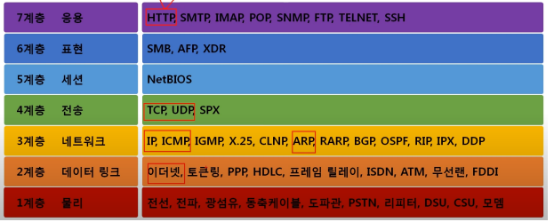
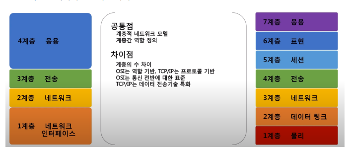

# 네트워크 모델

네트워크 모델의 필요성 : 통신이 일어나는 과정을 단계별로 알 수 있고, 특정한 곳에 이상이 생기면 그 단계만 수정할 수 있기 때문이다.

### OSI 7 계층

1. 물리
   단지 데이터를 전기적인 신호로 변환해서 주고받는 기능을 진행하는 공간

2. 데이터 링크
   물리 계층으로 송수신되는 정보를 관리하여 안전하게 전달되도록 도와주는 역할
   Mac 주소를 통해 통신한다. 프레임에 Mac 주소를 부여하고 에러검출, 재전송, 흐름제어를 진행한다.

3. 네트워크
   데이터를 목적지까지 전달하는 기능
   라우터를 통해 이동할 경로를 선택하여 IP 주소를 지정하고, 패킷 전달
   라우팅, 흐름 제어, 오류 제어, 세그먼테이션 수행

4. 전송
   TCP와 UDP 프로토콜을 통해 통신을 활성화 함

5. 세션
   데이터가 통신하기 위한 논리적 연결을 담당한다. TCP/IP 세션을 만들고 없애는 책임

6. 표현
   데이터 표현에 대한 독립성을 제공하고 암호화
   파일 인코딩, 명령어를 포장, 압축, 암호화

7. 응용
   최종 목적지로, 응용 프로세스와 직접 관계하여 일반적인 응용 서비스를 수행
   사용자 인터페이스, 전자우편, 데이터베이스 관리 등의 서비스를 제공

### TCP/IP 계층

