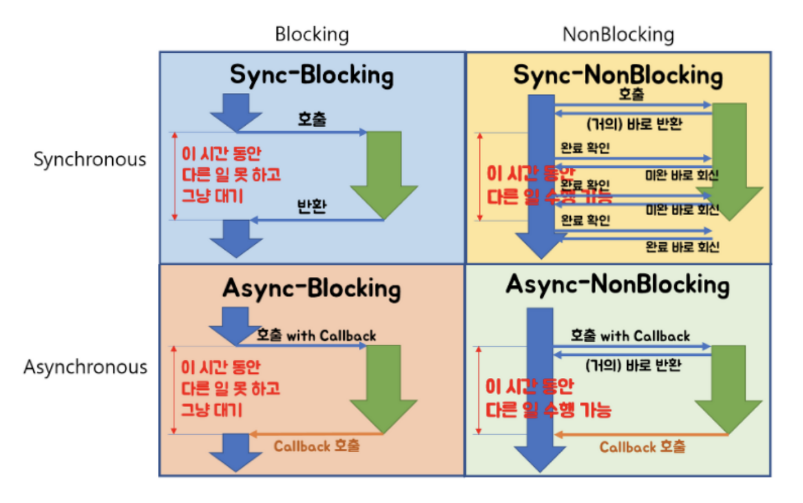

# Blocking/Non-blocking & Synchronous/Asynchronous

### Blocking/Non-blocking

호출된 함수가 호출한 함수에게 제어권을 건네주는 유무의 차이

함수 A, B가 있고 A 안에서 B를 호출했다고 가정해보자. 이때 호출한 함수는 A고, 호출된 함수는 B가 된다. 현재 B가 호출되면서 B는 자신의 일을 진행해야 한다. (제어권이 B에게 주어진 상황)

- Blocking : 함수 B는 내 할 일을 다 마칠 때까지 제어권을 가지고 있는다. A는 B가 다 마칠 때까지 기다려야 한다.

- Non-Blocking : 함수 B는 할 일을 마치지 않았어도 A에게 제어권을 바로 넘겨준다. A는 B를 기다리면서도 다른 일을 진행할 수 있다.

즉, 호출된 함수에서 일을 시작할 때 바로 제어권을 리턴해주느냐, 할 일을 마치고 리턴해주느냐에 따라 블럭과 논블럭이 나뉨

### Synchronous/Asynchronous

동기/비동기는 일을 수행중인 동시성에 주목

- Synchronous : 함수 A는 함수 B가 일을 하는 중에 기다리면서, 현재 상태가 어떤지 계속 체크한다.

- Asynchronous : 함수 B의 수행 상태를 B 혼자 직접 신경쓰면서 처리한다. (Callback)

즉, 호출된 함수를 호출한 함수가 신경 쓰는지, 호출된 함수가 스스로 신경쓰는지를 동기/비동기로 생각하면 됨

비동기는 호출 시 Callback을 전달하여 작업의 완료 여부를 호출한 함수에게 답하게 된다.
