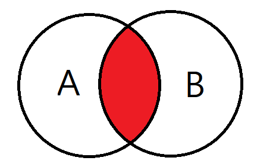
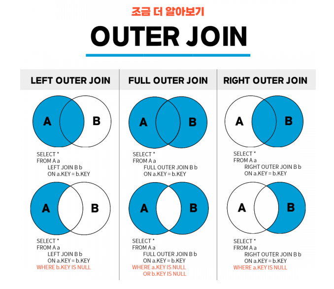
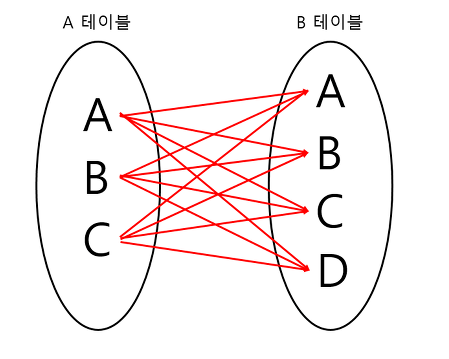
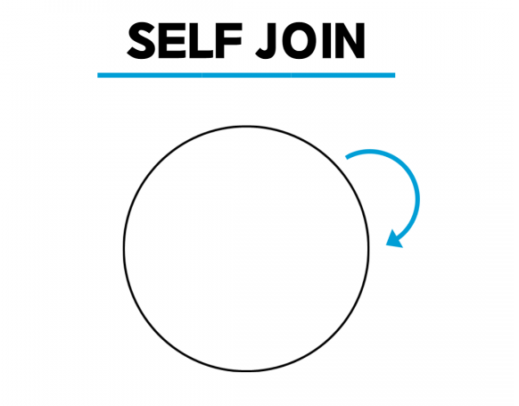

# key

key : 검색, 정렬 시 튜플을 구분할 수 있는 기준이 되는 속성

##### 1. 후보키

기본키로 사용할 수 있는 속성들

1. 유일성 : key로 하나의 Tuple을 유일하게 식별할 수 있음

2. 최소성 : 꼭 필요한 속성으로만 구성

##### 2. 기본키

후보키 중 선택한 Main key

Null값을 가질 수 없음, 동일한 값이 중복될 수 없음

##### 3. 대체키(보조키)

후보키 중 기본키를 제외한 나머지 키

##### 4. 슈퍼키

유일성은 만족하지만 최소성은 만족하지 못하는 키

##### 5. 외래키

다른 릴레이션의 기본키를 그대로 참조하는 속성의 집합

---

# SQL

### 1. SQL, NOSQL

##### SQL (관계형 DB)

SQL을 사용하면 RDBMS에서 데이터를 저장, 수정, 삭제, 검색이 가능

###### 특징

1. 데이터는 정해진 데이터 스키마에 따라 테이블에 저장된다.

2. 데이터는 관계를 통해 여러 테이블에 분산된다.

3. 일반적으로 수직적(서버의 성능 향상) 향상만 가능

###### 장점

1. 명확하게 정의된 스키마, 데이터의 무결성 보장

2. 관계는 각 데이터를 중복없이 한번만 저장

###### 단점

1. 덜 유연함. 데이터 스키마를 사전에 계획하고 알려야 함.

2. 관계를 맺고 있어서 조인문이 많은 복잡한 쿼리가 만들어질 수 있음

3. 대체로 수직적 확장만 가능

###### 사용

1. 관계를 맺고 있는 데이터가 자주 변경되는 애플리케이션의 경우

2. 변경될 여지가 없고, 명확한 스키마가 사용자와 데이터에게 중요한 경우

##### NOSQL (비관계형 DB)

스키마도 없고, 관계도 없다.

레코드를 문서(document)라 부른다.

###### 특징

1. 문서는 JSON과 비슷한 형태로 가지고 있다. 

2. 수평적(데이터베이스 분산) 확장 가능

3. 관련 데이터를 동일한 컬렉션에 넣는다.

4. 따라서 여러 테이블에 조인할 필요 없이 이미 필요한 모든 것을 갖춘 문서를 작성하는것이 NOSQL이다.

-> 조인을 잘 사용하지 않고, 자주 변경되지 않는 데이터일 때 NOSQL을 쓰면 효율적

###### 장점

1. 스키마가 없어서 유연함. 언제든지 저장된 데이터를 조정하고 새로운 필드 추가 가능

2. 데이터는어플리케이션이 필요로 하는 형식으로 저장되고, 데이터 읽어오는 속도 빨라짐

3. 수직, 수평 확장이 가능해서 애플리케이션이 발생시키는 모든 읽기/쓰기 요청 처리 가능

###### 단점

1. 유연성으로 인해 데이터 구조 결정을 미루게 될 수 있음

2. 데이터 중복을 계속 업데이트 해야 함

3. 데이터가 여러 컬렉션에 중복되어 있기 때문에 수정 시 모든 컬렉션에서 수행해야 함 (SQL에선 중복 데이터가 없기 때문에 한번만 수행)

###### 사용

1. 정확한 데이터 구조를 알 수 없거나 변경/확장 될 수 있는 경우

2. 읽기를 자주 하지만, 데이터 변경은 자주 없는 경우

3. 데이터베이스를 수평으로 확장해야 하는 경우 (빅데이터를 다뤄야 하는 경우)

### 2. JOIN

두 개 이상의 테이블이나 데이터베이스를 연결하여 데이터를 검색하는 방법

###### 종류

1. INNER JOIN
   

    교집합으로, 기준 테이블과 join테이블의 중복된 값을 보여준다

```sql
 SELECT <열 목록>
 FROM <첫 번째 테이블>
          INNER JOIN <두 번째 테이블>
          ON <조인될 조건>
 [WHERE 검색 조건]
```

2. OUTER JOIN
   
   
   - **LEFT** OUTER JOIN: 왼쪽 테이블의 모든 값이 출력되는 조인
   
   - **RIGHT** OUTER JOIN: 오른쪽 테이블의 모든 값이 출력되는 조인
   
   - **FULL** OUTER JOIN: 왼쪽 또는 오른쪽 테이블의 모든 값이 출력되는 조인

```sql
 SELECT <열 목록>
 FROM <첫 번째 테이블(LEFT 테이블)>
          <LEFT | RIGHT | FULL> OUTER JOIN <두 번째 테이블(RIGHT 테이블)>
           ON <조인될 조건>
 [WHERE 검색 조건]
```

3. CROSS JOIN
   
   모든 경우의 수를 전부 표현해주는 방식

```sql
 SELECT * 
 FROM <첫 번째 테이블>
           CROSS JOIN <두 번째 테이블>
```

4. SELF JOIN
   

    하나의 테이블을 여러번 복사해서 조인한다. (별칭을 사용함)
    자신이 갖고 있는 칼럼을 다양하게 변형시켜 활용할 때 자주 사용

```sql
 SELECT <열 목록>
 FROM <테이블> 별칭A
          INNER JOIN <테이블> 별칭B
          ON <조인될 조건>
 [WHERE 검색 조건]
```

### 3. SQL Injection

해커에 의해 조작된 SQL 쿼리문이 데이터베이스에 전달되어 비정상적 명령을 실행시키는 공격 기법

##### 공격방법

1. 인증우회
   input창에 비밀번호를 입력함과 동시에 다른 쿼리문을 함께 입력해 데이터베이스에 영향을 줌
   기본 쿼리문의 WHERE절 뒤에 OR문 추가하여 '1' = '1' 같은 true 문을 작성하여 무조건 적용되게 한 후 데이터베이스 조작

2. 데이터노출
   에러를 발생시키고 에러 메세지를 통해 데이터베이스 구조를 유추한 후 해킹

##### 방어방법

1. input 값을 받을 때 특수문자 여부 검사하기

2. SQL 서버 오류 시 에러메세지 감추기 (view를 활용하여 권한을 높임)

3. preparestatement 사용하기 (특수문자를 자동 escaping해줌)

---

# 정규화

가장 큰 목표는 테이블 간 중복된 데이터를 허용하지 않는 것.

- 데이터의 중복을 없애면서 불필요한 데이터를 최소화

- 무결성을 지키고, 이상 현상 방지

- 테이블 구성을 논리적이고 직관적으로

- 데이터베이스 구조 확장에 용이

### 제 1정규화

테이블 컬럼이 원자값을 앚도록 테이블을 분리 시킨다

- 어떤 릴레이션에 속한 모든 도메인이 원자값으로만 되어 있어야 함

- 모든 속성에 반복되는 그룹이 나타나지 않음

- 기본키를 사용하여 관련 데이터의 각 집합을 고유하게 식별할 수 있어야 함

### 제 2정규화

테이블의 모든 칼럼이 완전 함수적 종속을 만족해야 함

-> 테이블에서 기본키가 복합키로 묶여있을 때, 두 키 중 하나의 키만 다른 칼럼을 결정지을 수 있으면 안된다 (기본키의 부분집합 키가 결정자가 되어선 안된다.)

### 제 3정규화

이행적 종속(A->B, B->C 면 A->C)을 없애기 위해 테이블을 분리

- 릴레이션이 2NF에 만족함

- 기본키가 아닌 속성들은 기본키에 의존함

##### 정규화의 문제점

- 정규화는 데이터 조회시 조인을 유발하기 떄문에 CPU와 메모리를 많이 사용

### 반정규화

데이터베이스의 성능 향상을 위하여 데이터 중복을 허용하고 조인을 줄임

-> 조회 속도를 향상시키지만, 데이터 모델의 유연성은 낮아진다

###### 수행하는 이유

- 정규화에 충실하여 종속성, 활용성은 향상되었지만 수행 속도가 느린 경우

- 다량의 범위를 자주 처리해야하는 경우

- 특정 범위를 자주 처리해야하는 경우

- 요약/집계 정보가 자주 요구되는 경우

###### 반정규화기법

1. 테이블 통합 : 두 개의 테이블이 조인되는 경우가 많을 경우

2. 테이블 분할 : 테이블을 수평(레코드 기준), 수직(속성이 너무 많을 경우) 분할

3. 중복 테이블 추가 : 여러 테이블에서 데이터를 추출해서 사용할 때, 다른 서버에 저장된 테이블을 이용할 때

4. 중복 속성 추가 : 조인해서 데이터를 처리할 때 데이터를 조회하는 경로를 단축하기 위해 자주 사용하는 속성을 하나 더 추가

### 이상현상

1. 삽입이상 : 불필요한 데이터를 추가해야 삽입할 수 있는 상황

2. 갱신이상 : 일부만 변경하여 데이터가 불일치 하는 모순이 발생

3. 삭제이상 : 튜플 삭제로 인해 꼭 필요한 데이터까지 함께 삭제되는 문제

---

# 인덱스

저장 공간을 활용하여 데이터베이스 테이븡릐 검색 속도를 향상시키기 위한 자료구조

데이터베이스 안의 레코드를 처음부터 풀스캔하지 않고, B+트리로 구성된 구조에서 Index파일 검색으로 속도를 향상시킴

###### 파일구성

- FRM : 테이블 구조 저장 파일

- MYD : 실제 데이터 파일

- MYI : Index 정보 파일

###### 단점

- Index 생성시 .mdb 파일 크기가 증가한다

- 한 페이지를 동시에 수정할 수 있는 병행성이 줄어든다

- 인덱스 된 Field에서 Data를 업데이트 하거나, Record를 추가, 삭제시 성능이 떨어진다

- 데이터 변경 작업이 자주 일어나는 경우 비효율적

---

# 트랜잭션

데이터베이스의 상태를 변화시키기 위해 수행하는 작업 단위

작업단위 : 많은 SQL 명령문들을 사람이 정하는 기준에 따라 정하는 것 (여러 쿼리문을 써도 하나의 작업을 위하면 하나의 트랜잭션)

### 트랜잭션의 특징 (ACID)

- 원자성(Atomicity) : 트랜잭션이 DB에 모두 반영되거나, 혹은 전혀 반영되지 않아야 한다.

- 일관성(Consistency) : 트랜잭션의 작업 처리 결과는 항상 일관성 있어야 한다.

- 독립성(Isolation) : 둘 이상의 트랜잭션이 동시에 병행 실행되고 있을 때, 어떤 트랜잭션도 다른 트랜잭션 연산에 끼어들 수 없다.

- 지속성(Durability) : 트랜잭션이 성공적으로 완료되었다면, 결과는 영구적으로 반영되어야 한다. 

##### Commit

하나의 트랜잭션이 성공적으로 끝났고, DB가 일관성있는 상태일 때 이를 알려주기 위해 사용하는 연산

##### Rollback

하나의 트랜잭션 처리가 비정상적으로 종료되어 트랜잭션 원자성이 깨진 경우 시작 상태로 롤백

### DBMS

1. 구조
   크게 질의처리기, 저장시스템
   입출력 단위 : 고정 길이의 page 단위로 disk에 읽거나 쓴다.
   저장 공간 : 비휘발성 저장 장치인 disk에 저장, 일부분을 Main Memory에 저장
   

2. Page Buffer Manager or Buffer Manager
   BDMS의 Storage System에 속하는 모듈 중 하나로, Main Memory에 유지하는 페이지를 관리하는 모듈

3. UNDO
   필요한 이유 : 수정된 Page들이 Buffer 교체 알고리즘에 따라서 디스크에 출력될 수 있음
   버퍼 교체는 트랜잭션과 무관하게 버퍼의 상태에 따라서 결정됨. 이로 인해, 정상적으로 종료되지 않은 트랜잭션이 변경한 페이지들은 원상 복구 되어야 함

4. REDO
   이미 커밋한 트랜잭션의 수정을 재반영하는 복구 작업

### 트랜잭션 격리 수준

트랜잭션에서 일관성 없는 데이터를 허용하도록 하는 수준

##### Isolation level의 필요성

데이터베이스는 ACID 특징과 같이 트랜잭션이 독립적인 수행을 하도록 한다.

따라서 Locking을 통해 토랜잭션이 DB를 다루는 동안 다른 트랜잭션이 관여하지 못하도록 막는 것이 필요함.

하지만 무조건 Locking으로 동시에 수행되는 수많은 트랜잭션들을 순서대로 처리하는 방식으로 구현하게 되면 성능은 떨어지게 될 것이다.

-> 따라서 효율적인 Locking 방법이 필요!

##### Isolation level의 종류

1. Read Uncommitted (레벨0)
   SELECT 문장이 수행되는 동안 해당 데이터에 Shared Lock이 걸리지 않는 계층

2. Read Committed (레벨1)
   SELECT 문장이 수행되는 동안 해당 데이터에 Shared Lock이 걸리는 계층
   Commit이 이루어진 트랜잭션만 조회 가능
   대부분의 SQL 서버가 Default로 사용

3. Repeatable Read (레벨2)
   트랜잭션이 완료될 때까지 SELECT 문장이 사용하는 모든 데이터에 Shared Lock이 걸리는 계층
   트랜잭션이 범위 내에서 조회한 데이터 내용이 항상 동일함을 보장함
   MySQL에서 Default로 사용

4. Serializable (레벨3)
   트랜잭션이 완료될 때까지 SELECT 문장이 사용하는 모든 데이터에 Shared Lock이 걸리는 계층
   완벽한 읽기 일관성 모드를 제공

##### 고려사항

동시성을 증가시키면 데이터 무결성에 문제가 발생하고, 데이터 무결성을 유지하면 동시성이 떨어지게 됨

레벨을 높게 조정할 수록 발생하는 비용이 증가함

##### 낮은 단계를 활용할 때 발생하는 현상

- Dirty Read (레벨 0)
  어떤 트랜잭션에서 아직 실행이 끝나지 않은 다른 트랜잭션에 의한 변경사항을 보게되는 경우

- Non-Repeatable Read (레벨 1 이하)한 트랜잭션에서 같은 쿼리를 두 번 수행할 때 그 사이에 다른 트랜잭션 값을 수정 또는 삭제하면서 두 쿼리의 결과가 상이하게 나타나는 일관성이 깨진 현상

- Phantom Read (레벨 2 이하)
  한 트랜잭션 안에서 일정 범위의 레코드를 두 번 이상 읽었을 때, 첫번째 쿼리에서 없던 레코드가 두번째 쿼리에서 나타나는 현상

---

# 저장 프로시저

일련의 쿼리를 마치 하나의 함수처럼 실행하기 위한 쿼리의 집합

프로시저를 만들어두면, 애플리케이션에서 여러 상황에 따라 해당 쿼리문이 필요할 때 인자 값만 전달하여 쉽게 원하는 결과물을 받아낼 수 있다.

##### 장점

1. 최적화, 캐시
   프로시저의 최초 실행 시 최적화 상태로 컴파일 되며, 그 이후 프로시저 캐시에 저장된다.해당 프로세스가 여러번 사용될 때 컴파일을 다시 안함

2. 유지 보수
   작업이 변경될 때, 다른 작업은 건드리지 않고 프로시저 내부에서 수정만 하면 됨

3. 트래픽 감소
   클라이언트가 직접 SQL문을 작성하지 않고, 프로시저명에 매개변수만 담아 전달하면 됨
   SQL문이 서버에 이미 저장되어 있어서 네트워크상 트래픽 감소

4. 보안
   프로시저 내에서 참조 중인 테이블의 접근을 막을 수 있다.

##### 단점

1. 호환성
   구문 규칙이 SQL / PSM (저장 프로시저에 사용하기 위해 절차적 언어로 SQL 확장을 정의) 표준과의 호환성이 낮기 때문에 코드 자산으로 재사용성이 나쁘다

2. 성능
   문자 또는 숫자 연산에서 프로그래밍 언어보다 느리다

3. 디버깅
   에러가 발생했을 때, 어디서 잘못됐는지 디버깅하는 것이 힘들 수 있다.

---

# 레디스

빠른 오픈소스 인 메모리 키 값 데이터 구조 스토어

보통 데이터베이스는 하드디스크나 SSD에 저장하지만 Redis는 메모리(RAM)에 저장해 디스크 스캐닝이 필요 없어 매우 빠른 장점이 존재

캐싱도 가능에 실시간 채팅에 적합하여 세션 공유를 위해 세션 클러스터링에도 활용됨

##### 백업과정

- snapshot : 특정 지점을 설정하고 디스크에 백업

- AOF (Append Only File) : 명령(쿼리)들을 저장해두고, 서버가 셧다운되면 재실행해서 다시 만들어 놓는 것

데이터 구조는 key / value 값으로 이루어져 있음.
따라서 비정형 데이터를 저장하는 비관계형 데이터베이스 관리 시스템이다.
