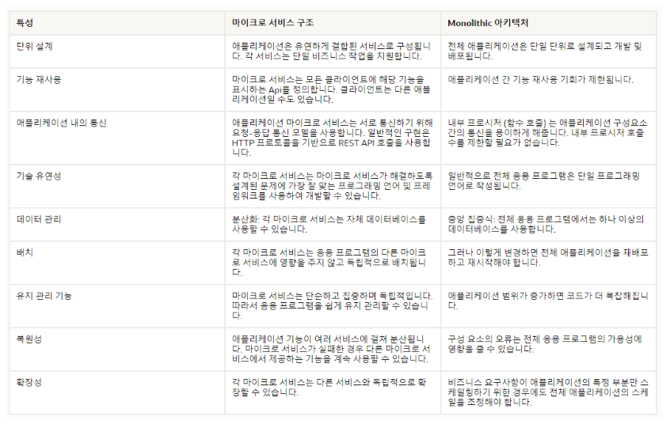

# 마이크로 서비스 아키텍쳐(MSA)

### Monolithic 아키텍쳐

모든 기능을 하나의 어플리케이션에서 비즈니스 로직을 구성해 운영한다.

###### 장점

개발을 하거나 환경설정에 있어 간단하여 작은 사이즈 프로젝트에 용이하다

###### 단점

하나를 수정해도 시스템 전체를 빌드해야 해서 유지보수가 힘들다

작은 문제가 시스템 전체에 문제를 일으킨다

하나의 서비스를 확장하기 위해 전체 프로젝트를 확장해야 한다.

### MSA 아키텍쳐

기능(목적)별로 컴포넌트를 나누고 조합할 수 있도록 구축

###### 장점

모든 서비스가 각각 독립된 서버로 운영되고 배포하기 때문에 문제가 생겨도 다른 서비스에 영향이 가지 않고, 서비스별로 부분 확장이 가능

팀 내에 피드백이 빨라지고 유연하게 운영이 가능

###### 단점

서비스별로 호출할 때 API로 통신하기 때문에 속도가 느림

서비스별로 통신에 맞는 데이터로 맞춰야 함

