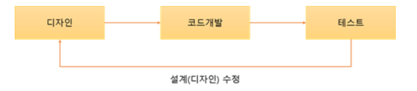
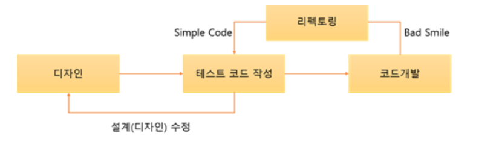
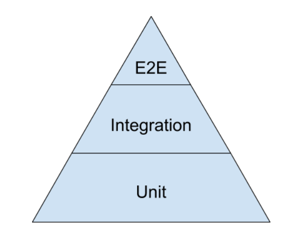
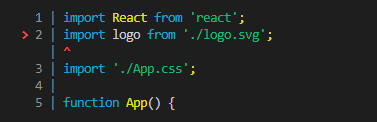
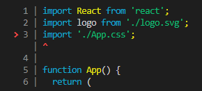

# TDD (Test Driven Development)

개발 할 때 설계를 한 후 코드 개발과 테스트 과정을 거치게 된다.



하지만 TDD는 테스트케이스를 먼저 작성한 후 실제 코드를 개발하는 리팩토링 절차를 밟는다.



반복적인 테스트와 수정을 통해 고품질의 소프트웨어를 탄생시킬 수 있다.

###### 장점

- 작업과 동시에 테스트를 진행하면서 실시간으로 오류 파악이 가능함 (시스템 결함 방지)

- 짧은 개발 주기를 통해 고객의 요구사항을 빠르게 수용 가능. 피드백이 가능하고 진행상황 파악이 쉬움

- 자동화 도구를 이용한 TDD 테스트케이스를 단위 테스트로 사용이 가능함

- 개발자가 기대하는 앱의 동작에 관한 문서를 테스트가 제공해줌

- 객체 지향적인(SOLID) 코드 개발이 가능 (기능별로 모듈화)

###### 단점

- 기존 개발 프로세스에 테스트케이스 설계가 추가되므로 생산 비용 증가

- 테스트의 방향성, 프로젝트 성격에 따른 테스트 프레임워크 선택 등 추가로 고려할 부분의 증가

### Front-end에서의 TDD



- End to End 테스트 : 프로젝트가 브라우저 위에서 제대로 작동하는지 사용자 관점에서 테스트하는 방법, 셀레니움(Selenium)이나 퍼페티어(Puppeteer) 등을 사용

- 통합 테스트 : 기능 단위로 묶어서 테스트하는 방법. 보통 유닛 테스트가 끝난 모듈을 묶어서 확인. 여러 컴포넌트들이 상호작용하고 렌더 되는지, 돔 이벤트가 발생했을때 원하는 UI 변화가 일어나는지 체크

- 유닛 테스트 : 최소 단위로 기능이 잘 동작하는지 확인하는 방법. 컴포넌트가 잘 렌더되는지, 특정 함수가 잘 작동하는지 등을 봄.

### 자바스크립트 테스팅 툴

- Jest

- Mocha

- Jasmine

- Karma

- Chai

테스트를 찾아서 실행하고, 테스트가 통과하는지 검사한다. 그리고 테스트 suites, 테스트 케이스 등을 작성할 수 있는 기능을 제공

- Enzyme

- Vue Test Utils

- react-testing-library

유저가 버튼을 클릭하면 div가 존재하는지 등 앱을 테스트하기 위한 가상 DOM을 제공

### TDD 방법

##### 5가지 규칙

1. Fast: 테스트는 빠르게 동작하여 자주 돌릴 수 있어야 한다.
2. Independent: 각각의 테스트는 독립적이며 서로 의존해서는 안된다.
3. Repeatable: 어느 환경에서도 반복 가능해야 한다.
4. Self-Validating: 테스트는 성공 또는 실패로 bool 값으로 결과를 내어 자체적으로 검증되어야 한다.
5. Timely: 테스트는 적시에 즉, 테스트하려는 실제 코드를 구현하기 직전에 구현해야 한다.

=> 빠르게 독립적으로 어느 환경에서든 실행이 가능하고 검증할 수 있고, 테스트 코드를 먼저 구현

##### 테스트 코드를 먼저 작성해야 하는 이유

- 깔끔한 코드를 작성할 수 있다.
- 장기적으로 개발 비용을 절감할 수 있다.
- 개발이 끝나면 테스트 코드를 작성하는 것은 매우 귀찮다. 실패 케이스면 더욱 그렇다.

##### TDD 순서

1. 실패하는 작은 단위 테스트를 작성한다. 처음에는 컴파일조차 되지 않을 수 있다.
2. 빨리 테스트를 통과하기 위해 프로덕션 코드를 작성한다. 이를 위해 정답이 아닌 가짜 구현 등을 작성할 수도 있다.
3. 그 다음의 테스트 코드를 작성한다. 실패 테스트가 없을 경우에만 성공 테스트를 작성한다.
4. 새로운 테스트를 통과하기 위해 프로덕션 코드를 추가 또는 수정한다.
5. 1~4단계를 반복하여 실패/성공의 모든 테스트 케이스를 작성한다.
6. 개발된 코드들에 대해 모든 중복을 제거하며 리팩토링한다.

# react + typescript + jest

##### typescript react 프로젝트 생성

```
npx create-react-app jest-example --template typescript
```

##### 라이브러리 설치

```
npm i -D jest @types/jest ts-jest
```

**jest** :  javascript 테스트 프레임워크 입니다.

**@types/jest** : jest의 타입 정의를 포함하고 있는 라이브러리 입니다.

**ts-jest** : typescript로 작성된 프로젝트들을 테스트 할 수 있게 해주는 typescript 전처리 라이브러리 입니다.

##### package.json 수정

```
"scripts": {
    ....
    "test": "jest" // coverage 옵션을 주고 싶으면 --coverage를 추가해주면 됩니다.
    ....
}
```

##### jest.config.js 생성 및 설정

```js
module.exports = {
  testPathIgnorePatterns: ["<rootDir>/client/node_modules/"],
  transform: {
    "^.+\\.(js|jsx|ts|tsx)$": "ts-jest",
  },
  moduleNameMapper: {
    "^src/(.*)$": "<rootDir>/src/$1",
  },
  testEnvironment: "jsdom",
};
```

**testPathIgnorePatterns** : 테스트 하지 않는 경로를 설정할 수 있습니다.

**transform** : "정규표현식" : "transformer" => 경로를 정규표현식으로 설정하고 transformer를 지정할 수 있습니다.

trasnformer는  source 파일들을 변환해주는 동기적으로 실행되는 함수를 제공해주는 모듈입니다.

babel (babel-jest) 과 typescript(ts-jest)를 설정할 수 있습니다.

저는 typescript를 파일내에 사용하였으므로 ts-jest를 설정해주었습니다.

babel은 적용해야할 boiler plate 코드들이 많다고 판단하여 적용하지 않았습니다.

**moduleNameMapper** : 정규표현식을 통해 경로의 이름과 실제 경로를 설정해줄 수 있습니다.

**testEnvironment** : 테스팅 되는 환경을 정의 하여 줍니다. 기본값은 "node" 입니다. 만약에 웹앱과 같은 브라우저 환경에서 테스트 되어야 한다면 "jsdom" 옵션을 주면 됩니다.

node 환경으로 정의되어 있다면 브라우저 에서 제공하는 api들은 사용할 수 없게 되어집니다. 

ex) document.createElement('div')

##### jest 버전이 27 이상일 경우

```js
 npm i jest-environment-jsdom

 // jest.config.js
 module.exports = {
+  testEnvironment: 'jest-environment-jsdom',
   // ... other options ...
 }
```

##### svg 허용



```js
npm i jest-svg-transformer

// jest.config.js
 module.exports = {
   moduleNameMapper: {
+    "^.+\\.svg$": "jest-svg-transformer",
    }
   // ... other options ...
}
```

##### css 허용



```js
npm i indentity-obj-proxy

// jest.config.js
 module.exports = {
   moduleNameMapper: {
+    "\\.(css|less|scss|sass)$": "identity-obj-proxy",
    }
   // ... other options ...
}
```

##### jest-dom import

App.test.tsx에 임포트

```
import '@testing-library/jest-dom'
```
