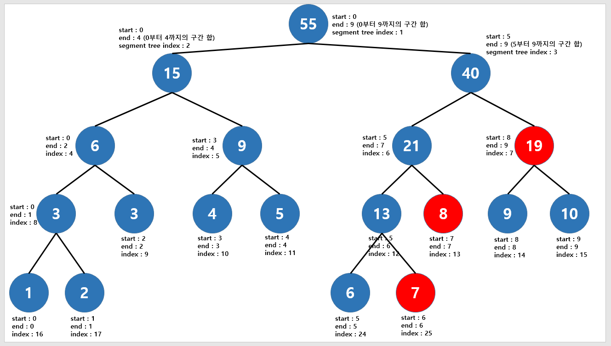

## LIS (가장 긴 증가하는 부분 수열)

- 오름차순으로 증가하는 부분 수열중 가장 길이가 긴 수열을 찾는 알고리즘 (DP 사용)

- 위 수열에서 10 20 30 50

- ```python
  # 기본 탬플릿
  n = int(input())  # 수열의 길이
  array = list(map(int, input().split()))  # 주어진 수열
  
  # DP 테이블 1로 초기화
  dp = [1] * n
  
  for i in range(1, n):
      for j in range(0, i):
          if array[j] < array[i]:
              dp[i] = max(dp[i], dp[j] + 1)
  
  # 가장 긴 증가하는 부분 수열의 길이값
  result = max(dp)
  print(result)
  ```

- https://www.acmicpc.net/problem/2565

- ```python
  # 일단 배열에 저장해(A전봇대 : 인덱스, B전봇대 : 값) 놓고 숫자가 작아지면 교차하는것
  # 최대 전깃줄 개수를 dp에 저장하고 마지막에 뺴줌
  
  n = int(input())
  
  # 위치의 번호는 500까지라 501개
  arr = [0] * 501
  dp = [0] * 501
  
  # 위치 갯수만큼 입력받고 arr에 저장
  for i in range(n):
      a, b = map(int, input().split())
      arr[a] = b
  
  # 뒤에서부터(앞에서부터 해도 똑같은데 왜 뒤부터했지,,) 순회
  for k in range(500, 0, -1):
      # 값이 0이 아닐때
      if arr[k]:
          # max_dp를 0으로 두고 k에서부터 끝까지 for문 돌면서
          max_dp = 0
          for j in range(k, 501):
              # 자기보다 큰 값이고 dp값이 max_dp보다 크면 max_dp 교체
              if arr[k] < arr[j] and max_dp < dp[j]:
                  max_dp = dp[j]
          # max_dp에 1을 더한 값이 그 값의 dp
          dp[k] = max_dp + 1
  # dp에서 가장 큰 값이 최대 연결된 전깃줄 수 이므로 n에서 빼준 값이 답
  print(n - max(dp))
  ```

- 바이너리 서치 사용
  
  ```python
  n = int(input())
  array = list(map(int, input().split()))
  
  def binarySearch(x):
      global resultLen
      s = 0
      e = resultLen - 1
      while s <= e:
          mid = (s + e) // 2
          if result[mid] == x:
              return mid
          elif result[mid] < x:
              s = mid + 1
          else:
              e = mid - 1
      return s
  
  result = [array[0]]
  resultLen = 1
  
  for i in array:
      if result[-1] < i:
          result.append(i)
          resultLen += 1
      else:
          idx = binarySearch(i)
          result[idx] = i
  print(resultLen)
  ```

## 투 포인터

- 특정 조건을 만족하는 연속 구간을 구할 때 사용

- 2개의 포인터를 조작하며 답을 찾음

- 

- https://www.acmicpc.net/problem/16472

- ```python
  from collections import defaultdict
  
  n = int(input())
  word = input()
  s = e = result = 0
  # 딕셔너리 추가 시 기본값을 주는 딕셔너리
  my_alpa = defaultdict(int)
  # 끝 포인터가 word 끝까지 올 때 까지 반복
  while e < len(word):
      # 딕셔너리에 한글자 추가 후 끝 포인터 이동
      my_alpa[word[e]] += 1
      e += 1
      # 딕셔너리의 크기가 n 보다 커지게 되면
      if len(my_alpa) == n + 1:
          # n보다 적어질 때까지 word[s] 를 1씩 빼고 s를 1씩 더해주며 범위를 줄여감
          # 만약에 딕셔너리 벨류가 0이 되면 pop 해줌으로 딕셔너리 크기를 줄여줌
          while len(my_alpa) != n:
              my_alpa[word[s]] -= 1
              if my_alpa[word[s]] == 0:
                  my_alpa.pop(word[s])
              s += 1
      # 갱신
      if result < e - s:
          result = e - s
  print(result)
  ```

## Sliding Window

- 배열이나 리스트 요소의 일정 범위의 값을 비교할 때 유용함

- 투 포인터는 연속 구간의 길이가 가변적일 때 사용하지만 슬라이딩 윈도우는 구간의 크기가 고정일 때 사용

- 배열 안의 구간의 크기가 고정인 임시 배열을 만들어 슬라이딩

- 

- https://www.acmicpc.net/problem/2559
  
  ```python
  N, K = map(int, input().split())
  arr = list(map(int, input().split()))
  # 투 포인터와 비슷하게 s, e 인덱스를 정해놓음
  start = 0
  end = K
  max = sum(arr[start:end])
  result = max
  for i in range(N-K):
      # start 값과 end 값을 하나씩 이동하며 더하고 빼줌
      max = max - arr[start + i] + arr[end + i]
      # 갱신
      if result < max:
          result = max
  print(result)
  ```

## Hash

- 딕셔너리임

- https://www.acmicpc.net/problem/10816

- ```python
  N = int(input())
  sang = list(map(int, input().split()))
  M = int(input())
  card = list(map(int, input().split()))
  result = dict()
  # 상근이가 가진 카드들이 있는지 없는지 신경써서 받아야 함(없는 값 찾으면 오류 발생)
  for i in sang:
      if i not in result:
          result[i] = 1
      else:
          result[i] += 1
  for j in card:
      try:
          print(result[j], end=' ')
      except:
          print(0, end=' ')
  ```

- ```python
  # defaultdict 초기 값을 줘서 없는 값을 찾아도 오류 발생 안함 개꿀
  from collections import defaultdict
  
  N = int(input())
  sang = list(map(int, input().split()))
  M = int(input())
  card = list(map(int, input().split()))
  result = defaultdict(int)
  for i in sang:
      result[i] += 1
  for j in card:
      print(result[j], end=' ')
  ```

- ```python
  # 갯수를 구해서 자동으로 딕셔너리로 만들어줌
  from collections import Counter
  
  N = int(input())
  sang = list(map(int, input().split()))
  M = int(input())
  card = list(map(int, input().split()))
  result = Counter(sang)
  for j in card:
      try:
          print(result[j], end=' ')
      except:
          print(0, end=' ')
  ```

## 플러드필

- 그래프 탐색을 활용하여 색칠하는 알고리즘

- 

- https://www.acmicpc.net/problem/2667
  
  ```python
  from collections import deque
  
  N = int(input())
  MAP = [list(map(int, input())) for _ in range(N)]
  queue = deque()
  result = []
  di = [1, -1, 0, 0]
  dj = [0, 0, 1, -1]
  for i in range(N):
      for j in range(N):
          if MAP[i][j] == 1:
              queue.append([i, j])
              q_count = 1
              # 0으로 바꾸고
              MAP[i][j] = 0
              while queue:
                  x, y = queue.popleft()
                  for k in range(4):
                      nx, ny = x + di[k], y + dj[k]
                      # 1인 곳만 방문
                      if 0 <= nx < N and 0 <= ny < N and MAP[nx][ny] == 1:
                          MAP[nx][ny] = 0
                          q_count += 1
                          queue.append([nx, ny])
              result.append(q_count)
  result.sort()
  print(len(result))
  for a in result:
      print(a)
  ```

## 부분합

- 배열의 일부 구간에 대한 합을 빠르게 구하는 스킬

- sum 배열을 만들어 구함
1. 1차원 배열
   
   

2. 2차원 배열
   
   
   
   
   
   - 검은색 27을 구하기 위해선
   
   - 5 (arr[i-1]\[j-1]) + 초록색(sum_arr[i-1]\[j]) + 주황색(sum_arr[i]\[j-1]) - 빨간색(중복)(sum_arr[i-1]\[j-1])
     
     ```python
     arr = [[1, 2, 3, 4], 
            [2, 3, 4, 5], 
            [3, 4, 5, 6]]
     
     m = 4
     n = 3
     
     sum_arr = [[0 for _ in range(m+1)] for _ in range(n+1)]
     for i in range(1, n+1):
         for j in range(1, m+1):
             sum_arr[i][j] = arr[i-1][j-1] + (sum_arr[i-1][j]) + (sum_arr[i][j-1]) - (sum_arr[i-1][j-1])
     
     for i in range(n+1):
         print(sum_arr[i])
     ```

3. 구간 합
   
   

## Trie

- 입력되는 문자열을 Tree 형식으로 만들어 빠른 문자열 검색이 가능

- 자동완성이나 검색어 추천 기능에서 Trie 알고리즘 사용
  
  
  
  ```python
  class Node(object):
      def __init__(self, key, data=None):
          # 해당 노드의 문자
          self.key = key
          # 문자열이 끝나는 위치를 알려줌(ex car -> key = "r" data = "car"  c,a 에는 none)
          self.data = data
          # 자식 노드를 추가
          self.children = {}
  
  class Trie:
      def __init__(self):
          self.head = Node(None)
  
      def insert(self, string):
          current_node = self.head
  
          for char in string:
              # 자식 노드중 같은 문자가 없다면 노드 생성
              if char not in current_node.children:
                  current_node.children[char] = Node(char)
              # 같은 문자가 있다면 생성하지 않고 해당 노드로 이동
              current_node = current_node.children[char]
          # 문자열이 다 끝난 지점 노드의 data에 string 입력
          current_node.data = string
  
      def search(self, string):
          current_node = self.head
  
          for char in string:
              if char in current_node.children:
                  # 자식 노드들을 찾아가며 갱신
                  current_node = current_node.children[char]
              else:
                  return False
          # 데이터가 있다면 마지막 글자(문자의 끝)이므로 존재
          if current_node.data:
              return True
          else:
              return False
  
      # profix로 시작되는 단어를 찾고 배열로 리턴
      def starts_with(self, prefix):
          current_node = self.head
          words = []
  
          for p in prefix:
              if p in current_node.children:
                  current_node = current_node.children[p]
              else:
                  return None
  
          current_node = [current_node]
          next_node = []
          while True:
              for node in current_node:
                  # node에 data가 있으면 마지막 글자인 것 이므로 word에 추가
                  if node.data:
                      words.append(node.data)
                  # 다음 노드에 children.values()를 다 추가해 줌
                  next_node.extend(list(node.children.values()))
              # 다음 노드가 있다면
              if len(next_node) != 0:
                  # 노드 갱신하고 next_node를 비워줌
                  current_node = next_node
                  next_node = []
              # 다음 노드가 없을 때 까지 반복
              else:
                  break
  
          return words
  ```
  
  ```python
  trie = Trie()
  word_list = ["frodo", "front", "firefox", "fire"]
  for word in word_list:
      trie.insert(word)
  
  print(trie.search("friend"))
  print(trie.search("frodo"))
  print(trie.search("fire"))
  print(trie.starts_with("fire"))
  print(trie.starts_with("fro"))
  print(trie.starts_with("jimmy"))
  print(trie.starts_with("f"))
  
  # output
  False
  True
  True
  ['fire', 'firefox']
  ['frodo', 'front']
  None
  ['fire', 'frodo', 'front', 'firefox']
  ```
  
  - https://www.acmicpc.net/problem/5052
  
  - ```python
    import sys
    input = sys.stdin.readline
    
    class Node(object):
        def __init__(self, key, data=None):
            self.key = key
            self.data = data
            self.children = {}
    
    class Trie:
        def __init__(self):
            self.head = Node(None)
    
        def insert(self, string):
            current_node = self.head
    
            for char in string:
                if char not in current_node.children:
                    current_node.children[char] = Node(char)
                current_node = current_node.children[char]
            current_node.data = string
    
        def search(self, string):
            current_node = self.head
    
            for char in string:
                if char in current_node.children:
                    current_node = current_node.children[char]
                else:
                    return False
    
            # 차일드가 있으면 겹치는게 있는 거라 안됨 
            if current_node.children:
                return True
            else:
                return False
    ```
    
    t = int(input())
    for _ in range(t):
    
        n = int(input())
        trie = Trie()
        arr = []
        for _ in range(n):
            phone = input().rstrip()
            trie.insert(phone)
            arr.append(phone)
        flag = 0
        for i in arr:
            # 만약에 trie.search 가 트루라면 flag를 세우고 break
            if trie.search(i):
                flag = 1
                break
        if flag:
            print('NO')
        else:
            print('YES')
    
    ```
    
    ```

## Segment Tree

- 구간 합을 선형적으로 구하면 O(N) 이 된다.
- 구간 합을 구하고 각각의 값을 수정할 때 빠르게 구하고 싶다!
- 각 노드가 구간 or 구간의 정보를 저장하고 있는 트리 => O(logN)
- 인덱스가 1부터 시작해야 왼쪽 자식으로 갈 때 * 2 해주면 되서 편함
- 
- 더하는 경우
- 
- 수정하는 경우
- 

```python
arr = [1, 2, 3, 4, 5, 6, 7, 8, 9, 10]
# 실제로는 데이터의 개수 N에 4를 곱한 크기만큼 미리 세그먼트 트리의 공간을 할당한다.
tree = [0] * (len(arr) * 4)


# <세그먼트 트리를 배열의 각 구간 합으로 채워주기>
# start : 배열의 시작 인덱스, end : 배열의 마지막 인덱스, index : 세그먼트 트리의 인덱스
def init(start, end, index):
    # 가장 끝에 도달했으면 arr 삽입
    if start == end:
        tree[index] = arr[start]
        return tree[index]
    mid = (start + end) // 2
    # 재귀를 통해 좌측 노드와 우측 노드를 채워주면서 부모 노드의 값도 채워준다.
    tree[index] = init(start, mid, index * 2) + init(mid + 1, end, index * 2 + 1)
    return tree[index]


# <구간 합을 구하는 함수>
# start : 시작 인덱스, end : 마지막 인덱스
# left, right : 구간 합을 구하고자 하는 범위
def interval_sum(start, end, index, left, right):
    # 범위 밖에 있는 경우
    if left > end or right < start:
        return 0
    # 범위 안에 있는 경우
    if left <= start and right >= end:
        return tree[index]
    # 그렇지 않다면 두 부분으로 나누어 합을 구하기
    mid = (start + end) // 2
    # start와 end가 변하면서 구간 합인 부분을 더해준다고 생각하면 된다. (바이너리)
    return interval_sum(start, mid, index * 2, left, right) + interval_sum(mid + 1, end, index * 2 + 1, left, right)


# <특정 원소의 값을 수정하는 함수>
# 특정 원소를 수정하면 구간 합이 당연히 달라진다.
# 이때, 해당 원소를 포함하고 있는 모든 구간 합 노드들을 갱신해주면 된다. 
# (즉, 전체가 아닌 부분적인 노드들만 바꿔주면 된다!)
# start : 시작 인덱스, end : 마지막 인덱스
# what : 구간 합을 수정하고자 하는 노드
# value : 수정할 값
def update(start, end, index, what, value):
    # 범위 밖에 있는 경우
    if what < start or what > end:
        return
    # 범위 안에 있으면 내려가면서 다른 원소도 갱신
    tree[index] += value
    if start == end:
        return
    mid = (start + end) // 2
    update(start, mid, index * 2, what, value)
    update(mid + 1, end, index * 2 + 1, what, value)


init(0, len(arr) - 1, 1)
print(interval_sum(0, len(arr) - 1, 1, 0, 9))  # 0부터 9까지의 구간 합 (1 + 2 + ... + 9 + 10)
print(interval_sum(0, len(arr) - 1, 1, 0, 2))  # 0부터 2까지의 구간 합 (1 + 2 + 3)
print(interval_sum(0, len(arr) - 1, 1, 6, 7))  # 0부터 2까지의 구간 합 (7 + 8)

# arr[0]을 +4만큼 수정
update(0, len(arr) - 1, 1, 0, 4)
print(interval_sum(0, len(arr) - 1, 1, 0, 2))   # 0부터 2까지의 구간 합 ((1 + 4) + 2 + 3)

# arr[9]를 -11만큼 수정
update(0, len(arr) - 1, 1, 9, -11)
print(interval_sum(0, len(arr) - 1, 1, 8, 9))   # 8부터 9까지의 구간 합 (9 + (10 - 11))
```

- https://www.acmicpc.net/problem/2042

- ```python
  import sys
  input = sys.stdin.readline
  
  def init(start, end, index):
      if start == end:
          tree[index] = arr[start]
          return tree[index]
      mid = (start + end) // 2
      tree[index] = init(start, mid, index * 2) + init(mid + 1, end, index * 2 + 1)
      return tree[index]
  
  def interval_sum(start, end, index, left, right):
      if left > end or right < start:
          return 0
      if left <= start and right >= end:
          return tree[index]
      mid = (start + end) // 2
      return interval_sum(start, mid, index * 2, left, right) + interval_sum(mid + 1, end, index * 2 + 1, left, right)
  
  def update(start, end, index, what, value):
      if what < start or what > end:
          return
      tree[index] += value
      if start == end:
          return
      mid = (start + end) // 2
      update(start, mid, index * 2, what, value)
      update(mid + 1, end, index * 2 + 1, what, value)
  
  n, m, k = map(int, input().split())
  arr = [0] * n
  for i in range(n):
      arr[i] = int(input())
  tree = [0] * (len(arr) * 4)
  
  init(0, len(arr) - 1, 1)
  # m + k 번 반복
  for _ in range(m + k):
      a, b, c = map(int, input().split())
      # a == 1일 때 update를 해줌
      if a == 1:
          update(0, len(arr)-1, 1, b-1, c - arr[b-1])
          # arr도 갱신함
          arr[b-1] = c
      # a == 2일 때 sum 해주고 출력
      else:
          print(interval_sum(0, len(arr)-1, 1, b-1, c-1))
  ```

## 펜윅 트리

구간에 대한 연산을 하는데 세그먼트 트리에 비해 메모리 소모량이 적다.


가장 오른쪽에 있는 1의 값을 적었는데 이를 x라고 두면 현재 index에서 x 칸만큼 더한 값을 가진다.

예를 들어 12는 1100이고 x는 4이다. 그러면 arr[12] + arr[11] + arr[10] + arr[9]의 값을 가진다.

##### 영향 받는 노드 찾기

arr[] 배열에 arr[9]을 넣는다고 가정한다면 arr[9]에 영향을 받는 노드들을 찾아야 한다.


9(1001), 10(1010), 12(1100), 16(10000) 인데 1이 존재하는 최 하위 비트에 1을 더한 값이 영향을 받는 노드들이다.

여기서 다음 인덱스 번호를 찾기 위해서는 Idx = Idx + (Idx & -Idx)를 해주면 된다.

9를 예시로 들면 Idx = 1001, -Idx(보수) = 0111 이 되고 둘을 & 연산하면 최 하위 비트인 0001이 나오게 된다.

##### 합 구하기


7(0111), 6(0110), 4(0100) 의 합이 되는데 이는 update와 반대로 1이 존재하는 최 하위 비트에서 1을 빼주면 된다.

```python
import sys
input = sys.stdin.readline

def update_fenwick_tree(tree, index, value):
    while index < len(tree):
        tree[index] += value
        index += (index & -index)
    return tree

def query_fenwick_tree(tree, index):
    res = 0
    while index > 0:
        res += tree[index]
        index -= (index & -index)
    return res

N, M, K = map(int, input().split())

tree = [0]*(N+1)
nums = [int(input()) for _ in range(N)]
for i in range(N):
    tree = update_fenwick_tree(tree, i+1, nums[i])
for _ in range(M + K):
    a, b, c = map(int, input().split())
    if a == 1:
        tree = update_fenwick_tree(tree, b, c - nums[b-1])
        nums[b-1] = c
    elif a == 2:
        print(query_fenwick_tree(tree, c) - query_fenwick_tree(tree, b-1))
```