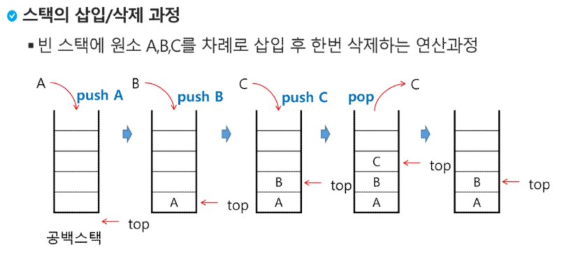

# Stack 1

* 자료구조 : 데이터를 효율적으로 저장하고 관리하기 위한 방법
* ADT : 데이터추상화  구조화된 데이터를 필요한 연산과 함께 묶어서 표현, 데이터의 특징+연산

## 스택

* 물건을 쌓아 올린 듯 자료를 쌓아 올린 형태의 자료구조
* 가장 마지막에 들어간 것이 가장 처음에 나온다(후입선출(LIFO))
* 가장 위(top)에서만 데이터의 삽입(push), 삭제(pop)가 일어난다.
* 연산
  * 삽입 : 저장소에 자료를 저장 push
  * 삭제 : 저장소에서 자료를 꺼낸다(top-1 하고 굳이 지울 필요는 없음) pop
  * 스택이 공백인지 확인 : isEmpty
  * 스택의 top에 있는 원소를 반환 : peek
* 

- ```python
  class stack:
      def __init__(self, size):
          self.size = size
          self.arr = [0] * size
          self.top = -1
  
      def push(self, a):
          self.top += 1
          self.arr[self.top] = a
  
      def pop(self):
          self.top -= 1
          return self.arr[self.top + 1]
  
      def is_empty(self):
          if self.top == -1:
              return True
          else:
              return False
  
      def is_full(self):
          if self.top == self.size - 1:
              return True
          else:
              return False
  ```

## 재귀호출

* 자기 자신을 호출하여 순환 수행되는 것
* 팩토리얼, 피보나치 등

## Memoization & DP

### memoization

* 재귀로 구현하면 많은 중복호출이 존재

* 이전에 계산한 값을 저장하여 다시 계산하지 않도록 하는 것

* ```python
  def fibo1(n):
      flobal memo
      if n >= 2 and len(memo) <= n:
          memo.append(fibo1(n-1) + fibo1(n-2))
      return memo[n]
  memo = [0, 1, 1, 2, 3, 5, 8, 13, 21]
  ```

### DP

* DP : 동적 계획 알고리즘 => 그리디 알고리즘과 같이 최적화 문제를 해결하는 알고리즘

* 먼저 입력 크기가 작은 부분 문제들을 모두 해결한 후에 그 해들을 이용하여 보다 큰 크기의 부분 문제들을 해결하여 최종 문제를 해결

* ```python
  def fibo2(n):
      f = [0, 1]
      for i in range(2, n+1):
          f.append(f[i-1] + f[i-2])
      return f[n]
  ```

