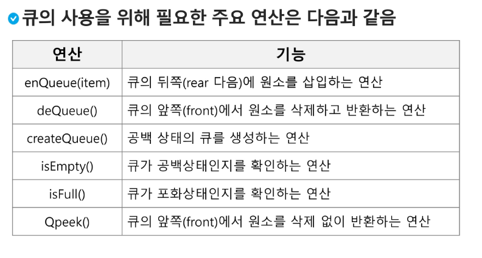
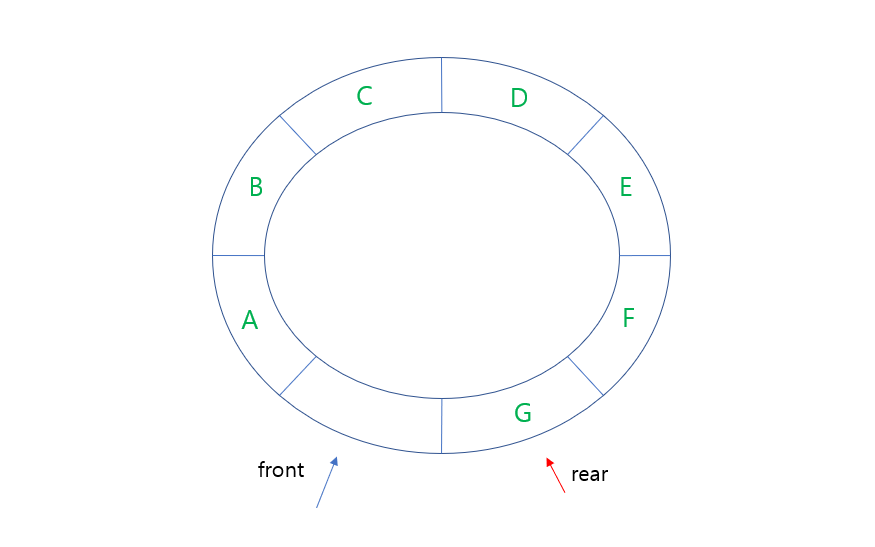
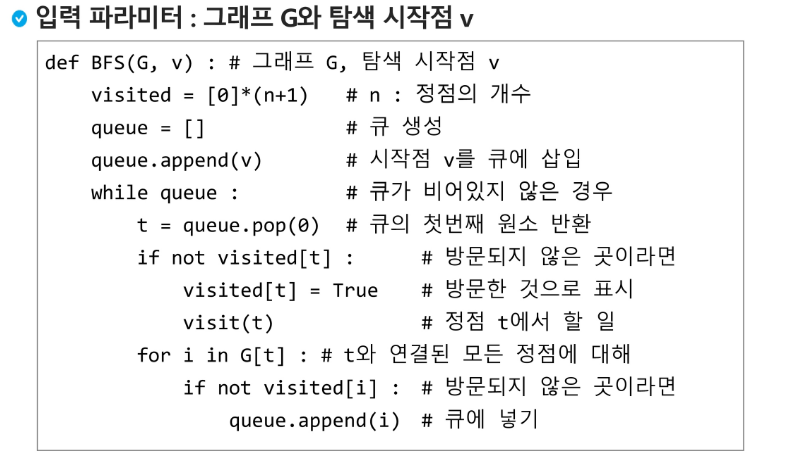
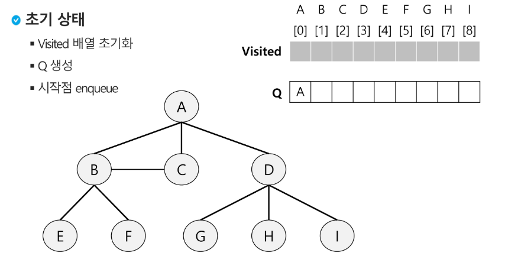
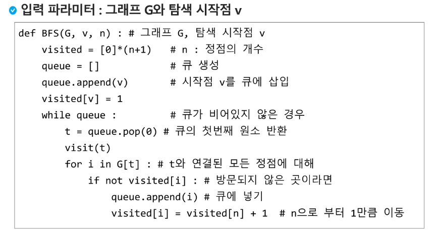

# Queue

* 스택과 마찬가지로 삽입과 삭제의 위치가 제한적인 자료구조

* 선입선출 구조(FIFO) : 가장 먼저 삽입된 원소가 가장 먼저 삭제함

* 

* front : 삭제된 위치 , rear : 저장된 위치  - 둘 다 -1로 초기화해놓음

* 삽입하면 rear + 1, 삭제하면 front + 1후 꺼냄

  ```python
  class Queue:
  
      # createQueue
      def __init__(self, size):
          self.size = size
          self.items = [None] * size
          self.rear = -1
          self.front = -1
  
      def enQueue(self, el):
          if self.isFull():
              # 여러가지 해결방법
              # 1. queue의 크기를 늘린다.
              # 2. 또다른 예외처리
              print('Queue is Full!!')
          else:
              self.rear += 1
              self.items[self.rear] = el
  
      def deQueue(self):
          if self.isEmpty():
              print('Queue is Empty!!')
          else:
              self.front += 1
              return self.items[self.front]
  
      def isEmpty(self):
          # 선형 큐에서 큐가 비어 있다는 뜻
          return self.rear == self.front
  
      def isFull(self):
          return self.rear == self.size - 1
  
      def QPeek(self):
          return self.items[self.front]
  ```

## 선형큐

* 선형 큐 이용시의 문제점 : 잘못된 포화 상태 인식
  * 선형 큐를 이용하여 원소의 삽입과 삭제를 계속할 경우, 배열의 앞부분에 활용할 수 있는 공간이 있음에도 불구하고, rear = n-1 인 상태 즉, 포화상태로 인식하여 더 이상의 삽입을 수행하지 않게 됨

* 해결 방법 : 매 연산마다 저장된 원소들을 배열의 앞부분으로 이동시킴 => 효율성 감소
* import queue
* from collection import deque

## 원형큐

* 1차원 배열을 사용하되, 논리적으로는 배열의 처음과 끝이 연결되어 원형 형태의 큐를 이룬다고 가정하고 이용

* 초기 공백 상태 front = rear = 0  마지막 인덱스 n-1 다음 0인덱스로 이동 

  rear : (rear + 1) % QueueSize

* front 공백상태와 포화상태 구분을 위해 front가 있는 자리는 사용하지 않고 항상 빈자리

* 공백상태 : front == rear

* 포화상태 : 삽입 할 rear의 다음 위치 == 현재 front /  (rear + 1) % QueueSize == front

* 

  ```python
  MAX_QSIZE = 10
  class CircularQueue :
      def __init__(self):
          self.front = 0
          self.rear = 0
          self.items = [None] * MAX_QSIZE
          
      def enqueue(self, item):
          if not self.isFull():
              self.rear = (self.rear + 1) % MAX_QSIZE
              self.items[self.rear] = item
      
      def dequeue(self):
          if not self.isEmpty():
              self.front = (self.front+1) % MAX_QSIZE
              return self.items[self.front]
          
      def isEmpty(self):
          return self.front == self.rear
  
      def isFull(self):
          return self.front == (self.rear+1)%MAX_QSIZE
  
      def peek(self):
          if not self.isEmpty():
              return self.items[(self.front+1)%MAX_QSIZE]
  ```

## 우선순위 큐

* 우선순위를 가진 항목들을 저장하는 큐
* FIFO 순서가 아니라 우선순위가 높은 순서대로 먼저 나가게 된다.
* 배열을 이용하여 자료 저장
* 원소를 삽입하는 과정에서 우선 순위를 비교하여 적절한 위치에 삽입하는 구조
* 가장 앞에 최고 우선순위의 원소가 위치하게 됨
* import heapq
* from queue import PriorityQueue

## 큐의활용 : 버퍼

* 버퍼 : 데이터를 한 곳에서 다른 한 곳으로 전송하는 동안 일시적으로 그 데이터를 보관하는 메모리의 영역
* 버퍼링 : 버퍼를 활용하는 방식 또는 버퍼를 채우는 동작을 의미

## BFS(Breadth First Search)

* 너비우선탐색은 탐색 시작점의 인접한 정점들을 먼저 모두 차례로 방문한 후에, 방문했던 정점을 시작점으로 하여 다시 인접한 정점들을 차례로 방문하는 방식
* 인접한 정점들에 대해 탐색을 한 후, 차례로 다시 너비우선탐색을 진행해야 하므로, 선입선출 형태인 큐를 활용
* 
* 
* 
* 문제점 : 큐의 길이를 확정하기 힘듬 -> while문 들어가기 전 이미 줄 서고 있는지 확인을 해줌
* 빠져 나올때 visited에 표기하지 않고 줄 설때 바로 표기함
* 
* 

