# 트리

## 트리

* 비선형 구조
* 원소들 간에 1:n 관계를 가지는 자료구조
* 노드(node) : 트리의 원소
* 간선(edge) : 노드를 연결하는 선, 부모 노드와 자식 노드를 연결
* 루트노드(root node) : 트리의 시작 노드
* 노드의 차수 : 노드에 연결된 자식 노드의 수  

## 이진 트리

* 모든 노드들이 최대 2개의 서브트리를 갖는 특별한 형태의 트리

* 포화 이진 트리 : 모든 레벨에 노드가 포화상태로 차 있는 이진 트리

  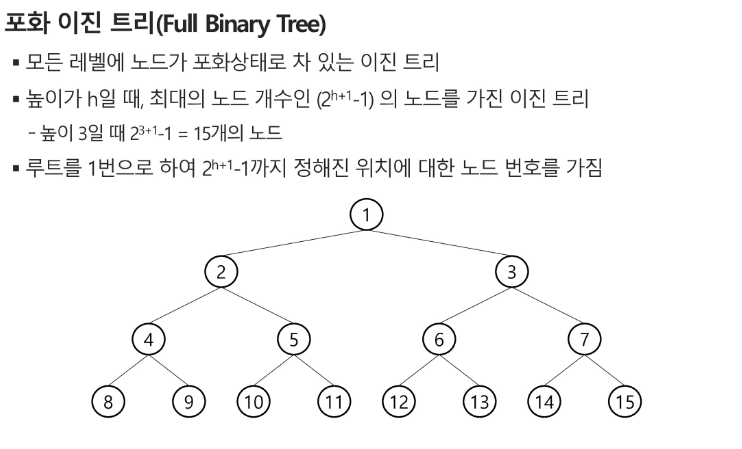

* 완전 이진 트리 : 높이가 h이고 노드 수가 n개 일 때, 포화 이진 트리의 노드 번호 1번부터 n번까지 빈자리가 없는 이진 트리

  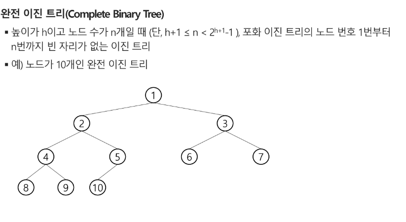

* 편향 이진 트리 : 높이 h에 대한 최소 개수의 노드를 가지면서 한쪽 방향의 자식 노드만을 가진 이진 트리

  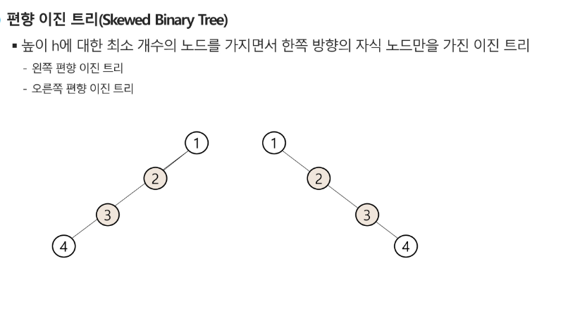

* 이진트리 순회 : 트리의 각 노드를 중복되지 않게 방문하는 것

  * 전위 순회 : VLR - 부모노드 방문 후 자식노드를 좌, 우 순서로 방문

    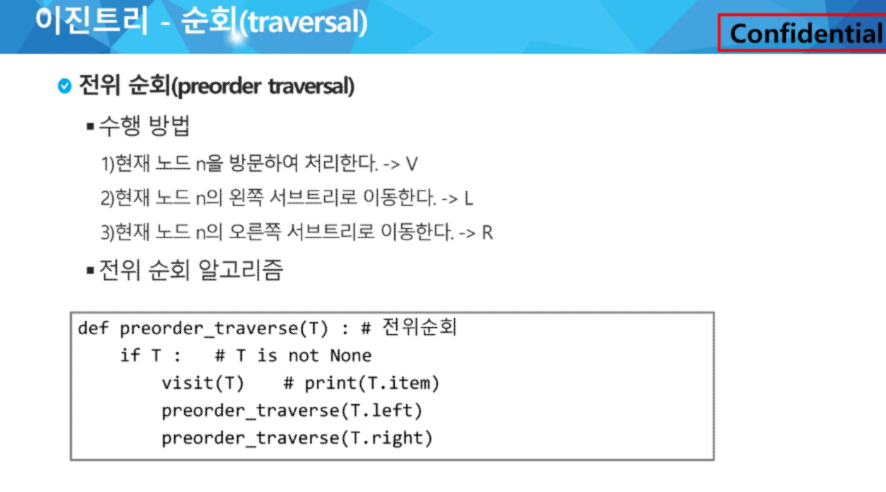

    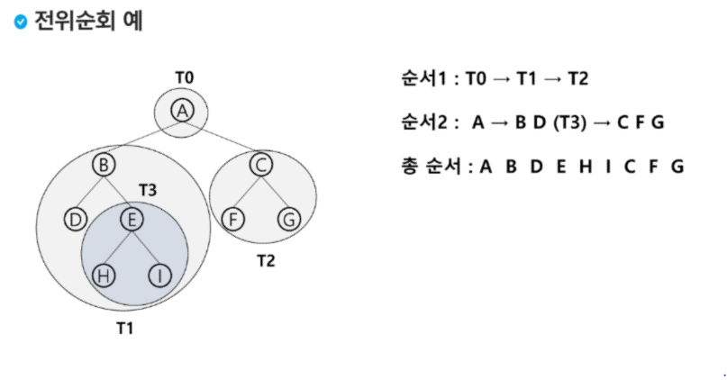

    
  
  * 중위 순회 : LVR - 왼쪽 자식노드, 부모노드, 오른쪽 자식노드 순으로 방문
  
    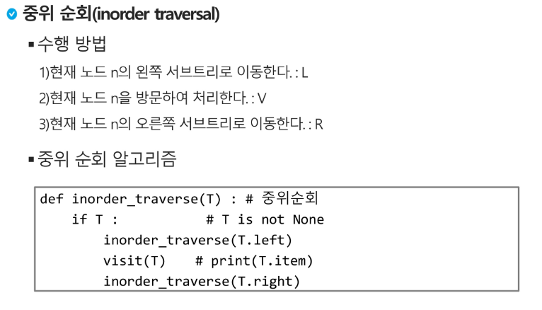
  
    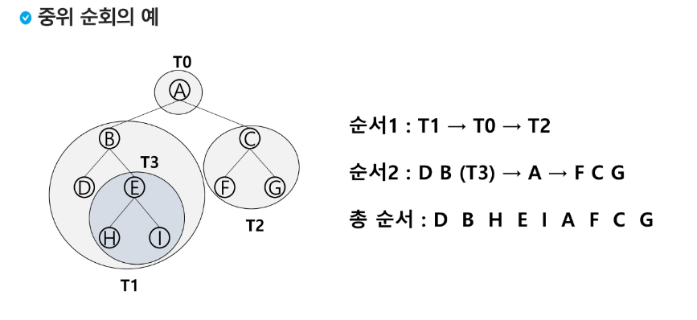
  
  * 후위 순회 : LRV - 자식노드를 좌우 순서로 방문한 후, 부모노드로 방문한다.
  
    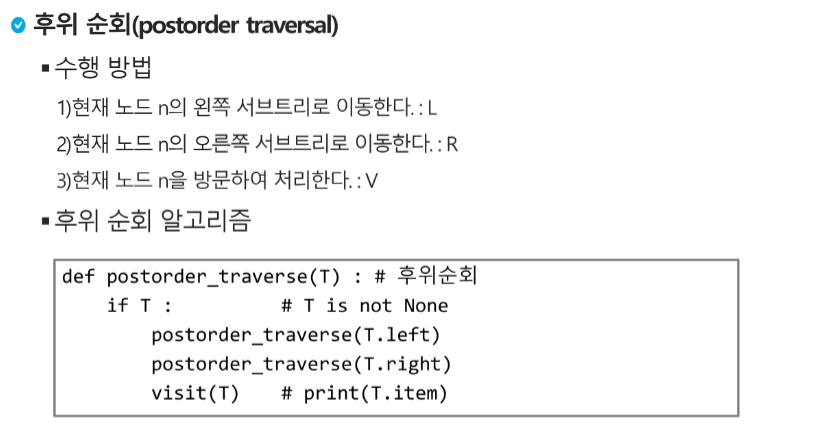
  
    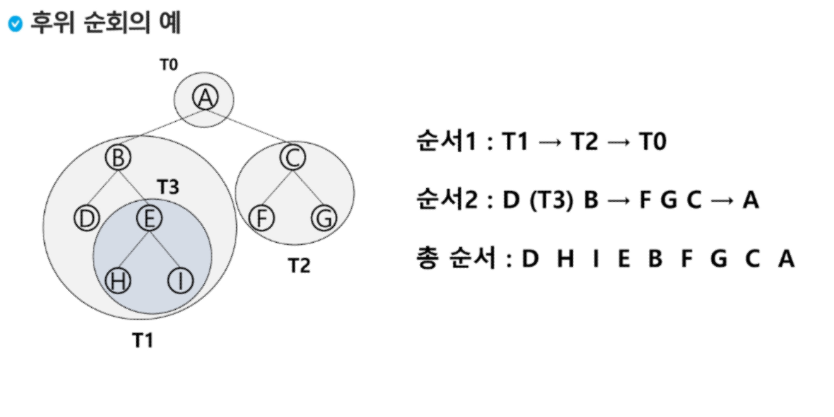

## 이진트리의 표현

* 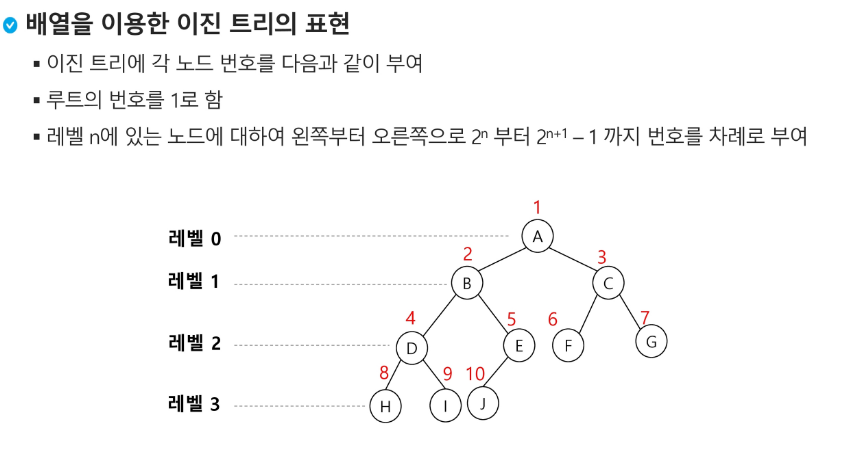

* 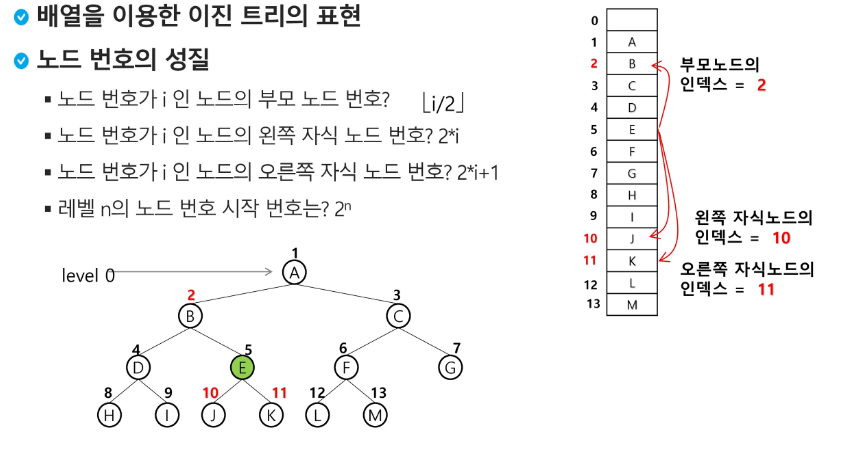

* 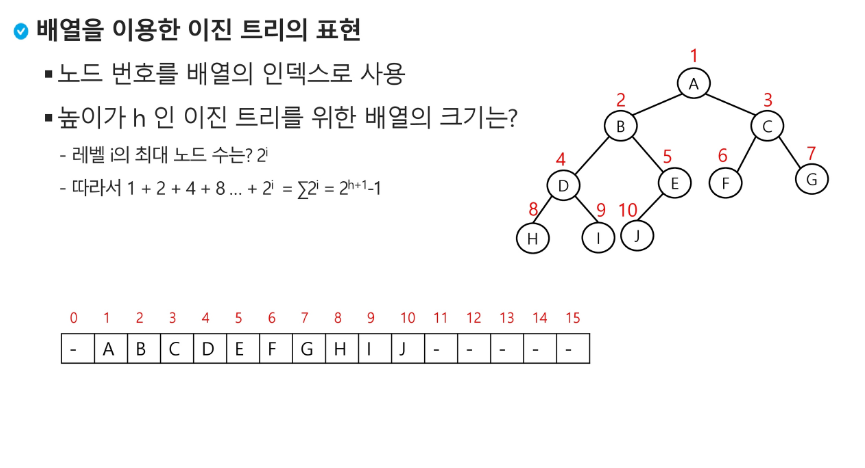

* 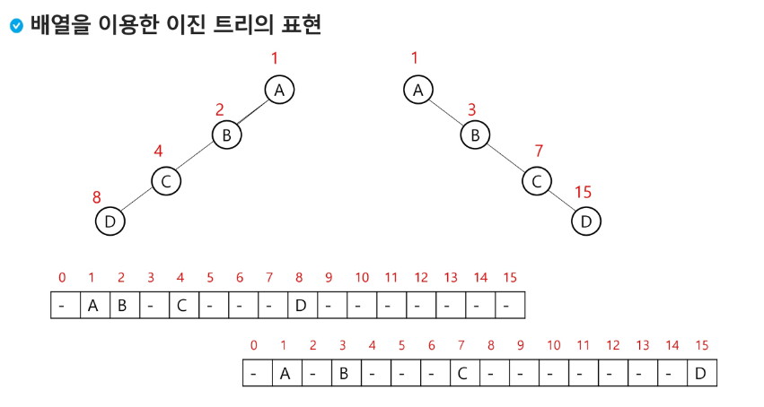

* 비효율적

* 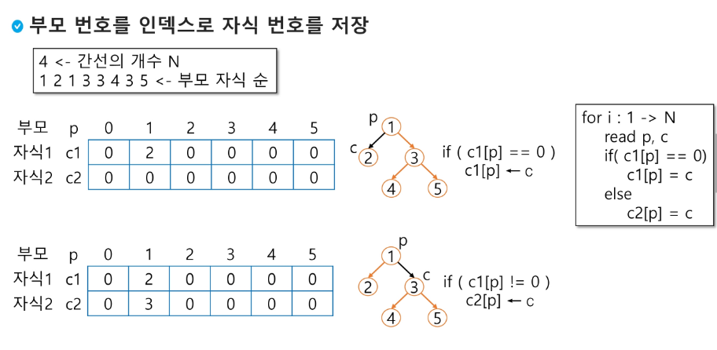

* 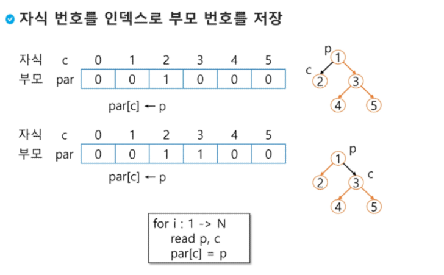

* 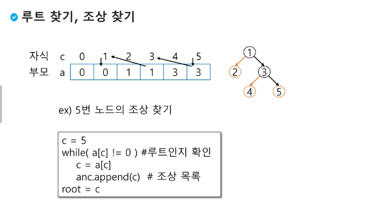

* 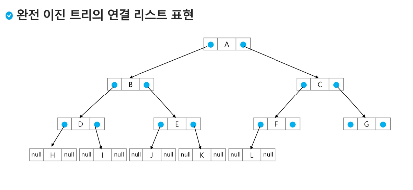

  

## 이진탐색 트리

* 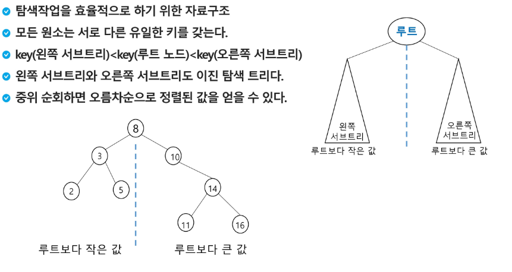

* 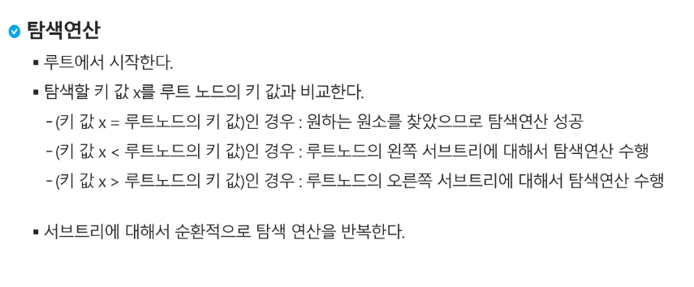

* 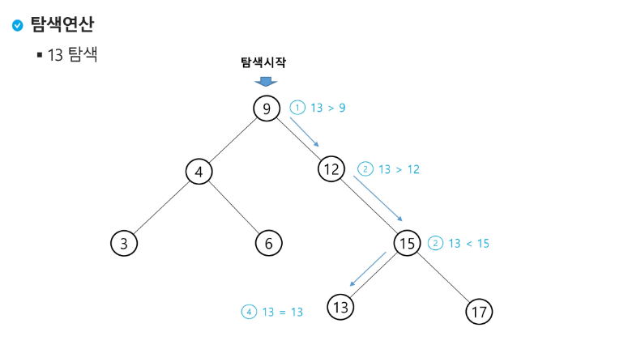

* 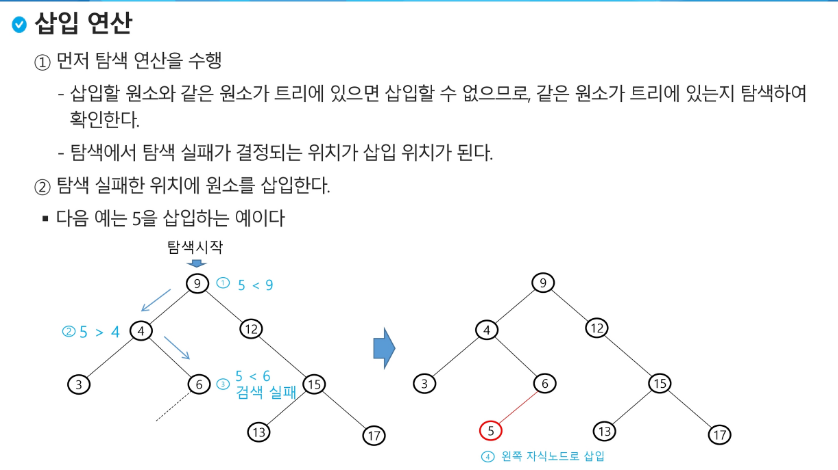

- https://velog.io/@seanlion/bstimplementation

## 힙

* 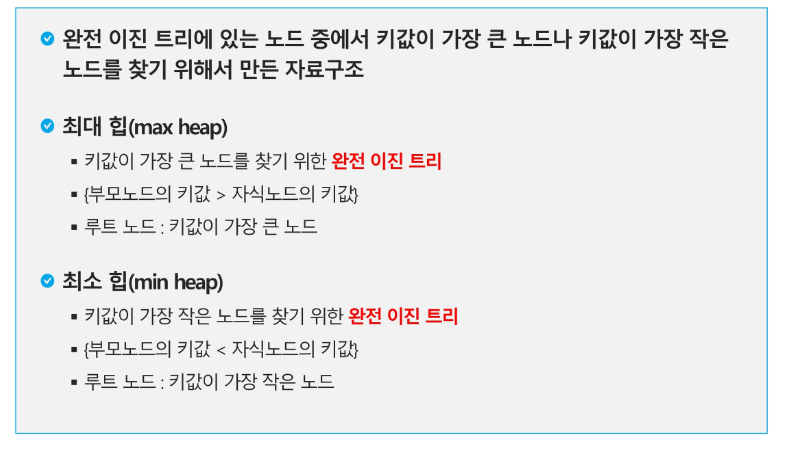
* 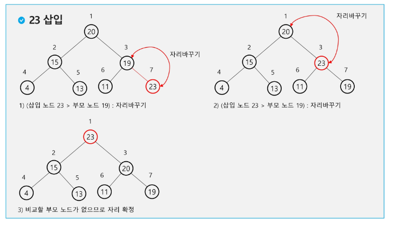
* 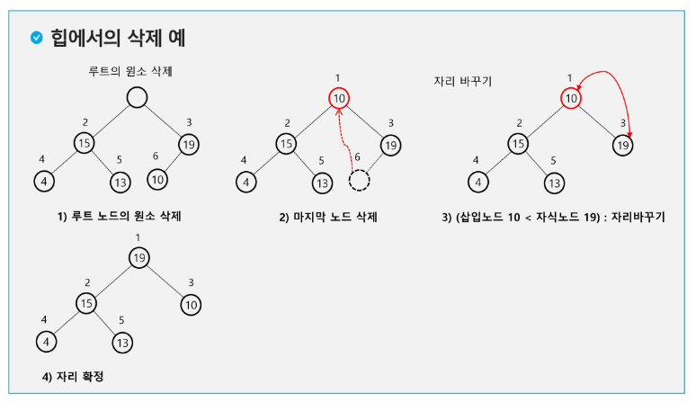

- https://daimhada.tistory.com/108
