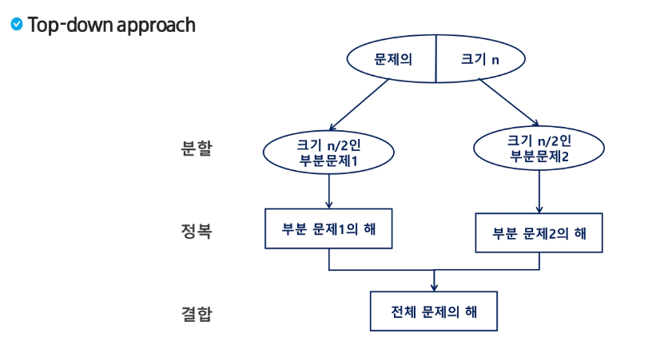
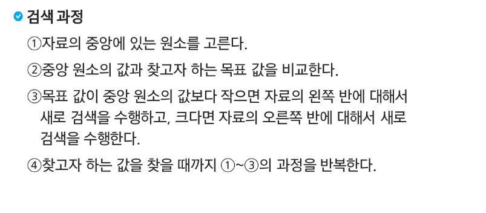
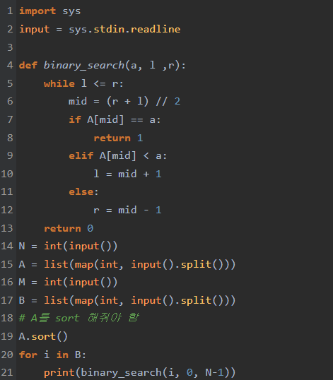
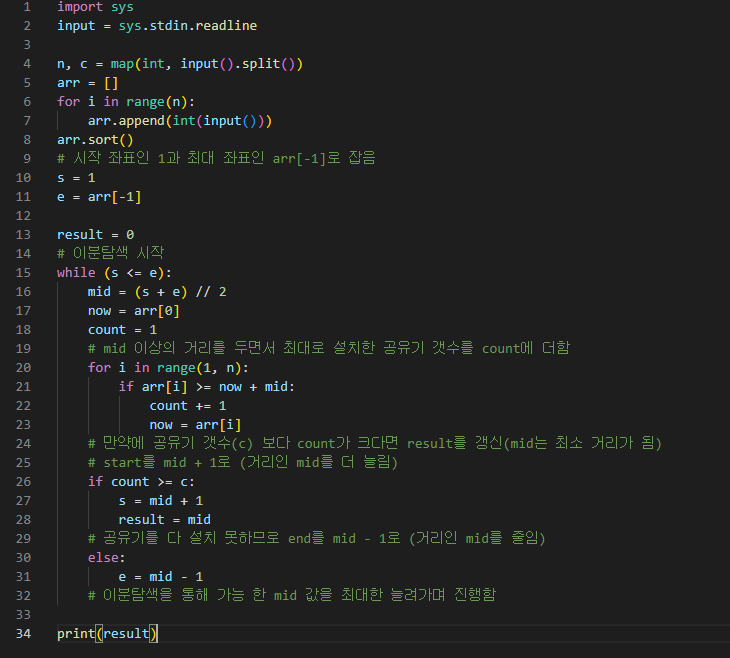
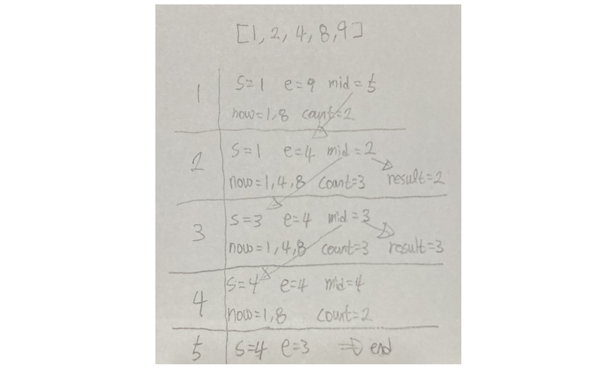
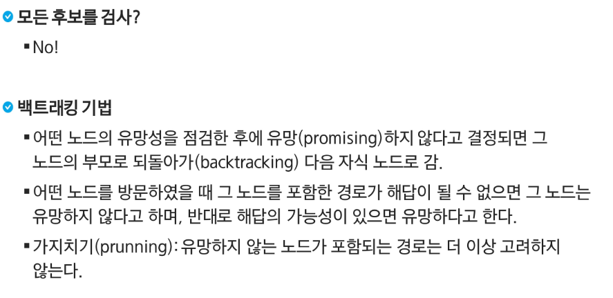
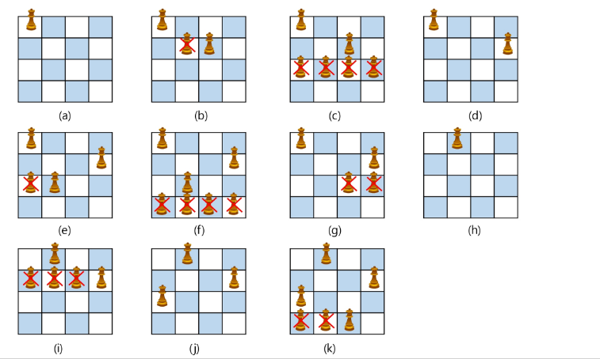
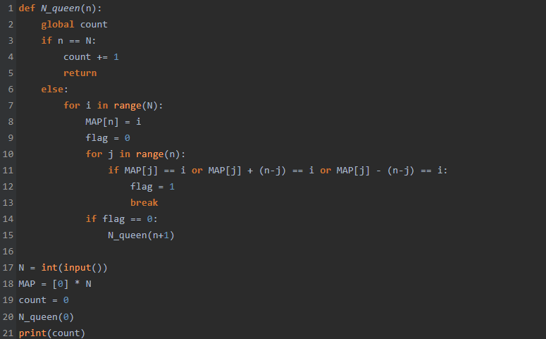
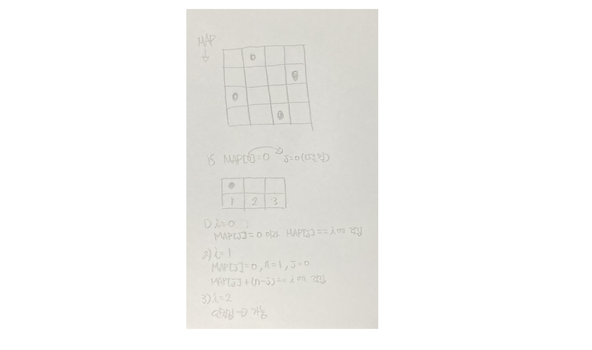

# 분할정복

## 분할정복을 이용한 거듭제곱

- https://www.acmicpc.net/problem/1629
- 

## 이진탐색(Binary Search)

- 

- https://www.acmicpc.net/problem/1920
- 

## 매개 변수 탐색(Parametric Search)

- 비슷한 개념
- 정확한 값을 찾는 것이 아니라 조건에 맞는 최대 or 최소값을 찾음
- https://www.acmicpc.net/problem/2110
- 
- 

# 백트래킹

- 

## n-queen

- 
- https://www.acmicpc.net/problem/9663
- 

- 