# 그래프

- 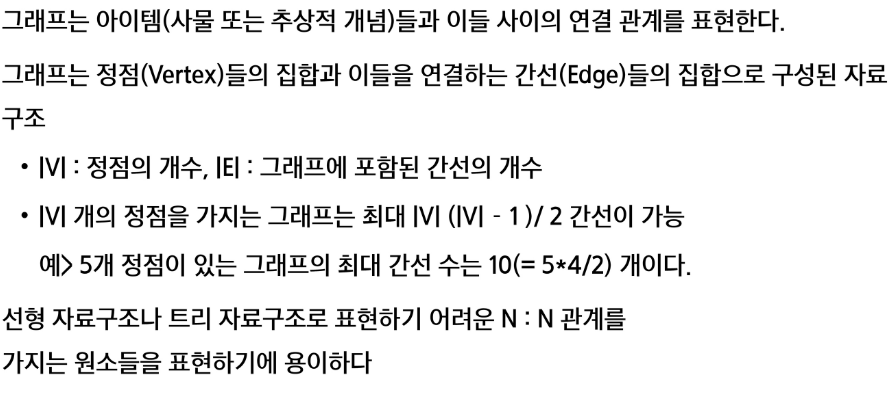
- 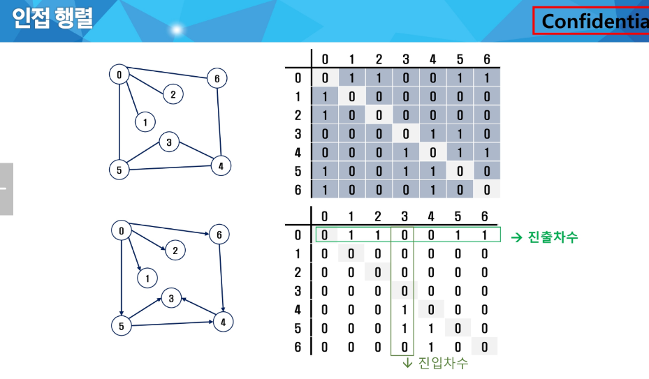
- 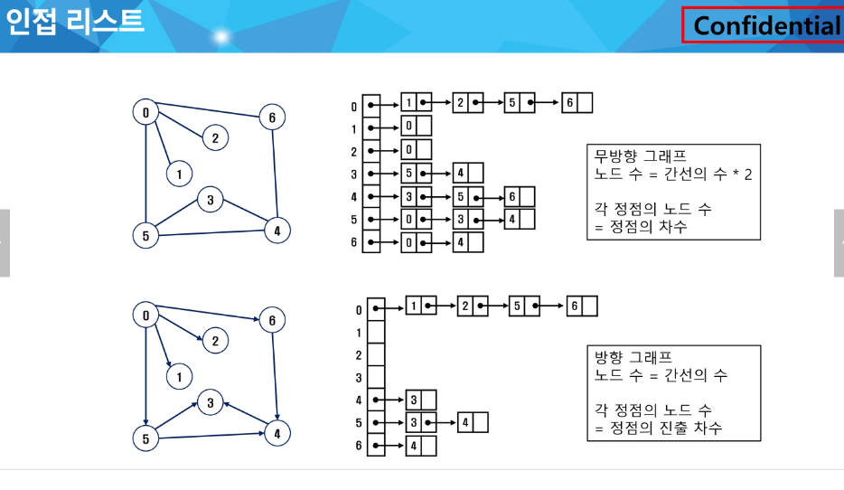

## DFS (깊이 우선 탐색)

- 끝까지 갔다가 갈 길이 없으면 마지막 갈림길로 돌아와 탐색을 반복함

- 따라서 후입 선출 구조인 스택을 사용함

- ```sh
  # input
  1 2 1 3 2 4 2 5 4 6 5 6 6 7 3 7
  # output
  1 2 4 6 5 7 3
  # or
  1 3 7 6 5 2 4
  ```

- 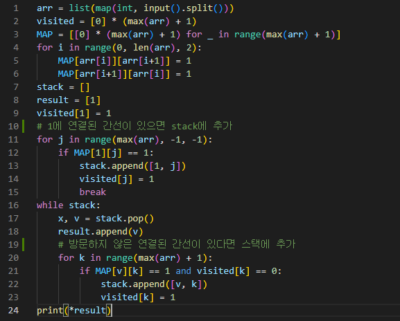

## BFS(깊이 우선 탐색)

- 인접한 접점들을 모두 차례로 방문하고 다시 그 접점들을 기준으로 탐색
- 선입 선출 형태인 큐를 사용
- https://www.acmicpc.net/problem/1987
- 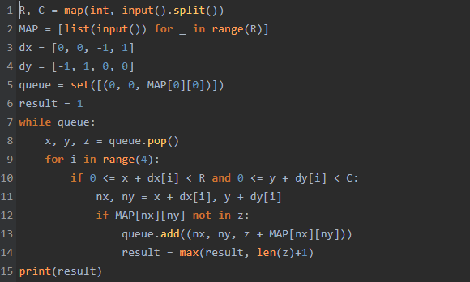

## 서로소 집합


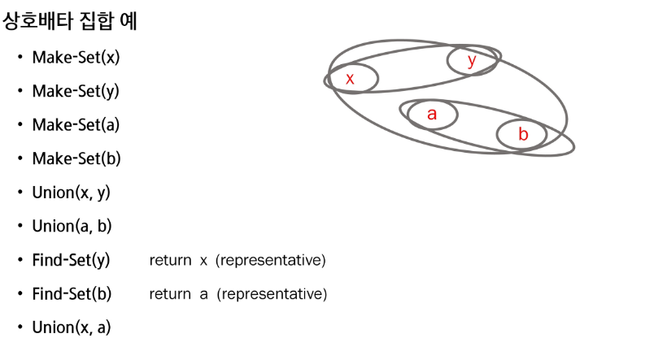

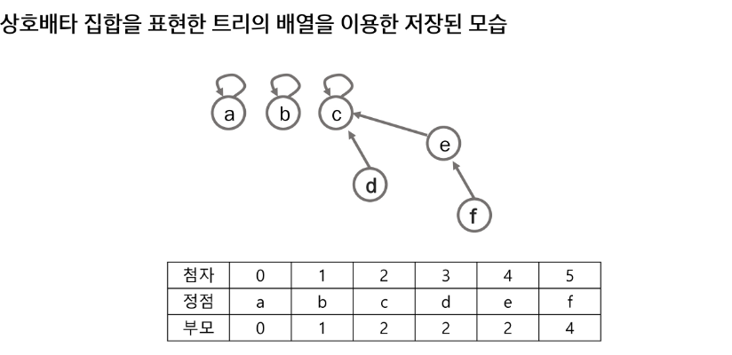

- https://swexpertacademy.com/main/code/userProblem/userProblemDetail.do?contestProbId=AX--pdmaF9YDFARi
- 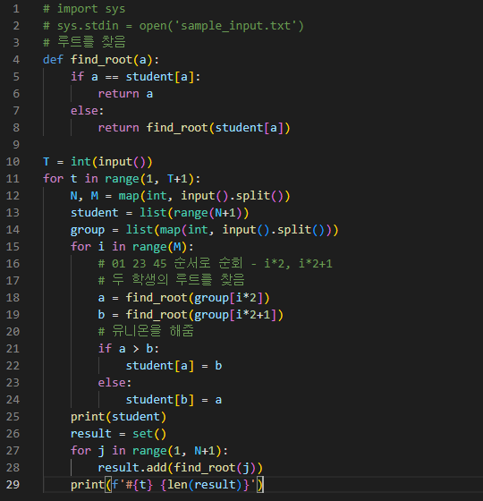

## 최소 신장 트리(MST)

- 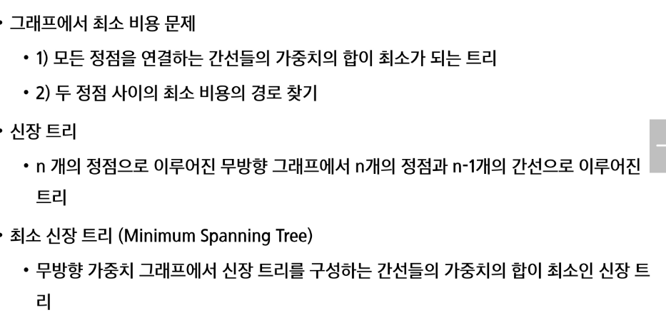

- https://swexpertacademy.com/main/learn/course/subjectDetail.do?courseId=AVuPDYSqAAbw5UW6&subjectId=AWUYHO7a2JoDFAVT

### prim 알고리즘

- 

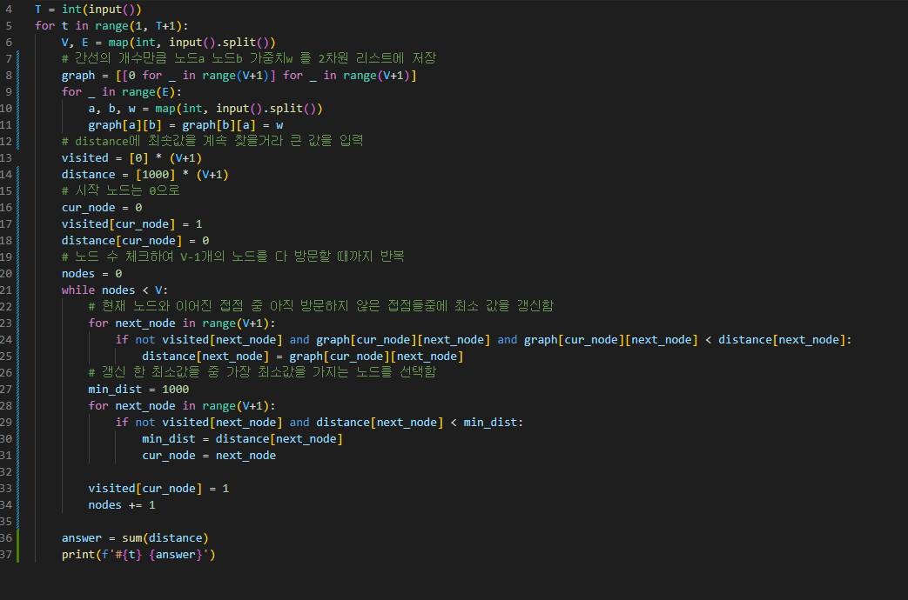

### Kruskal 알고리즘

- 

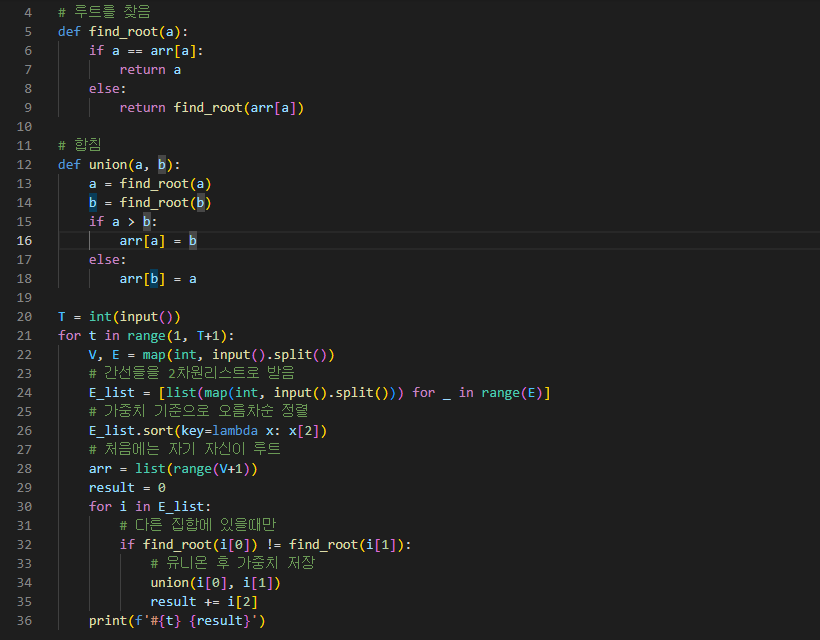

## 최단 경로

- https://techblog-history-younghunjo1.tistory.com/ 여기 개꿀

### 다익스트라 알고리즘

- 하나의 시작 정점에서 끝 정점까지

- 음의 가중치 x
  
  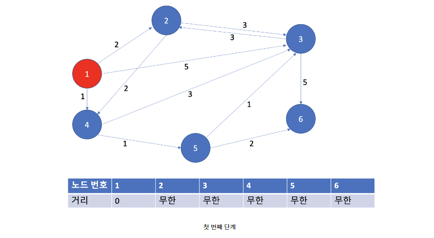
  
  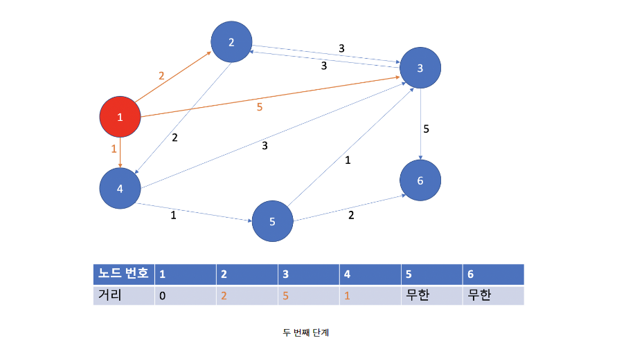
  
  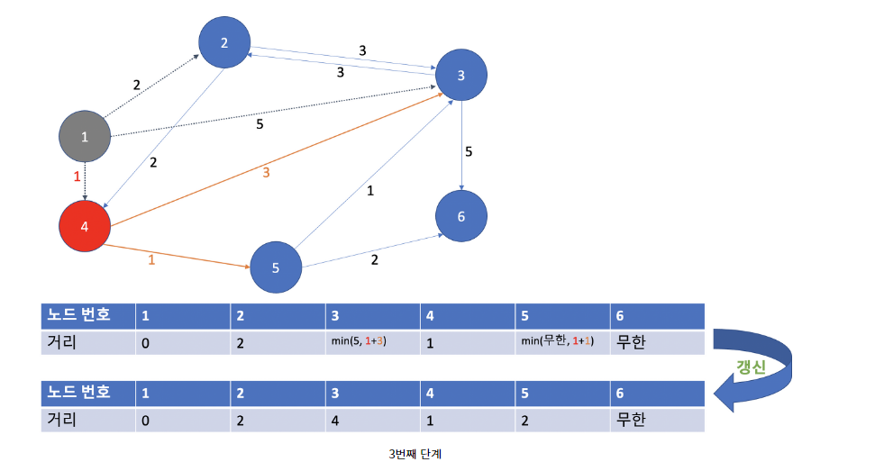
1. 일반적 다익스트라
   
   ```python
   import sys
   input = sys.stdin.readline
   INF = 100000000
   
   n, m = map(int, input().split())
   start = int(input())
   graph = [[] for _ in range(n+1)]
   visited = [0] * (n+1)
   distance = [INF] * (n+1)
   
   for _ in range(m):
       a, b, c = map(int, input().split())
       graph[a].append((b, c))
   
   # 방문하지 않은 노드이면서 시작노드와 최단거리인 노드 반환
   def get_smallest_node():
       min_value = INF
       index = 0
       for i in range(1, n+1):
           if not visited[i] and distance[i] < min_value:
               min_value = distance[i]
               index = i
       return index
   
   # 다익스트라 알고리즘
   def dijkstra(start):
       # 시작노드 -> 시작노드 거리 계산 및 방문처리
       distance[start] = 0
       visited[start] = 1
       # 시작노드의 인접한 노드들에 대해 최단거리 계산
       for i in graph[start]:
           distance[i[0]] = i[1]
   
       # 시작노드 제외한 n-1개의 다른 노드들 처리
       for _ in range(n-1):
           now = get_smallest_node()
           visited[now] = 1        # 해당 노드 방문처리
           # 해당 노드의 인접한 노드들 간의 거리 계산
           for next in graph[now]:
               cost = distance[now] + next[1]  # 시작->now 거리 + now->now의 인접노드 거리
               if cost < distance[next[0]]:    # cost < 시작->now의 인접노드 다이렉트 거리
                   distance[next[0]] = cost
   
   
   dijkstra(start)
   for i in range(1, n+1):
   if distance[i] == INF:
       print('도달 할 수 없음')
   else:
       print(distance[i])
   ```

2. 우선순위 큐(pq) 다익스트라
   
   ```python
   import sys
   import heapq
   input = sys.stdin.readline
   n, m = map(int, input().split())
   start = int(input())
   INF = 100000000
   distance = [INF] * (n+1)
   graph = [[] for _ in range(n+1)]
   for _ in range(m):
       a, b, c = map(int, input().split())
       graph[a].append((b, c))
   
   
   def dijkstra(start):
       q = []
       heapq.heappush(q, (0, start))  # 시작노드 정보 우선순위 큐에 삽입 (거리, 노드)
       distance[start] = 0            # 시작노드->시작노드 거리 기록
       while q:
           dist, node = heapq.heappop(q)
           # 큐에서 뽑아낸 거리가 이미 갱신된 거리보다 클 경우(=방문한 셈) 무시
           if distance[node] < dist:
               continue
           # 큐에서 뽑아낸 노드와 연결된 인접노드들 탐색
           for next in graph[node]:
               cost = distance[node] + next[1]   # 시작->node거리 + node->node의인접노드 거리
               if cost < distance[next[0]]:      # cost < 시작->node의인접노드 거리
                   distance[next[0]] = cost
                   heapq.heappush(q, (cost, next[0]))
   
   
   dijkstra(start)
   
   for i in range(1, len(distance)):
       if distance[i] == INF:
           print('도달할 수 없음')
       else:
           print(distance[i])
   ```

```

```

### 벨만 포드 알고리즘

- 하나의 시작 정점에서 끝 정점까지

- 음의 가중치 o (시간 복잡도가 더 커서 양수일때는 다익스트라 사용)

- 음수 사이클에서 무한 사이클을 돌아서 그걸 막아야 함
  
  ```python
  import sys
  input = sys.stdin.readline
  INF = 100000000
  
  n, m = map(int, input().split())
  edges = [] # 모든 간선에 대한 정보를 담는 리스트 생성
  distance = [INF] * (n+1) # 최단 거리 테이블을 모두 무한으로 초기화
  
  for _ in range(m):
      u, v, w = map(int, input().split()) # 노드, 인접 노드, 가중치
      edges.append((u, v, w))
  
  def bf(start):
      distance[start] = 0 # 시작 노드에 대해서 거리를 0으로 초기화
      for i in range(n): # 정점 수만큼 반복
          for j in range(m): # 매 반복 마다 모든 간선 확인 (이래서 다익스트라보다 복잡도가 높음)
              node = edges[j][0] # 현재 노드 받아오기
              next_node = edges[j][1] # 다음 노드 받아오기
              cost = edges[j][2] # 가중치 받아오기
              # 현재 간선을 거쳐서 다른 노드로 이동하는 거리가 더 짧은 경우
              if distance[node] != INF and distance[next_node] > distance[node] + cost:
                  distance[next_node] = distance[node] + cost
                  if i == n-1: # n-1번 이후 반복에도 값이 갱신되면 음수 순환 존재
                      return True
      return False
  
  # 벨만 포드 알고리즘 수행
  negative_cycle = bf(1)
  
  if negative_cycle:
      print('-1')
  else:
      # 1번 노드를 제외한 다른 모든 노드로 가기 위한 최단 거리 출력
      for i in range(2, n+1):
          if distance[i] == INF: # 도달할 수 없는 경우 -1 출력
              print('-1')
          else: # 도달할 수 있는 겨우 거리를 출력
              print(distance[i])
  ```

### 플로이드 워샬 알고리즘

- 모든 정점들에 대한 최단 경로
- 모든 노드에서 모든 노드까지의 데이터를 저장하기에 2차원 리스트 활용
- 최단 거리를 갱신 할 때 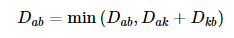 점화식을 사용함(DP 적용)

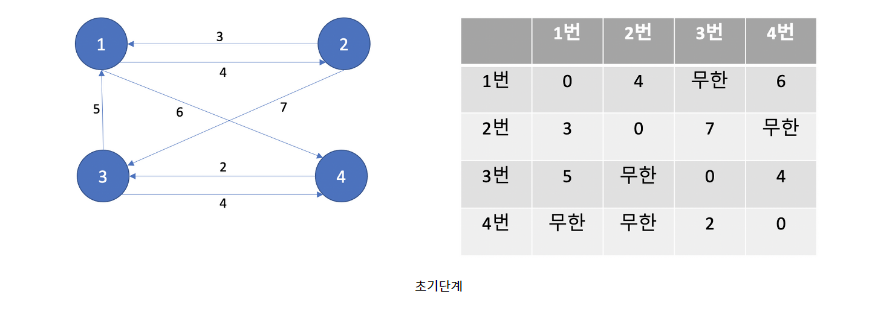

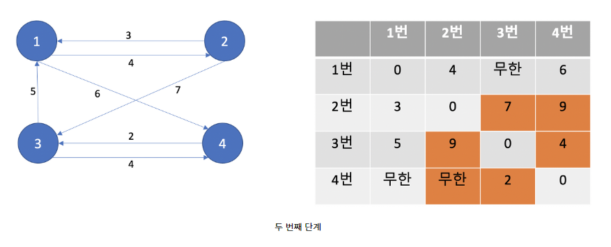

```python
import sys
input = sys.stdin.readline

INF = 100000000
n, m = map(int, input().split())
# 2차원 거리테이블 리스트 초기화
graph = [[INF] * (n+1) for _ in range(n+1)]
# 자신의 노드간의 거리는 0으로 변경
for i in range(1, n+1):
    for j in range(1, n+1):
        if i == j:
            graph[i][j] = 0
# 주어지는 그래프 정보 입력
for _ in range(m):
    # a -> b로 가는 비용은 c
    a, b, c = map(int, input().split())
    graph[a][b] = c

# k=거쳐가는 노드
for k in range(1, n+1):
    for i in range(1, n+1):
        for j in range(1, n+1):
            graph[i][j] = min(graph[i][j], graph[i][k] + graph[k][j])

for i in range(1, n+1):
    for j in range(1, n+1):
        if graph[i][j] == INF:
            print('도달할 수 없음', end=' ')
        else:
            print(graph[i][j], end=' ')
    print()
```
