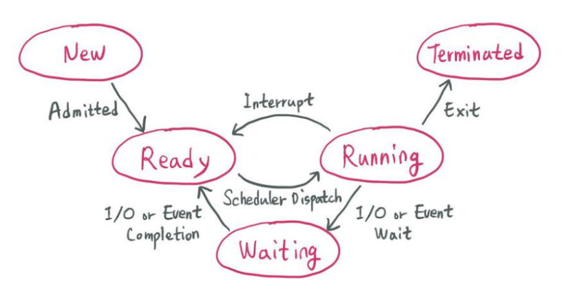

# CPU Scheduling

##### 1. 선점 / 비선점 스케줄링

- 선점(Preemptive) : OS가 CPU의 사용권을 선점할 수 있는 경우, 강제 회수하는 경우

- 비선점(NonPreemptive) : 프로세스 종료 or I/O등의 이벤트가 있을 때까지 실행 보장

### 2. 프로세스 상태

##### 프로세스의 상태 전S이

- 승인(Admitted) : 프로세스 생성이 가능하여 승인됨

- 스케줄러 디스패치 : 준비 상태에 있는 프로세스 중 하나를 선택하여 실행시키는 것

- 인터럽트 : 예외, 입출력, 이벤트 등이 발생하여 현재 실행중인 프로세스를 준비 상태로 바꾸고, 해당 작업을 먼저 처리하는 것.

- 입출력 또는 이벤트 대기 : 실행 중인 프로세스가 입출력이나 이벤트를 처리해야 하는 경우, 입출력/이벤트가 모두 끝날 때까지 대기 상태로 만드는 것

- 입출력 또는 이벤트 완료 : 입출력/이벤트가 끝난 프로세스를 준비 상태로 전환하여 스케줄러에 의해 선택될 수 있도록 만드는 것.

### 3. CPU 스케줄링의 종류

- 비선점 스케줄링
  
  1. FCFS (First Come First Served)
     
     - 큐에 도착한 순서대로 CPU 할당
     
     - 실행 시간이 짧은 게 뒤로 가면 평균 대기시간이 길어짐
  
  2. SJF (Shortest Job First)
     
     - 수행시간이 가장 짧다고 판단되는 작업을 먼저 수행
     
     - FCFS보다 평균 대기 시간 감소, 짧은 작업에 유리
  
  3. HRN (Hightest Response-ratio Next)
     
     - 우선순위를 계산하여 점유 불평등을 보완한 방법(SJF의 단점 보완)
     
     - 우선순위 = (대기시간 + 실행시간) / (실행시간)

- 선점 스케줄링
  
  1. Priority Scheduling
     
     - 정적/동적으로 우선순위를 부여하여 우선순위가 높은 순서대로 처리
     
     - 우선순위가 낮은 프로세스가 무한정 기다리는 Starvation이 생길 수 있음
     
     - Aging 방법으로 Starvation 문제 해결
  
  2. Round Robin
     
     - FCFS에 의해 프로세스들이 보내지면 각 프로세스는 동일한 시간의 Time Quantum(실행의 최소 단위 시간 = Time Slice) 만큼 CPU를 할당 받음
     
     - 할당시간이 크면 FCFS와 같아지고 작으면 Context Switching이 잦아져 오버헤드 증가
  
  3. Multilevel-Queue
     
     - 작업들을 여러 종류의 그룹으로 나누어 여러개의 큐를 이용하는 기법
     
     - 우선순위가 낮은 큐들이 실행 못하는 걸 방지하고자 각 큐마다 다른 Time Quantum을 설정 해주는 방식 사용
     
     - 우선순위가 높은 큐는 작은 Time Quantum 할당. 우선순위가 낮은 큐는 큰 Time Quantum 할당
  
  4. Multilevel-Feedback-Queue
     
     - 다단계 큐에서 자신의 Time Quantum를 다 채운 프로세스는 밑으로 내려가고 자신의 Time Quantum를 다 채우지 못한 프로세스는 원래 큐 그대로
     
     - 짧은 작업에 유리, 인터럽트가 잦은 작업에 우선권을 줌
     
     - 처리시간이 짧은 프로세스를 먼저 처리하기 때문에 Turnaround 평균 시간을 줄여줌

### 4. CPU 스케줄링 척도

1. Response Time
   
   - 작업이 처음 실행되기까지 걸린 시간

2. Turnaround Time
   
   - 실행시간과 대기시간을 모두 합한 시간으로 작업이 완료될 때까지 걸린 시간
