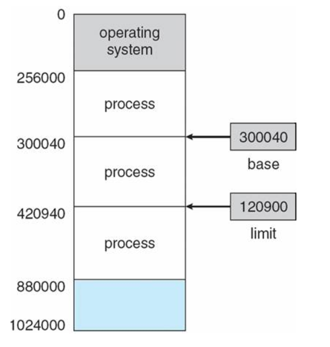

# 메모리

### 메인 메모리

메인 메모리는 CPU가 직접 접근할 수 있는 기억 장치

프로세스가 실행되려면 프로그램이 메모리에 올라와야 함

### MMU (Memory Management Unit)

- 논리주소를 물리주소로 변환해 준다.

- 메모리 보호나 캐시 관리 등 CPU가 메모리에 접근하는 것을 총 관리해 주는 하드웨어

메모리의 공간이 한정적이기 때문에 사용자에게 더 많은 메모리를 제공하기 위해 '가상주소'라는 개념이 등장 (프로그램 상에서 사용자가 보는 주소 공간)

이 가상주소에서 실제 데이터가 담겨 있는 곳에 접근하기 위해선 빠른 주소 변환이 필요한데 이를 MMU가 도와줌

또한 메인 메모리의 직접 접근은 비효율적이므로, CPU와 메인 메모리 속도를 맞추기 위해 캐시가 존재함

##### MMU의 메모리 보호

프로세스는 독립적인 메모리 공간을 가져야 되고, 자신의 공간만 접근해야 함

base와 limit 레지스터를 활용한 메모리 보호 기법. 메모리 영역(x)는

base <= x < base + limit

이 영역 밖에서 접근을 요구하면 trap을 발생시킴

(커널 모드에서 base와 limit 수정 가능)

##### 메모리 과할당(over allocating)

실제 메모리의 사이즈보다 더 큰 사이즈의 메모리를 프로세스에 할당한 상황

페이지 기법과 같은 메모리 관리 기법은 사용자가 눈치 채지 못하도록 눈속임을 통해 메모리 할당 (가상 메모리 사용)

과할당 상황에 들킬만한 상황

1. 프로세스 실행 도중 페이지 폴트 발생

2. 페이지 폴트를 발생시킨 페이지 위치를 디스크에서 찾음

3. 메모리의 빈 프레임에 페이지를 올려야 하는데, 모든 메모리가 사용중이라 빈 프레임이 없음

해결하기 위해 빈 프레임을 확보할 수 있어야 함

1. 메모리에 올라와 있는 한 프로세스를 종료시켜 빈 프레임을 얻음

2. 프로세스 하나를 swap out하고, 이 공간을 빈 프레임으로 활용

swapping 기법을 통해 공간을 바꿔치기하는 2번 방법과는 달리 1번은 사용자에게 페이징 시스템을 들킬 가능성이 매우 높아서 하면 안됨

(페이징 기법은 사용자 모르게 시스템 능률을 높이기 위해 선택한 일이므로 들키지 않게 처리해야한다)

따라서, 2번과 같은 해결책을 통해 페이지 교체가 이루어져야 함

##### 페이지 교체

메모리 과할당이 발생했을 때, 프로세스 하나를 swap out해서 빈 프레임을 확보하는 것

1. 프로세스 실행 도중 페이지 부재 발생

2. 페이지 폴트를 발생시킨 페이지 위치를 디스크에서 찾음

3. 메모리에 빈 프레임이 있는지 확인

4. 없다면 victim 프레임을 선정해 디스크에 기록하고 페이지 테이블을 업데이트함

5. 빈 프레임에 페이지 폴트가 발생한 페이지를 올리고, 페이지 테이블 업데이트

아무일도 일어나지 않은 것처럼 하기 위해서 페이지 교체 당시 오버헤드를 줄여야 함

##### 오버헤드 감소법

###### 방법1

변경비트를 모든 페이지마다 둬서, victim 페이지가 정해지면 해당 페이지의 비트를 확인

해당 비트가 set : 해당 페이지 내용이 디스크 상의 페이지 내용과 달라졌다는 뜻 (즉, 페이지가 메모리 올라온 이후 한번이라도 수정이 일어났던 것. 디스크에 기록해야 함)

해당 비트가 clear : 디스크 상의 페이지 내용과 메모리 상의 페이지가 일치 (기록 필요X)

###### 방법2

페이지 교체 알고리즘을 선택 (FIFO, OPT, LRU)

### 캐시 메모리

주기억장치에 저장된 내용의 일부를 임시로 저장해두는 기억장치

CPU와 주기억장치의 속도 차이로 성능 저하를 방지하기 위한 방법

캐시는 플립플롭 소자로 구성되어 SRAM이라 DRAM보다 빠른 장점을 지님

##### CPU와 기억장치의 상호작용

CPU에서 주소 전달 -> 캐시 메모리에 명령이 존재하는지 확인

###### 존재 (Hit)

해당 명령어를 CPU로 전송 -> 완료

###### 비존재 (Miss)

명령어를 갖고 주기억장치로 접근 -> 해당 명령어를 가진 데이터 인출 -> 해당 명령어 데이터를 캐시에 저장 -> 해당 명령어를 CPU로 전송 -> 완료

캐시 적중률을 높이기 위해 사용되는 것이 지역성의 원리

##### 지역성

기억장치 내의 정보를 균일하게 엑세스 하는 것이 아니라 한 순간에 특정 부분을 집중적으로 참조하는 특성

시간지역성 : 최근에 참조된 주소의 내용은 곧 다음에도 참조되는 특성

공간지역성 : 실제 프로그램이 참조된 주소와 인접한 주소의 내용이 다시 참조되는 특성

##### 캐싱라인

캐시에 목적 데이터가 저장되어있을 때 바로 접근하여 출력할 수 있어야 캐시 활용이 의미있어짐

따라서 캐시에 데이터를 저장할 때 자료구조를 활용해 묶어서 저장

즉, 캐시에 저장하는 데이터에 데이터의 메모리 주소를 함께 저장하면서 빠르게 원하는 정보를 찾을 수 있음 (set 이나 map 등을 활용)
