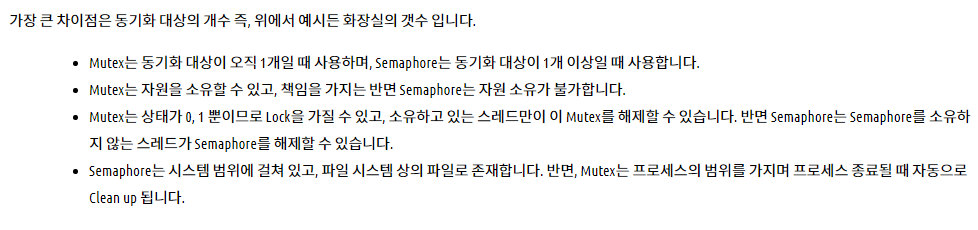

# 세마포어(Semaphore), 뮤텍스(Mutex)

공유된 자원에 여러 프로세스가 동시에 접근하면서 문제가 발생할 수 있다. 이때 공유된 자원의 데이터는 한 번에 하나의 프로세스만 접근할 수 있도록 제한을 둬야 한다.

### 세마포어

멀티프로그래밍 환경에서 공유 자원에 대한 접근을 제한하는 방법

##### 임계구역 (Critical Section)

여러 프로세스가 데이터를 공유하며 수행될 때, 각 프로세스에서 공유 데이터를 접근하는 프로그램 코드 부분

공유 데이터를 여러 프로세스가 동시에 접근할 때 잘못된 결과를 만들 수 있기 때문에, 한 프로세스가 임계 구역을 수행할 때는 다른 프로세스가 접근하지 못하도록 해야 함

##### 세마포어 P, V 연산

- P : 임계구역 들어가기 전 수행 (프로세스 진입 여부를 자원의 개수(S)를 통해 결정)

- V : 임계구역에서 나올 때 수행 (자원 반납 알림, 대기중인 프로세스를 깨우는 신호)

```python
procedure P(S)   --> 최초 S값은 1임
    while S=0 do wait  --> S가 0면 1이 될때까지 기다려야 함
    S := S-1   --> S를 0로 만들어 다른 프로세스가 들어 오지 못하도록 함
end P

--- 임계 구역 ---

procedure V(S) --> 현재상태는 S가 0임
    S := S+1   --> S를 1로 원위치시켜 해제하는 과정
end V
```

이를 통해, 한 프로세스가 P 혹은 V를 수행하고 있는 동안 프로세스가 인터럽트 당하지 않게 된다. P와 V를 사용하여 임계 구역에 대한 상호배제 구현이 가능하게 됨

### 뮤텍스

임계구역을 가진 스레드들의 실행시간이 서로 겹치지 않고 각각 단독으로 실행되게 하는 기술 (상호 배제 (Mutral Exclusion)의 약자)

해당 접근을 조율하기 위해 lock과 unlock을 사용한다.

- lock : 현재 임계 구역에 들어갈 권한을 얻어옴 (만약 다른 프로세스/스레드가 임계 구역 수행중이면 종료할 때까지 대기)

- unlock : 현재 임계 구역을 모두 사용했음을 알림 (대기중인 다른 프로세스/스레드가 임계구역에 진입할 수 있음)

##### 뮤텍스 알고리즘

1. 데커 알고리즘
   
   flag와 turn 변수를 통해 임계 구역에 들어갈 프로세스/스레드를 결정하는 방식
   
   - flag : 프로세스 중 누가 임계영역에 진입할 것인지 나타내는 변수
   
   - turn : 누가 임계구역에 들어갈 차례인지 나타내는 변수
   
   ```python
   while(true) {
       flag[i] = true; // 프로세스 i가 임계 구역 진입 시도
       while(flag[j]) { // 프로세스 j가 현재 임계 구역에 있는지 확인
           if(turn == j) { // j가 임계 구역 사용 중이면
               flag[i] = false; // 프로세스 i 진입 취소
               while(turn == j); // turn이 j에서 변경될 때까지 대기
               flag[i] = true; // j turn이 끝나면 다시 진입 시도
           }
       }
   }
   
   // ------- 임계 구역 ---------
   
   turn = j; // 임계 구역 사용 끝나면 turn을 넘김
   flag[i] = false; // flag 값을 false로 바꿔 임계 구역 사용 완료를 알림
   ```

2. 피터슨 알고리즘
   
   데커와 유사하지만, 상대방 프로세스/스레드에게 진입 기회를 양보하는 것에 차이가 있음
   
   ```python
   while(true) {
       flag[i] = true; // 프로세스 i가 임계 구역 진입 시도
       turn = j; // 다른 프로세스에게 진입 기회 양보
       while(flag[j] && turn == j) { // 다른 프로세스가 진입 시도하면 대기
       }
   }
   
   // ------- 임계 구역 ---------
   
   flag[i] = false; // flag 값을 false로 바꿔 임계 구역 사용 완료를 알림
   ```

3. 제과점 알고리즘
   
   여러 프로세스/스레드에 대한 처리가 가능한 알고리즘. 가장 작은 수의 번호표를 가지고 있는 프로세스가 임계 구역에 진입한다.
   
   ```python
   while(true) {
   
       isReady[i] = true; // 번호표 받을 준비
       number[i] = max(number[0~n-1]) + 1; // 현재 실행 중인 프로세스 중에 가장 큰 번호 배정 
       isReady[i] = false; // 번호표 수령 완료
   
       for(j = 0; j < n; j++) { // 모든 프로세스 번호표 비교
           while(isReady[j]); // 비교 프로세스가 번호표 받을 때까지 대기
           while(number[j] && number[j] < number[i] && j < i);
   
           // 프로세스 j가 번호표 가지고 있어야 함
           // 프로세스 j의 번호표 < 프로세스 i의 번호표
       }
   }
   
   // ------- 임계 구역 ---------
   
   number[i] = 0; // 임계 구역 사용 종료
   ```

### 차이점


