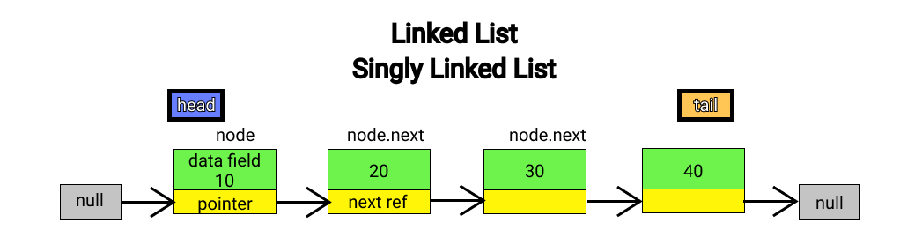
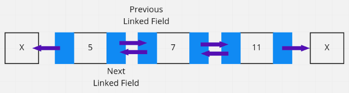

# Array, ArrayList, LinkedList

##### 1. Array

array는 선언할 때 크기와 데이터 타입을 지정해야 함(메모리 공간에 사이즈를 정해놓음)

장점 : index가 존재해서 검색이 빠름

단점 : 데이터가 늘어날 때 최대 사이즈를 알 수 없으면 부적합함, 중간에 새로운 값을 넣거나 뺄 때 비효율적(새로운 값을 넣고 index를 밀어내는 과정이 들어감)

##### 2. List

array처럼 크기를 정해주지 않아도 된다 (가득 차면 알아서 크기를 늘리고 복사)

장점 : 크기가 정해져있지 않기 때문에 데이터를 추가하거나 삭제 가능

단점 : index를 가지고 있기 때문에 중간 데이터 추가 삭제 비효율적 (리스트에서 인덱스는 몇 번째 데이터인가 정도의 의미)

##### 3. ArrayList

###### 자바

List : 인터페이스, ArrayList : 클래스

따라서

```java
ArrayList <Object> list = new ArrayList <>();
List <Object> list = new ArrayList <>();  
```

보통 아래와 같이 (업캐스팅) 사용하는데 그 이유는

1. List로 선언해야 List에서 제공하는 메소드까지 사용 가능

2. 다른 리스트로 바꿔야 할 때 더 편함 (유연함)

###### C#

List : 선언시 데이터 타입이 고정됨

ArrayList : 여러 데이터타입을 넣을 수 있음 (성능이 저하되서 잘 사용 안함)

##### 4. Vector

ArrayList와 유사하지만 레거시 클래스이고 차이점이 몇개 있음

1. Vector는 한번에 하나의 스레드만 접근이 가능하며 ArrayList는 동시에 여러 스레드가 작업 가능함 (멀티스레드 환경에선 Vector를 사용하는것이 안전)

2. ArrayList가 더 빠름

3. 최대 인덱스가 초과될때 ArrayList는 1.5배 증가 Vector는 2배 증가

##### 5. LinkedList



노드를 사용하여 다음 노드와 연결될 포인터 위치를 가지고 있음(단일은 뒤의 노드만 가리키고 다중은 앞뒤 모두 가리킴)

장점 : 추가 삭제가 빠름

단점 : index가 없기 때문에 검색이 느림

##### 6. Doubly Linked List



노드가 서로 양 방향으로 연결되어 있음

장점 : 양 방향으로 탐색이 가능함

단점 : 메모리를 더 사용함

##### 7. 튜플

튜플은 리스트와 유사하지만 값을 변경할 수 없다는 특징이 있다.

프로그램이 실행되는 동안 그 값이 변경되지 않아야 하는 경우 사용하고, 리스트에 비해 메모리가 적고 더 빠르다.
