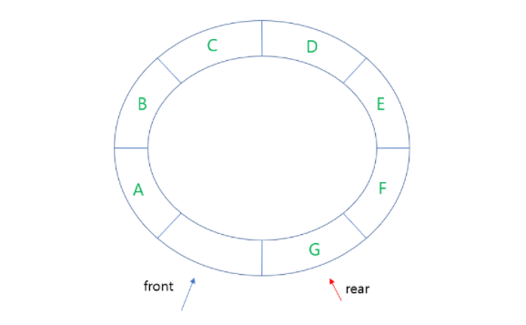
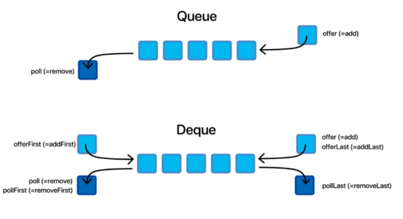

# Stack, Queue

##### 1. Stack

후입선출 방식

원소의 삽입과 삭제가 한쪽 끝에서만 이루어짐 (top)

함수의 콜스택, 연산자 후위표기법, DFS

##### 2. Queue

선입선출 방식

원소의 삽입과 삭제가 양쪽 끝에서 이루어짐 (front, rear)

버퍼, BFS

- 원형 큐
  
  선형 큐를 이용하여 원소의 삽입과 삭제를 계속할 경우, 배열의 앞부분에 활용할 수 있는 공간이 있음에도 불구하고, rear = n-1 인 상태 즉, 포화상태로 인식하여 더 이상의 삽입을 수행하지 않게 됨
  
  

- Deque
  
  데크(Deque)는 양방향에서 요소를 추가하고 제거할 수 있는 양방향 큐 이다. 단방향 큐를 일반적인 리스트(list) 로 구현할 때 요소를 추가하고 제거할 때의 복잡도는 O(n) 인 반면, 양방향에서 값을 추가하고 제거하는 처리의 복잡도는 O(1)로 구현할 수 있다.
  
  

- Priority Queue
  
  데이터를 근거로 한 우선순위를 파악하고, 우선순위가 높은 것 부터 나감
  
  구현방법
  
  1. 배열 (삭제 : O(1), 삽입 : O(n))
     데이터 삽입 시 비효율적이고 삽입하기 위해 배열의 모든 데이터 탐색
  
  2. 연결리스트 (삭제 : O(1), 삽입 : O(n))
     배열과 비슷함
  
  3. 힙 (삭제 : O(log2n), 삽입 : O(log2n))
     완전 이진트리로 최소값이나 최대값이 가장 루트에 있음
     부모의 우선순위는 자식의 우선순위보다 크다.

##### 3. Heap

우선순위 큐를 위해 만들어진 자료 구조

완전 이진 트리의 일종으로 최대값과 최소값을 빠르게 찾아내도록 만들어진 자료구조

```python
class nheap(object) :

    def __init__(self):
        self.hq = [0]

    def get_priority(self, node):
        if len(self.hq) - 1 >= node * 2 + 1:
            if self.hq[node * 2] > self.hq[node * 2 + 1]:
                return node * 2 + 1
            else:
                return node * 2
        elif len(self.hq) - 1 == node * 2:
            return node * 2
        else:
            return -1

    def heappop(self):
        if len(self.hq) == 1:
            return 0
        return_value = self.hq[1]
        last_data = self.hq[-1]
        node = 1
        while 1:
            pri_node = self.get_priority(node)
            if pri_node == -1:
                break
            if last_data > self.hq[pri_node]:
                self.hq[node] = self.hq[pri_node]
                node = pri_node
            else:
                break
        self.hq[node] = last_data
        self.hq.pop()
        return return_value

    def heappush(self,value) :
        self.hq.append(value)
        node = len(self.hq) - 1
        last_idx = node
        while node > 1 :
            node //= 2
            if self.hq[node] > value :
                self.hq[last_idx] = self.hq[node]
                last_idx = node
            else :
                break
        self.hq[last_idx] = value
        return
```
