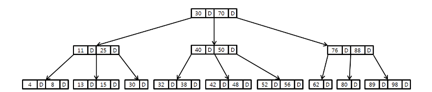
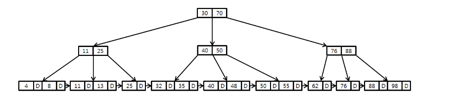

# Tree

Node와 Edge로 이루어진 자료구조

트리에는 사이클이 존재하지 않는다, 루트에서 한 노드로 가는 경로는 유일한 경로뿐이다

##### 트리 순회 방식

1. 전위순회
   루트 > 왼쪽자식 > 오른쪽자식

2. 중위순회
   왼쪽자식 > 루트 > 오른쪽자식

3. 후위순회
   왼쪽자식 > 오른쪽자식 > 루트

4. 레벨순회
   루트부터 계층별로 방문

##### 1. 이진탐색트리(BST)

노드의 왼쪽에는 노드보다 작은 값들, 오른쪽에는 큰 값으로 구성

##### 2. 레드블랙트리

자가 균형 이진 탐색 트리

이진 탐색 트리가 만약에 정렬되어있다면 시간복잡도가 O(n)이 되어 비효율적이지만 레드 블랙트리는 최악의 경우에도 O(logN)의 복잡도로 삽입, 삭제, 검색이 가능

[[자료구조] 레드-블랙 트리(Red-Black Tree)란? | 레드-블랙 트리 쉽게 이해하기](https://code-lab1.tistory.com/62)

##### 3. B-트리

이진트리와 다르게 하나의 노드에 많은 정보를 담을 수 있음 (더 많은 자식을 가질 수 있게 일반화)

데이터베이스, 파일시스템에서 주로 사용

##### 4. B+트리

리프노드에 key와 data가 있고, 모든 리프노드가 연결리스트라 탐색이 빠름
