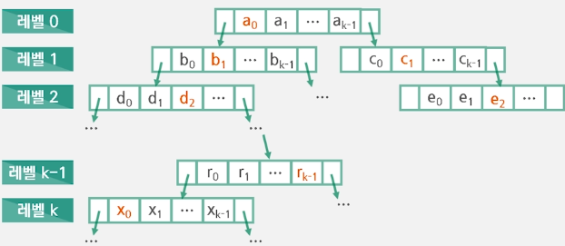
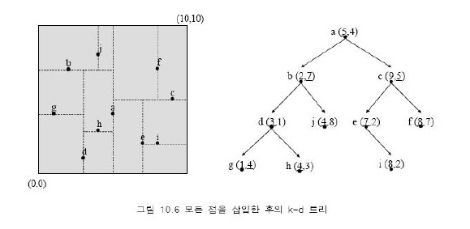
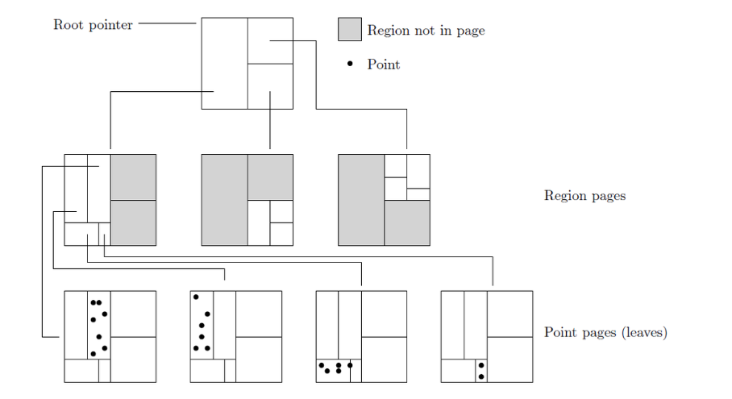
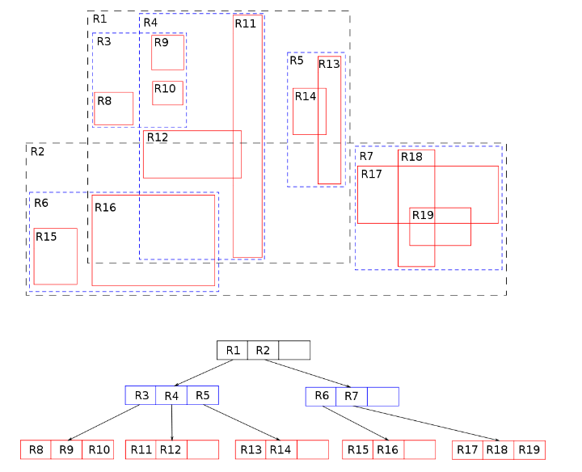

# Tree

Node와 Edge로 이루어진 자료구조

트리에는 사이클이 존재하지 않는다, 루트에서 한 노드로 가는 경로는 유일한 경로뿐이다

##### 트리 순회 방식

1. 전위순회 
   루트 > 왼쪽자식 > 오른쪽자식

2. 중위순회
   왼쪽자식 > 루트 > 오른쪽자식

3. 후위순회
   왼쪽자식 > 오른쪽자식 > 루트

4. 레벨순회
   루트부터 계층별로 방문

##### 1. 이진탐색트리(BST)

노드의 왼쪽에는 노드보다 작은 값들, 오른쪽에는 큰 값으로 구성

##### 2. 레드블랙트리

자가 균형 이진 탐색 트리

이진 탐색 트리가 만약에 정렬되어있다면 시간복잡도가 O(n)이 되어 비효율적이지만 레드 블랙트리는 최악의 경우에도 O(logN)의 복잡도로 삽입, 삭제, 검색이 가능

[[자료구조] 레드-블랙 트리(Red-Black Tree)란? | 레드-블랙 트리 쉽게 이해하기](https://code-lab1.tistory.com/62)

##### 3. B-트리

이진트리와 다르게 하나의 노드에 많은 정보를 담을 수 있음 (더 많은 자식을 가질 수 있게 일반화)

데이터베이스, 파일시스템에서 주로 사용

##### 4. B+트리

리프노드에 key와 data가 있고, 모든 리프노드가 연결리스트라 탐색이 빠름

##### 5. K-D (k - Dimensional) 트리

BST를 확장한 개념으로 k개의 필드로 이루어진 key를 연산에 사용한다.

level = 0인 노드는 첫 번째 필드를 이용해 분기하고

level = 1이면 두 번쨰, level = 3이면 세 번째 필드를 이용해 분기한다.

k-d 트리는 다차원 탐색 키에 관련된 탐색 같은 적용분야에 유용한 자료구조이다. (예: 범위 탐색과 최근접 이웃 탐색)

##### 6. KDB 트리

kd 트리와 b트리의 특성을 결합함.

kd 트리에서 영역의 개념이 추가되어서 노드가 영역 노드와 키 노드로 나뉜다.

1. 영역노드 (Region Pages)
   
   복수 개의 (영역, 페이지 번호) Pair로 구성된다.
   
   영역 노드에서의 페이지 번호란, 자식 노드가 위치한 페이지 번호를 의미한다.

2. 키 노드 (Point Pages)
   
   복수 개의 (키, 페이지 번호) Pair로 구성된다.
   
   키 노드에서의 페이지 번호란, 실질적인 레코드(정보)가 위치한 페이지 번호를 의미한다.

##### 7. R 트리

B트리를 다차원으로 확장시킨 트리

KDB-트리에서는 노드들이 전체 공간을 나누어 커버하는 반면 R-트리는 키들을 모두 포함하는 최소 영역만 노드에 있음

공간을 MBR(Minumum Bounding Rectangle; 최소 경계 사각형)로 분할하여 저장한다.

MBR끼리는 겹칠 수 있고, 상위 레벨의 MBR은 하위 레벨의 MBR을 포함한다.

노드 구조는 KDB 트리와 같다

###### R+트리

R트리에서 겹침으로 인한 성능 저하 개선을 위해 겹침 허용 안함

###### R*트리

겹침 허용하지만 최소화, 둘레 면적 최소화 등 합리적 방법 복합 사용
