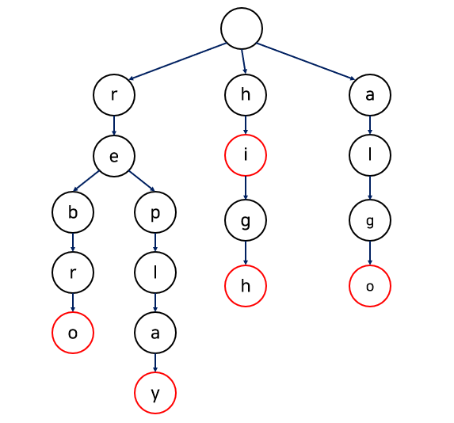

# 트라이(Trie)

문자열에서 검색을 빠르게 도와주는 자료구조

이진 탐색 트리에서 원소를 찾는데 O(logN)의 시간이 걸리게 된다. 

하지만, 문자열의 경우 두 문자열을 비교하기 위해서는 문자열의 길이만큼의 시간이 걸리기 때문에 

원하는 문자열을 찾기 위해서는 O(MlogN)의 시간이 걸리게 된다.

트라이를 사용한다면 O(L)으로 가능 (L : 가장 긴 문자열)



문자열 집합 {"rebro", "replay", "hi" , "high", "algo"}를 트라이로 구현한 것이다.

한 문자열에서 다음에 나오는 문자가 현재 문자의 자식이 되고, 빨간색 노드는 문자열의 끝을 의미한다.

자동완성이나 검색어 추천 기능에서 Trie 알고리즘 사용

##### 장 단점

장점 : 문자열을 빠르게 찾을 수 있다.

단점 : 메모리를 너무 많이 잡아먹는다.

##### 구현

```python
class Node(object):
    def __init__(self, key, data=None):
        # 해당 노드의 문자
        self.key = key
        # 문자열이 끝나는 위치를 알려줌(ex car -> key = "r" data = "car"  c,a 에는 none)
        self.data = data
        # 자식 노드를 추가
        self.children = {}

class Trie:
    def __init__(self):
        self.head = Node(None)

    def insert(self, string):
        current_node = self.head

        for char in string:
            # 자식 노드중 같은 문자가 없다면 노드 생성
            if char not in current_node.children:
                current_node.children[char] = Node(char)
            # 같은 문자가 있다면 생성하지 않고 해당 노드로 이동
            current_node = current_node.children[char]
        # 문자열이 다 끝난 지점 노드의 data에 string 입력
        current_node.data = string

    def search(self, string):
        current_node = self.head

        for char in string:
            if char in current_node.children:
                # 자식 노드들을 찾아가며 갱신
                current_node = current_node.children[char]
            else:
                return False
        # 데이터가 있다면 마지막 글자(문자의 끝)이므로 존재
        if current_node.data:
            return True
        else:
            return False

    # prefix로 시작되는 단어를 찾고 배열로 리턴
    def starts_with(self, prefix):
        current_node = self.head
        words = []
        
        # prefix를 순회하며 마지막 글자의 자식들을 current_node에 넣고
        # 없다면 None 리턴 
        for p in prefix:
            if p in current_node.children:
                current_node = current_node.children[p]
            else:
                return None

        current_node = [current_node]
        next_node = []
        while True:
            for node in current_node:
                # node에 data가 있으면 마지막 글자인 것 이므로 word에 추가
                if node.data:
                    words.append(node.data)
                # 다음 노드에 children.values()를 다 추가해 줌
                next_node.extend(list(node.children.values()))
            # 다음 노드가 있다면
            if len(next_node) != 0:
                # 노드 갱신하고 next_node를 비워줌
                current_node = next_node
                next_node = []
            # 다음 노드가 없을 때 까지 반복
            else:
                break

        return words


trie = Trie()
word_list = ["frodo", "front", "firefox", "fire"]
for word in word_list:
    trie.insert(word)

print(trie.search("friend"))
print(trie.search("frodo"))
print(trie.search("fire"))
print(trie.starts_with("fire"))
print(trie.starts_with("fro"))
print(trie.starts_with("jimmy"))
print(trie.starts_with("f"))

# output
False
True
True
['fire', 'firefox']
['frodo', 'front']
None
['fire', 'frodo', 'front', 'firefox']
```
