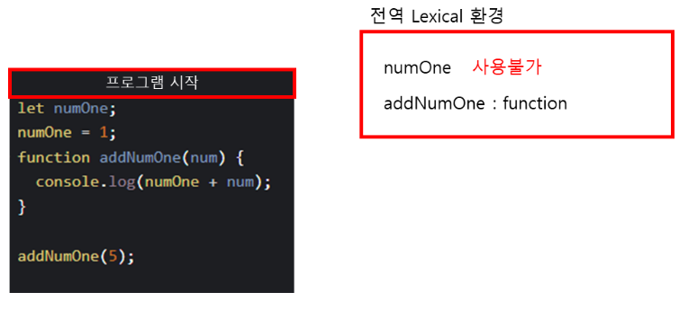
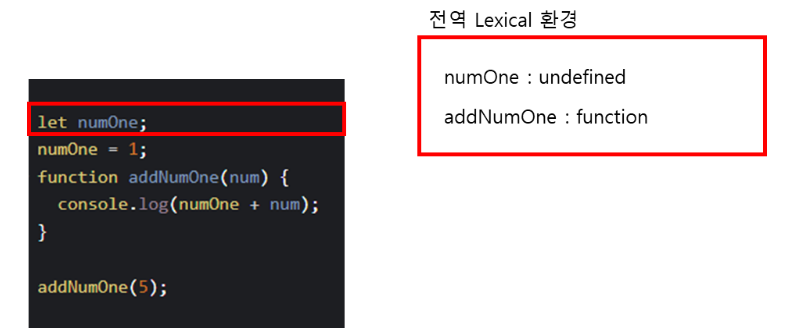
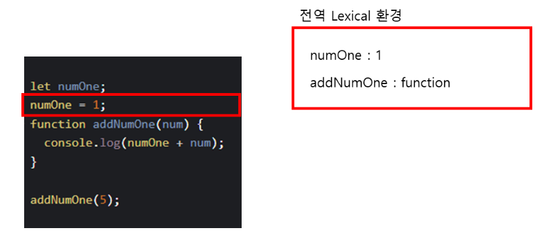
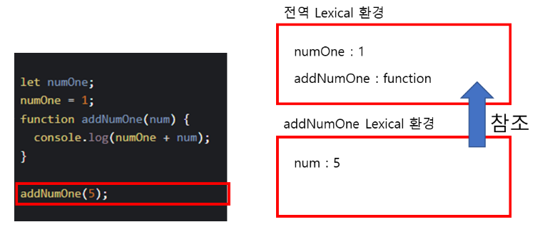
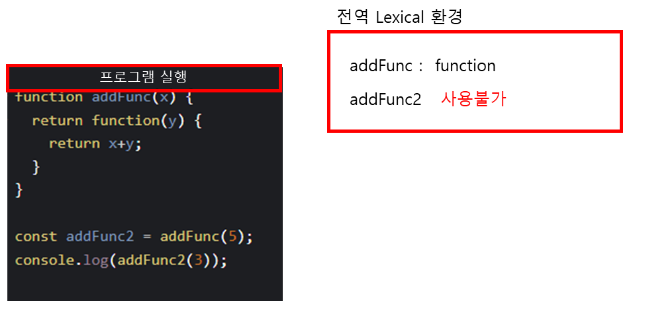
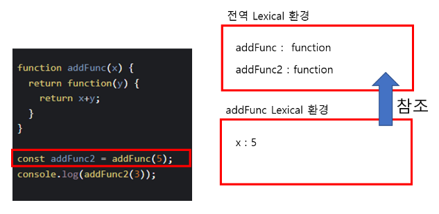
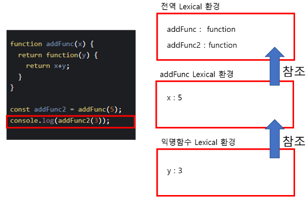

# 클로저(closure)

클로저는 어떤 함수가 자신의 내부가 아닌 외부에서 선언된 변수에 접근하는 것.

클로저는 함수와 그 함수가 선언 됐을 때의 렉시컬 환경과의 조합이다 => 자신이 선언될 당시의 환경을 기억하는 함수

##### 예시1

##### 예시2

##### 부작용

클로저가 많아지면 코드를 읽기 힘들거나 고치기 어려워짐.
