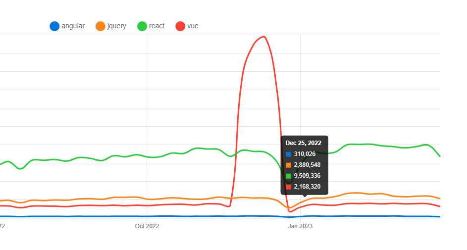
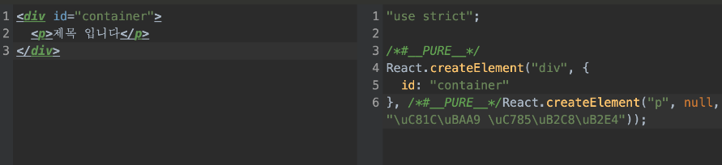
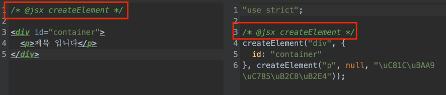
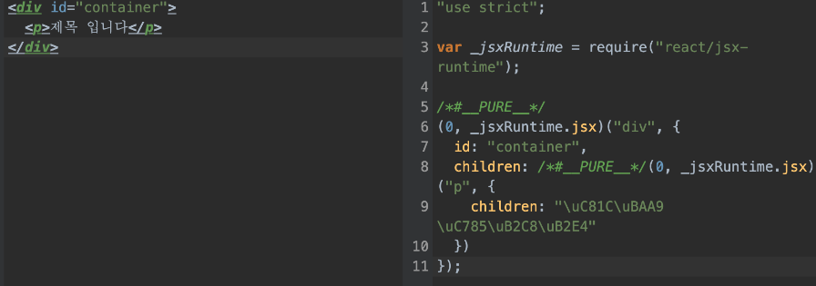
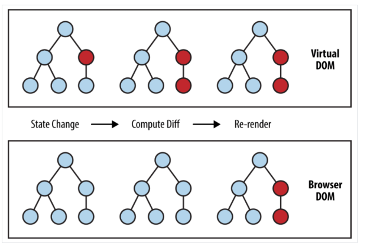

# React

몇년 전 까지만 해도 UI 개발 라이브러리는 jQuery가 가장 인기가 많았다.



하지만 현재 [npm trends](https://www.npmtrends.com/)(npm에 등록된 패키지의 트렌드를 확인하고 비교할 수 있는 사이트) 기준 프런트엔드 UI 개발 라이브러리 순위는 react, jquery, vue 순서가 되었다.

### DOM

웹은 DOM(Document Object Model)로 되어 있다. 그리고 DOM의 동적 변경을 위해 웹은 DOM API를 제공한다.

하지만 DOM API를 다루는 것은 매우 까다롭다.

예를 들어, DOM을 선택하는 주요 방법으로, ID 선택자를 활용하는 `getElementById`와 Class 선택자를 활용한 `getElementByClassName`이 있는데, 둘 다 DOM을 가져오는 함수지만 다른 타입의 값을 리턴한다.

getElementById : HTMLElement를 상속받은 객체를 리턴

```js
const container = document.getElementById('container');
console.log(container);  return <div id="container"></div>
console.log(container.__proto__); return HTMLDivElement {Symbol: 'HTMLDivElement'}
```

getElementByClassName : HTMLCollection을 리턴

```js
const container = document.getElementsByClassName('container');
console.log(container); return HTMLCollection [className: 'container']
console.log(container.__proto__); return HTMLCollection {Symbol: 'HTMLCollection'}
```

또한, 브라우저별로 DOM API와 스펙이 각각 다르기 때문에 더욱 복잡해진다.

따라서 프론트엔드 UI 개발 라이브러리는 DOM API를 쉽게 다룰 수 있게 만들어 졌고, 어떻게 다룰 수 있는지가 핵심이라고 볼 수 있다.

최근 javascript에서 메서드들을 추가하거나, 모던 브라우저들이 ES6 표준을 따르기 때문에 크로스 브라우징같은 이슈들이 개선되고 있긴 함

### 쉽고 직관적으로 DOM API를 다룰 수 있는 jQuery


jQuery는 DOM Selector API로 DOM을 선택하여 특정 이벤트가 발생하면 변화를 주는 방식으로 매우 쉽고 직관적임.

하지만 성능을 고려한 라이브러리가 아니었기에 매우 느리다는 단점이 있다.


P태그를 3만 줄 추가하는 예제인데 jQuery는 1199ms, JS는 48ms가 걸렸다.(25배 차이)

이렇게 차이가 나는 이유는 jQuery는 크로스 브라우징 등의 이슈를 해결하기 위해  jQuery 라이브러리를 거치면서 브라우저에 맞는 네이티브 자바스크립트로 변환된 뒤 실행되어, 실제 태그를 추가하기까지 많은 과정을 거치게 되기 때문.

그리고 다루어야 할 데이터가 많아질수록 더 많은 DOM을 선택해야 하기 때문에, 페이지가 복잡해질수록 코드가 기하급수적으로 능러나고, 코드 관리가 힘들어지는 단점이 있음.

### React의 등장

React는 개발자에게 DOM API를 쓸 필요가 없게 만들었다.

개발자는 React 문법에 맞춰 상태(state)만 관리하면, 상태를 기준으로 DOM API는 React에서 알아서 처리하여 DOM을 랜더링함.

###### React의 핵심 기능 5가지

1. 가상돔(VirtualDOM)
2. JSX(JavaScript And Xml)
3. 가상돔을 리얼돔으로 렌더링하기(VirtualDOM → RealDOM)
4. Diffing Update
5. Hooks

### 1. 가상돔 (VirtualDOM)

가상돔은 DOM의 형태를 본떠 만든 객체

```js
<div id="container">
  <p>VirtualDOM</p>
</div>
```

이러한 DOM 코드를 Virtual DOM식으로 표현된 코드

```js
const VirtualDOM = {
    tag: 'div',
    props: {
      id: 'container'
    },
    children: [
      {
        tag: 'p',
        props: {},
        children: ["VirtualDOM"],
      },
    ],
};
```

이러한 객체 형태로 데이터를 계속 추가하기 위해 함수를 만들어 줌

```js
function createElement(tagName, props, ...children) {
  return { tagName, props, children: children.flat() }
}

const VirtualDOM2 = (
  createElement('div', { id: 'container' }, 
    createElement('p', { style: 'color: red' }, '제목 입니다'),
  )
)
```

하지만, createElement 함수로 매번, 복잡한 UI를 웹 개발자가 VirtualDOM을 생성해 줄 수는 없음.

이 createElement를 쉽게 사용할 수 있게 해 주는 것이 바로 JSX

### 2. JSX (JavaScript And Xml)

개발자는 익숙한 마크업 문법으로 개발하고, JavaScript 컴파일러인 Babel에서 createElement 함수로 변환(transpile) 해 주는 역할을 함



React 없이 JSX를 사용하기 위해선 소스코드 주석에 `@jsx ‘함수명'`을 기입해야 함



 React 라이브러리를 사용하지 않으므로, React.createElement 함수로 Transpile 된다면 에러를 반환. `@jsx '함수명'`을 기입해, 직접 만든 createElement 함수로 Transpile할 수 있음.

##### Q. React 17 버전 이전 함수 컴포넌트에서 반드시 React를 import 하는 이유

```js
// 임포트 하지 않음
// import React from 'react';

const Title = () => {
  return <p>타이틀 입니다</p>
};

export default Title;
```

JSX를 transpile하려면 React.createElement 함수를 사용해야 하는데, React를 import하지 않으면 React 패키지에 createElement 함수를 사용할 수가 없게 됨.

좀 더 정확히는 런타임에 빌드된 코드 안에서 React.createElement 함수를 찾을 수가 없음.

하지만 React 17 버전부터는 함수 컴포넌트에서 React를 import하지 않아도 에러를 반환하지 않고 잘 작동함.

React 17 버전부터는, 새로운 JSX Transform 덕분에, React를 import하지 않고도 React 패키지 자체의 _jsxRuntime 함수를 불러와 JSX 문법을 사용 가능하게 해 줌.



### 3. 가상돔을 리얼돔으로 렌더링하기

JSX를 활용해 VirtualDOM까지 생성하였지만, VirtualDOM은 어디까지나 객체임.

이 객체를 리얼돔으로 랜더링 하기 위해 DOM API를 사용해야 함.

```js
export function createElement(tagName, props, ...children) {
  return { tagName, props, children: children.flat() }
}

/* @jsx createElement */
const jsxDOM = <div id="container">
  <p>제목 입니다</p>
</div>

export function renderRealDOM(VirtualDOM){
  // 가장 끝 하위 요소 String 예외 처리
  if(typeof VirtualDOM === 'string'){
    return document.createTextNode(VirtualDOM)
  }

  // tag 생성
  const $Element = document.createElement(VirtualDOM.tagName);

    // 재귀 호출
  VirtualDOM.children
    .map(renderRealDOM)
    .forEach(node => $Element.appendChild(node));
  return $Element;
}
```

이 renderRealDOM 함수가 하는 일은

1. VirtualDOM의 tagName을 바탕으로 document.createElement API를 이용하여 태그를 생성

2. VirtualDOM의 자식(children) 구조가 동일하므로 재귀 호출로 renderRealDOM 을 호출

3. 각각의 Children Node 데이터를 appendChild API로 Element를 추가

4. 가장 끝 하위 요소 Children은 String이기 때문에, 예외 처리를 해 주고, createTextNode로 TextNode를 생성

=> 재귀 호출로 DOM API를 이용해 태그를 생성함

### 4. Diffing Update 적용

가상돔은 객체이기 때문에 이전 적용된 Old 가상돔과 New 가상돔을 비교하여 변경된 부분만 업데이트 할 수 있음.



쉬운 예시를 위해 텍스트가 변경된 경우에만 Diffing Update를 구현

```js
export function diffingUpdate (parent, nextNode, previousNode, parentIndex = 0) {
// Node가 string일 때 업데이트해 줍니다
  if (typeof nextNode === "string" && typeof previousNode === "string") {
    // 만약 해당 문자열이 동일하다면, replace해 줄 이유가 없습니다.
    if (nextNode === previousNode) return;
    return parent.replaceChild(
      renderRealDOM(nextNode),
      parent.childNodes[parentIndex]
    )
  }

  // nextNode와 previousNode의 모든 자식 태그를 순회하며 diffingUpdate 함수를 반복해 줍니다.
  for (const [index] of nextNode.children.entries()) {
    diffingUpdate(
      parent.childNodes[parentIndex],
      nextNode.children[index],
      previousNode.children[index],
      index
    )
  }
}
```

1. VirtualDOM 객체의 구조(tag, props, children)는 동일하기 때문에 diffingUpdate 함수를 재귀 호출함으로써, 모든 자식 태그를 순회
2. 함수의 인자로 부모 노드, 변경할 노드, 이전 노드, parentIndex를 받아서, replaceChild DOM API로 변경된 부분만을 업데이트

### 5. Hook 구현하기

클래스 컴포넌트같은 경우, 최초로 생성되는 컴포넌트만 새롭게 인스턴스를 만들고, 컴포넌트가 삭제되기 전까지 만들어진 인스턴스를 통해 render 메서드를 이용하여 상태 변경을 감지(setState)함.

즉, 해당 인스턴스에서 필요한 부분만을 업데이트하여 context 상태를 계속 유지할 수 있음.

하지만 함수 컴포넌트(function componen)의 경우 props를 인자로 받아서, JSX 문법에 맞는 React Component를 반환해 주기 때문에 함수 컴포넌트의 호출은 무조건 렌더링을 일으킴.

이미 만들어진 인스턴스를 가지고 render만 호출하는 클래스 컴포넌트와는 다르게, 함수 컴포넌트는 상태가 변경될 때마다 새로운 인스턴스를 생성.

하지만, React 16.8 버전부터는 함수 컴포넌트에서도 상태(State)를 갖고 유지할 수 있는 Hook을 제공함.

함수 컴포넌트가 다시 실행되어도, 해당 함수의 상태(State) 값이 초기화되지 않고, React에 의해 사라지지 않음.

```js
// 4, useState 함수 외부에 두어서 데이터를 유지(클로저)
let hookState = undefined;
function useState (initState) {
    // 1. 초기값 설정
  if (hookState === undefined) hookState = initState;
    // 2. 상태를 수정할수 있는 메서드 제공(Hooks의 두 번째 인자)
  const setState = (nextState) => {
    hookState = nextState;
        // 상태 수정 후 렌더링
    rendering();
  }
  //3. 상태와 상태를 변경할 핸들러를 배열로 반환
  return [ hookState, setState ];
 }
```

1. 초깃값이 설정되어 있지 않을 시 초깃값을 설정
2. setState로 상태를 수정 및 수정 후에는 렌더링
3. 상태와 상태를 변경할 핸들러의 배열을 반환하여, destructuring한 형태의 배열로 받아서 사용
4. hookState는 useState 함수 외부에 두어, useState 호출과는 상관없이 데이터를 유지

=> hookState를 useState 함수 외부에 두어, 클로저로 데이터를 유지시켜, 함수가 다시 호출되더라도 이전 상태를 기억

##### 다중 상태 관리

각기 다른 컴포넌트에서 setState로 hookState의 값을 수정하더라도, 수정되는 값은 동일한 hookState 변수를 바라보기 때문에 1개 이상의 상태는 다룰 수 없음

따라서, 1개 이상의 상태를 다루기 위해 hookState를 배열로 변경해야 함.

=> hook은 클로저로 구현된 배열일 뿐임

```js
let currentIndex = 0; // Hook을 사용하는 컴포넌트의 배열 위치 값
const hookStates = []; // Hook 데이터를 보관할 배열
function useState(initialState) {
  const index = currentIndex;
  if (hookStates.length === index) {
    hookStates.push(initialState);
  }
  const setState = (newState) => {
    hookStates[index] = newState;
    rendering();
  }
  currentIndex++;
  return [ hookStates[index], setState ];
}
```

1. 각각의 함수 컴포넌트들이 useState를 호출할 때마다 currentIndex로 해당 컴포넌트의 배열 위치 값을 관리함. useState를 호출하는 각각의 컴포넌트를 순서대로 currentIndex 즉, 일종의 ‘Key’로 구분.
2. setState로 데이터를 수정 시, 해당 배열 내부의 값을 변경
3. useState 함수가 종료되기 전 currentIndex 값을 증가시켜 다음 hookStates 배열의 Index 값을 업데이트

##### 훅 사용 규칙

1. 최상위(at the Top Level)에서만 Hook을 호출해야 함.

Hook은 순서대로 배열에 저장되는데, 만약 최상위 레벨이 아닌 조건문이나, 반복문, 중첩 함수에서 Hook을 사용한다면 맨 처음 함수가 실행될 때 저장되었던 순서와 맞지 않게 되어 다른 상태 값을 참조하게 되는 버그를 유발할 수 있음.

2. 오직 React 함수 내에서 Hook을 호출해야 함.

Hook은 React 함수 컴포넌트가 상태를 가질 수 있게 제공하는 기능이기에 React 함수가 아닌, 일반 함수는 Hook을 저장할 수도, 위치 값을 알 수도 없음. 클래스 컴포넌트는 상태가 변경될 때 인스턴스를 새롭게 만들지 않고, render 메서드를 통해 상태가 업데이트되어 Hook의 호출 시점을 만들 수 없으므로 Hook을 사용할 수 없음.

### 정리

1. jQuery는 다루기 까다로운 DOM API를 직관적으로 손쉽게 다룰 수 있는 모델을 제시했지만, 성능 최적화의 아쉬움과 개발 생산성의 문제가 있었음.
2. React는 개발자가 DOM API를 다룰 필요가 없게 만들고, 상태(State)를 기반으로 DOM을 업데이트시켜 빠른 성능과 개발 생산성에도 효과적인 모델을 제시함.
3. 가상돔은 DOM의 형태를 본떠 만든 객체
4. JSX는 개발자는 익숙한 마크업 문법으로 개발하고, 바벨에서 createElement 함수로 변환해 VirtualDOM을 손쉽게 만들어 줌.
5. Diffing Update는 비교적 무거운 RealDOM의 비교가 아닌, 가벼운 VirtualDOM의 비교를 통해 적은 비용으로 충분히 빠르게 UI를 업데이트해 줌.
6. Hook은 일종의 배열 데이터로, 클로저에 의해 저장됨.
