# 가비지 컬렉션

자바스크립트 메모리 관리를 위해 쓸모 없어진 원시값, 객체, 함수 등을 찾아내 자동으로 삭제해줌

### 변수와 메모리

###### Primitive Type

- 자바스크립트 원시 타입은 숫자, 문자영, 불리언, null, undefined, 심볼이 있는데 불변하는 데이터로, 메모리를 한번 할당받으면 값이 변경되지 않는다.

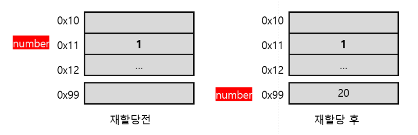

- 자바스크립트에선 값을 재할당하면 새로운 메모리 공간을 할당받아 값을 넣고, 변수가 가리키는 메모리주소를 변경한다.

- 이전 값은 더 이상 사용되지 않으므로 가비지 컬렉션 대상이 된다.

###### Object Type

- 원시 타입을 제외한 모든 것이 객체 타입으로, 객체, 배열, 함수 등이 있고, 객체 타입을 변수에 할당하면, 변수에는 실제 객체가 저장된 힙 메모리 주소가 저장된다.

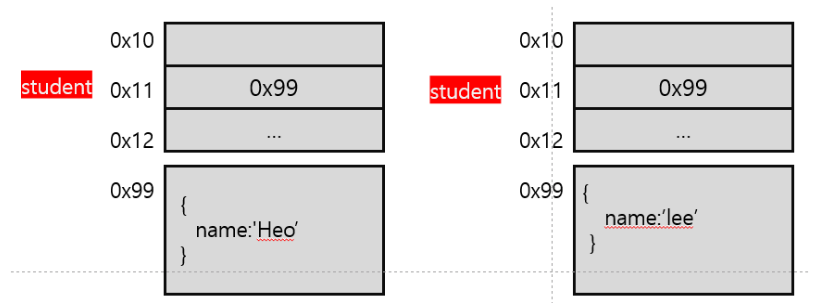

- 자바스크립트 객체에 접근하는 방법은 메모리 주소를 통하는 것으로, 일종의 포인터 역할을 한다.

- 객체를 가리키는 포인터가 하나도 없으면 객체를 사용할 방법이 없으므로 가비지 컬렉션의 대상이 된다.

### 메모리 구조

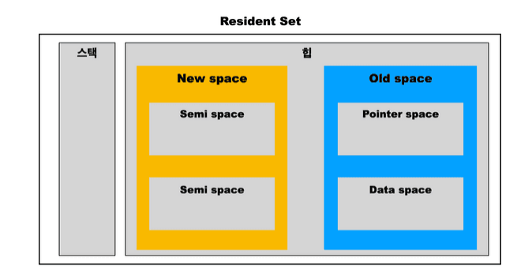

###### New space

- 새로 만들어진 객체가 저장

###### Old space

- New space에서 마이너 가비지 컬렉션이 2번 발생할 동안 살아남은 객체들이 저장됨
  
  - Pointer space : 다른 객체를 참조하는 객체
  
  - Data space : 문자열, 실수 등의 데이터만을 가진 객체

### 가비지 컬렉션 알고리즘

##### Reference Counting

- 참조 갯수를 카운팅하여 참조가 하나도 없으면 가비지로 판단하는 방법

```javascript
function f() {
  var x = {}; 
  var y = {};

  x.a = y; // x의 속성 a가 y에 담긴 객체를 참조합니다. 
  y.a = x; // y의 속성 a가 x에 담긴 객체를 참조합니다. 
  return 'azerty';
}

f(); 
```

- 하지만 두 객체가 서로를 참조하고 있다면 함수가 종료되더라도 가비지 컬렉션을 수행하지 못하는 문제 발생

##### Mark and Sweep

- roots라는 전역변수의 집합부터 시작하여 roots가 참조하는 객체 -> 그 자식들이 참조하는 객체 ->..... 이런 식으로 접근 가능한 객체를 선별하고, 접근 불가능 한 객체들을 가비지로 판단하는 방법이다. (최신 브라우저는 이거씀)

- 순환 참조의 경우 실행 컨텍스트가 소멸하는 순간 접근 불가능한 객체가 되기 때문에 순환 참조가 발생하지 않는다.
1. Mark
   
   객체가 생성될 때마다 mark bit가 false로 설정되고 접근 가능한 객체의 mark bit가 True로 설정 됨

2. Sweep
   
   Mark 단계 이후에도 여전히 false 객체면 가비지 컬렉터가 수집해 메모리에서 해제됨

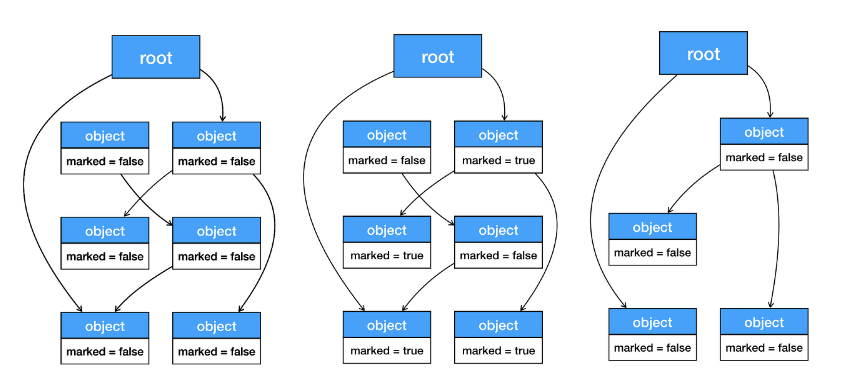

### 가비지 컬렉션 동작

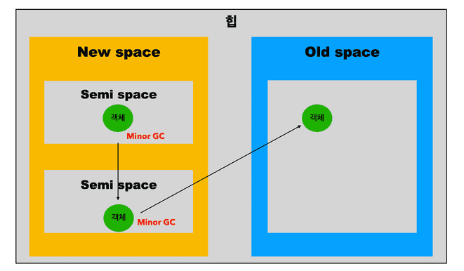

New space에선 마이너 GC이 2번 동작하게 되고 Old space에선 메이저 GC이 동작하게 된다.

##### 마이너 GC

- 2개의 Semi space가 있고 대피 과정을 위해 하나의 Semi space는 비어있다. 비어있는 영역을 To space, 객체가 머무르는 영역을 From space라고 부른다.

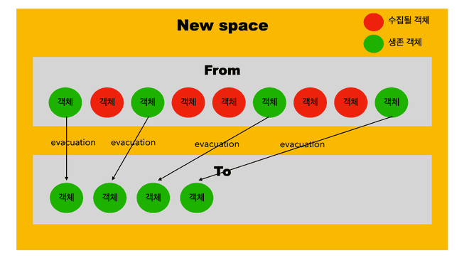

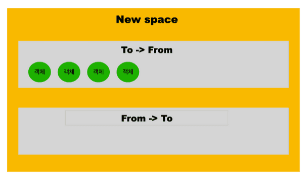

- From space가 가득 차게 되면 mark and sweep 알고리즘이 수행 되고, 버리지 않을 객체를 대피시킨다.

- From space에서 To space로 대피가 완료되면 From에 쓸모 없는 객체들을 버리고, From과 To의 역할을 바꿈

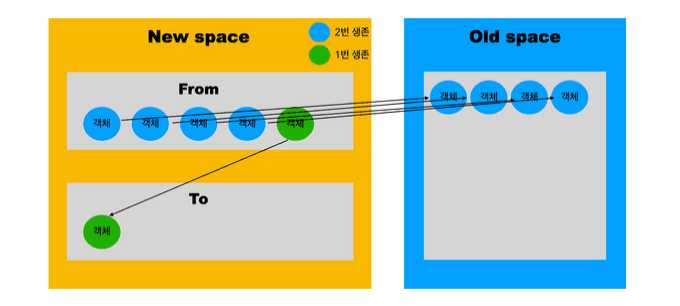

- 그러다 From 공간이 가득차면 또 mark and sweep 알고리즘이 수행되는데 여기서 기존에 생존했던 4개의 객체는 또 한번 생존하게 되면 Old space로 이동한다.

##### 메이저 GC

- Old space가 가득 차게 된다면 Marking Sweep Compact 알고리즘이 수행된다.

- Mark and Sweep과 비슷한데 Compact를 통해 메모리 단편화가 심한 페이지들을 재배치함

### 가비지 컬렉션 기술

- 가비지 컬렉션이 실행되면 프로그램이 멈추게 됨(Stop The World). 더 나은 UX를 위해 GC 기술이 발전해 옴

###### Parallel

- 기존에 메인 쓰레드 혼자 하던 일을 헬퍼 쓰레드와 나누어 일을 함.

- 쓰레드 간의 동기화를 처리해야 해서 오버헤드가 생기지만 STW 시간이 감소

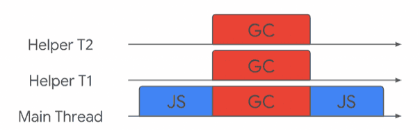

###### Incremental

- 메인 쓰레드가 적은 양의 작업을 간헐적으로 처리

- 메인 쓰레드에서 가비지 컬렉션에 소요하는 시간이 분산되어 더 나은 UX 제공

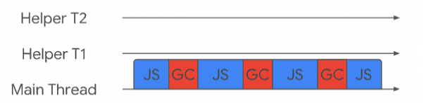

###### Concurrent

- 헬퍼 쓰레드에서만 가지비 컬렉션을 수행

- 기술적으로 구현하기 힘들지만, 메인 쓰레드의 STW 시간이 전혀 없음

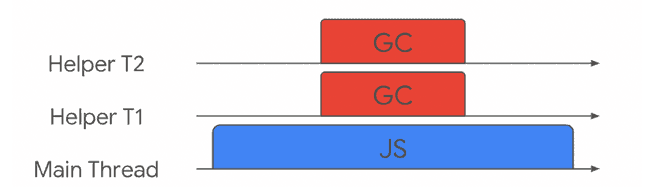
