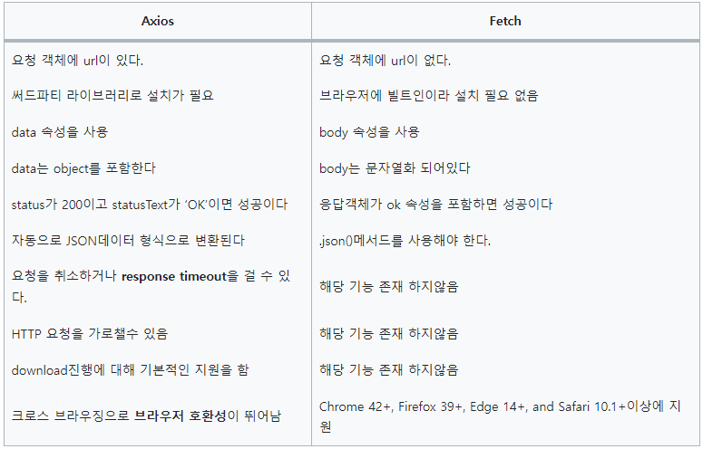

# 비동기 HTTP 통신

### Ajax(Asynchronous JavaScript And XML)

자바스크립트를 사용한 비동기 통신, 클라이언트와 서버간에 데이터를 주고받는 기술

Ajax를 통해 서버와 비동기적으로 통신함으로 인해 우리는 전체 웹페이지를 다시 불러오는 동기 방식과는 다르게 점진적으로 해당 부분의 사용자 인터페이스를 갱신할 수 있다.

```jsx
// use Ajax without Jquery

function reqListener (e) {
    console.log(e.currentTarget.response);
}

var oReq = new XMLHttpRequest();
var serverAddress = "https://jsonplaceholder.typicode.com/posts";

oReq.addEventListener("load", reqListener);
oReq.open("GET", serverAddress);
oReq.send();
```

순수 ajax를 사용할 경우 XMLHttpRequest() 라는 객체를 사용함.

- XMLHttpRequest 객체를 생성

- open() 메서드로 요청에 필요한 정보를 설정

- send() 메서드로 서버에 요청을 보냄

- 응답에 대한 콜백 함수를 생성

```javascript
// use Ajax with Jquery

var serverAddress = 'https://jsonplaceholder.typicode.com/posts';

// jQuery의 .get 메소드 사용
$.ajax({
    url: ,
    type: 'GET',
    success: function onData (data) {
        console.log(data);
    },
    error: function onError (error) {
        console.error(error);
    }
});
```

jquery를 사용하면 조금 더 간단해지고 직관적임

### Fetch

자바스크립트의 내장 라이브러리

Promise 기반으로 만들어져 데이터를 다루는데 어렵지 않고, 내장 라이브러리라 편리함

```javascript
//fetch
const url ='http://localhost3000/test`
const option ={
   method:'POST',
   header:{
     'Accept':'application/json',
     'Content-Type':'application/json';charset=UTP-8'
  },
  body:JSON.stringify({
      name:'sewon',
        age:20
  })

  fetch(url,options)
      .then(response => console.log(response))
```

###### 장점

- 내장 라이브러리라 별도의 import가 필요 없다.

- 내장 라이브러리라 사용하는 프레임워크가 안정적이지 않을 때 사용하기 좋다.

###### 단점

- ie의 경우 fetch를 지원하지 않는 버전이 존재(이젠 ie 사망)

- 기능이 부족함

### Axios

node.js와 브라우저를 위한 Promise 기반의 HTTP통신 라이브러리.

```javascript
axios({
  method: 'post',
  url: '/user/12345',
  data: {
    firstName: 'Yongseong',
    lastName: 'Kim'
  }
});
```

###### 장점

- fetch에서 지원하지 않는 다양한 기능

- 크로스 브라우징에 신경을 많이 써서 브라우저 호환성이 뛰어남

###### 단점

- 모듈 설치가 필요

### Fetch vs Axios



Axios가 Fetch의 상위 호환 버전

간단하게 쓰려면 Fetch를 쓰고 확장성을 염두에 두면 Axios를 쓰자
