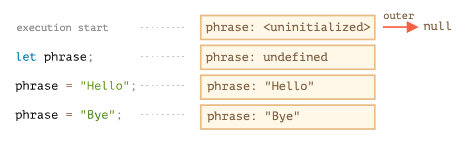

# 실행 컨텍스트(Execution Context)

실행할 코드에 제공할 환경 정보들을 모아놓은 객체

모든 자바스크립트 코드는 실행 컨텍스트 내부에서 실행이 됨

### 생성

자바스크립트 엔진이 스크립트를 처음 마주할 때 전역 컨텍스트를 생성하고, 콜 스택에 푸시

함수 호출을 발견할 때마다, 함수의 실행 컨텍스트를 콜 스택에 푸시 (함수가 실행될 때)

실행 컨텍스트를 만드는 방법은

1. 전역공간

2. 함수 실행

3. eval() 함수 실행

4. block을 만듬

```javascript
var a = 1; // 전역 컨텍스트
function outer () { // outer 컨텍스트
  function inner () { // inner 컨텍스트
    console.log(a); // undefined
    var a = 3;
    console.log(a); // 3
  }
  inner();
  console.log(a); // 1
}
outer();
console.log(a); // 1
```

###### 콜스택

1. 프로그램 실행 : [전역컨텍스트]

2. outer 실행: [전역컨텍스트, outer]

3. inner 실행: [전역컨텍스트, outer, inner]

4. inner 종료: [전역컨텍스트, outer]

5. outer 종료: [전역컨텍스트]

### 구성

##### variableEnvironment

현재 컨텍스트 내의 식별자들에 대한 정보와 외부 환경 정보를 담는다.

선언 시점의 LexicalEnvironment의 스냅샷으로 변경사항은 반영되지 않는다.

실행 컨텍스트를 생성할 때 variableEnvironment에 먼저 정보를 담고 복사하여 LexicalEnvironment를 만든다

##### LexicalEnvironment

처음에는 variableEnvironment와 같지만 변경사항이 실시간으로 반영된다.

##### ThisBinding

this 식별자가 바라봐야 할 대상 객체. 실행 컨텍스트가 활성될 때 this가 지정되지 않은 경우 this에는 전역 객체가 저장됨

# 랙시컬 환경(Lexical Environment)

실행할 스코프 범위 안에 있는 변수와 함수를 프로퍼티로 저장하는 이론상 객체 

스크립트 전체, 코드블록, 호출된 함수는 각자 자신만의 렉시컬 환경을 가짐

-> 우리가 소스 코드를 실행하면서 참조가 필요한 변수의 값을 랙시컬 환경이라는 객체에서 식별자 이름을 키로 찾는다

### 구성

##### 환경 레코드

렉시컬 환경에서 모든 지역변수를 프로퍼티로 저장하고 있는 객체이다.

따라서 변수는 특수 내부 객체인 환경 레코드의 프로퍼티라 변수를 가져오거나 변경하는 것은 환경 레코드의 프로퍼티를 가져오거나 변경하는 것이다.

```javascript
function add(a, b) {
    let name = 'Pete' 
}

add()

환경레코드에 {name: 'Pete', a: undefined } 이런식으로 저장되어 있다. 
```

##### 외부 렉시컬 환경

현재 렉시컬 환경보다 더 상위의 렉시컬 환경.

스크립트는 최상위 렉시컬 환경이며, 스크립트 내에 호출된 함수나 코드블록은 외부 렉시컬 환경으로 스크립트 렉시컬 환경을 참조한다.

렉시컬 환경이 만들어질 때 Environment라는 숨김 프로퍼티가 만들어진다. 프로퍼티에는 외부렉시컬 환경이 저장되어있으며 지역내에서 참조할 값이 없을 경우 프로퍼티에 접근하여 외부 렉시컬 환경을 참조하게되는데 값이 없을 경우 최상위 렉시컬 환경까지 검색하게 되는 체이닝 과정이 일어난다. 그렇기 때문에 모든함수는 클로저라고 할 수 있다.

### 스크립트 실행



스크립트가 시작되면 변수가 렉시컬 환경에 올라가는데 변수의 상태는 uninitialized가 된다. 자바스크립트 엔진이 변수를 인지하긴 하지만, let을 만나기 전까진 참조할 수 없다.

1. let이 나타났지만 할당 전이라 undefined. (undefined로서 사용이 가능)

2. Hello나 Bye 값이 할당되고 변경됨

### 함수는 선언이 아닌 실행될 때 렉시컬 환경이 구성됨

```javascript
function makeCounter() {
  let count = 0;

  return function() {
    return count++;
  };
}

let counter = makeCounter();
console.log(counter()); // 0
console.log(counter()); // 1
console.log(counter()); // 2

console.log(makeConter()()); // 0
console.log(makeConter()()); // 0
console.log(makeConter()()); // 0
```

위 중첩 함수에서 함수 호출을 변수에 저장해두고 쓰면 하나의 렉시컬 환경이 만들어 진다. 중첩된 함수를 여러번 호출할 때에 하나의 makeCounter() 함수를 외부 렉시컬 환경으로 참조하므로 count가 증가된 값들이 반영된다.

하지만 변수에 저장해두고 쓰지 않고 함수를 3번 호출한 경우 3개의 고유한 렉시컬 환경이 만들어지고 중첩된 함수는 각각의 서로다른 외부렉시컬 환경을 참조하기 때문에 위와 같은 콘솔 결과가 나타난다.
