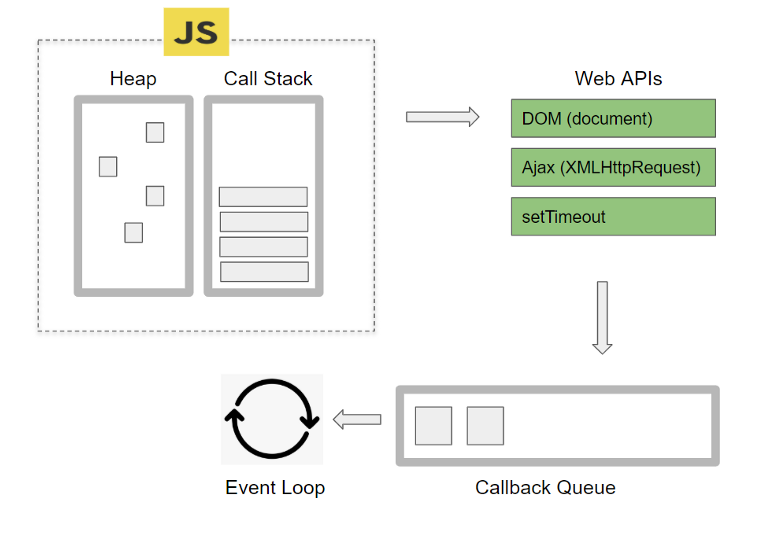
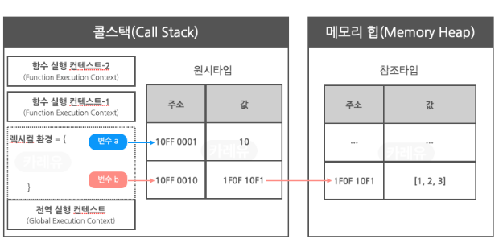
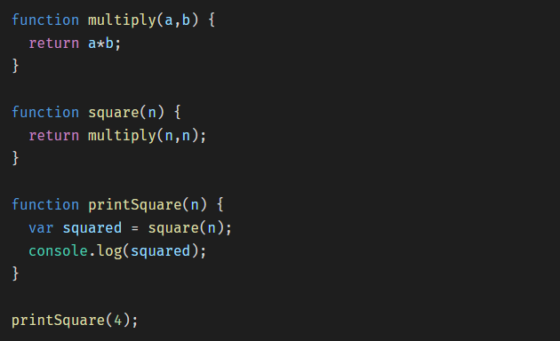
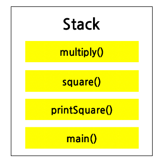

# 자바스크립트 이벤트 루프

### 브라우저 기본 구조

- Heap : 메모리 할당이 발생함

- Call Stack : 실행된 코드의 환경을 저장하는 자료구조로, 함수 호출 시 이곳에 저장됨.

- Web APIs : 브라우저에서 제공하는 API로 Call Stack에서 실행된 비동기 함수는 Web API를 호출하고 Web API는 콜백 함수를 Task Queue에 넣는다.

- Callback Queue : 함수를 저장하는 자료구조로, Call Stack과 다르게 먼저 들어온 함수를 먼저 처리.

- Event Loop : Call Stack이 비워지면 Callback Queue에 존재하는 함수를 하나씩 Call Stack으로 옮긴다.

### 메모리 힙

참조 타입 데이터를 저장한다.

### 콜스택

하나의 쓰레드 = 하나의 콜 스택 = 한번에 하나의 작업

메모리 힙에 있는 함수들이 콜 스택에 호출한 순서대로 쌓인다.

### Web API

Ajax요청, setTimeout(), 이벤트 핸들러의 등록 등 웹 브라우저에서 제공하는 기능.

요청의 처리가 JavaScript 엔진의 쓰레드와는 다른 쓰레드에서 이루어짐.

JavaScript 엔진의 스택에서 실행된 비동기 함수가 요청하는 비동기 작업에 대한 정보와 콜백 함수를 웹 API를 통해 브라우저에 넘기면 별도의 쓰레드에 위임하고, 요청이 완료되면 콜백함수를 JavaScript 태스크 큐(콜백 큐)에 넣음.

##### setTimeout() 동작

- JavaScript 엔진은 웹 API를 통해 브라우저에게 setTimeout() 작업을 요청하면서 콜백 함수를 전달하고, 브라우저는 별도의 쓰레드에 위임.

- 명시된 시간이 흐르면 전달 받았던 콜백 함수를 태스크 큐에 넣음.

- 콜 스택이 비어있다면 스택에 콜백 함수를 순서대로 푸시하고 실행 됨.

(태스크 큐에 콜백 함수가 있어도 스택이 비어있지 않으면 콜백 함수가 바로 실행되지 않기 때문에 setTimeout()의 시간은 최소 시간임)

### 이벤트 루프

이벤트 루프는 매 순간 스택이 비어있는지 확인을 해서 스택이 비어있다면 태스크 큐에 콜백 함수가 들어올 때까지 기다렸다가 첫 번째로 들어오는 콜백 함수를 스택에 쌓는 역할을 한다.

이벤트 루프란 스택과 태스크 큐를 확인하는 작업(틱 이라고 부름)을 무한히 반복하는 무한 루프이다.
