# 이벤트 버블링, 캡쳐, 위임

### 이벤트 등록

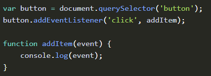

버튼을 클릭하게 되면 addItem 함수가 실행 되고, 함수에 event 인자가 넘어옴.

여기서 브라우저는 어떻게 이벤트의 발생을 감지할까?

### 이벤트 버블링

이벤트 버블링은 특정 화면 요소에서 이벤트가 발생했을 때 해당 이벤트가 더 상위의 화면 요소들로 전달되어 가는 특성

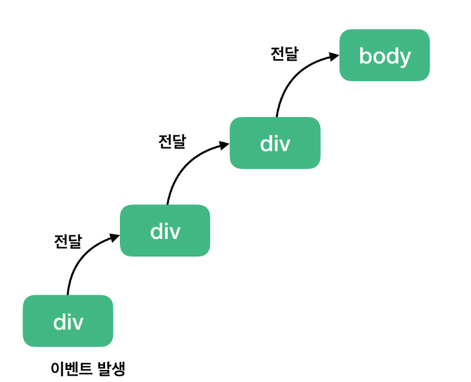

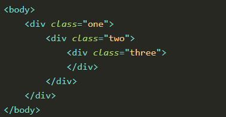

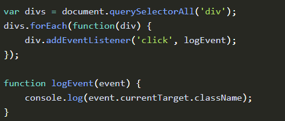

세 개의 div 태그에 모두 클릭 이벤트를 등록 하고 최하위 div 태그를 클릭하면

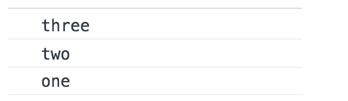

3개의 이벤트가 발생한다.

브라우저는 특정 화면 요소에서 이벤트가 발생했을 때 그 이벤트를 최상위에 있는 화면 요소까지 이벤트를 전파시킨다. 이를 이벤트 버블링 이라고 함

### 이벤트 캡쳐

이벤트 캡쳐는 이벤트 버블링과 반대 방향으로 진행되는 이벤트 전파 방식

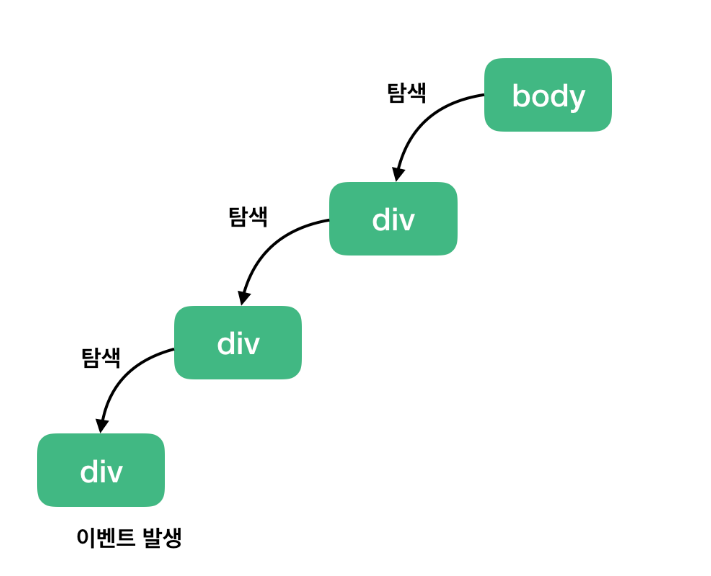

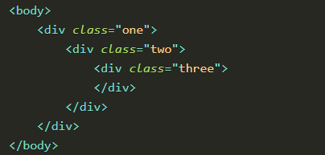

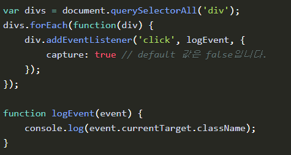

addEventListener() 옵션 객체에 capture: true 를 설정 해주면 이벤트를 감지하기 위해 이벤트 버블링과 반대 방향으로 탐색함

따라서 최하위 div를 클릭하면

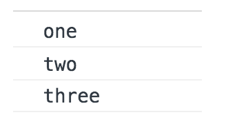

### event.stopPropagation()

이 API는 이벤트 전파를 막아 이벤트 버블링의 경우 클릭한 요소의 이벤트만 발생시키고, 캡쳐의 경우 클릭한 요소의 최상위 요소 이벤트만 동작시킨다.

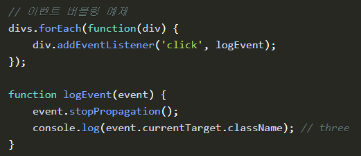

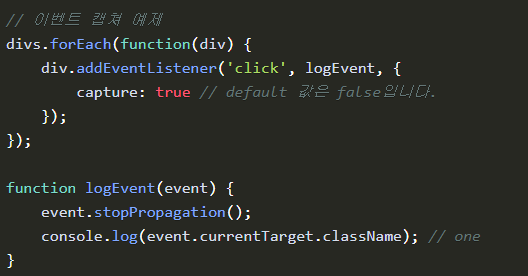

### 이벤트 위임(Delegation)

하위 요소에 각각 이벤트를 붙이지 않고 상위 요소에서 하위 요소의 이벤트들을 제어하는 방식

##### 여러개의 자식 엘리먼트 이벤트 관리

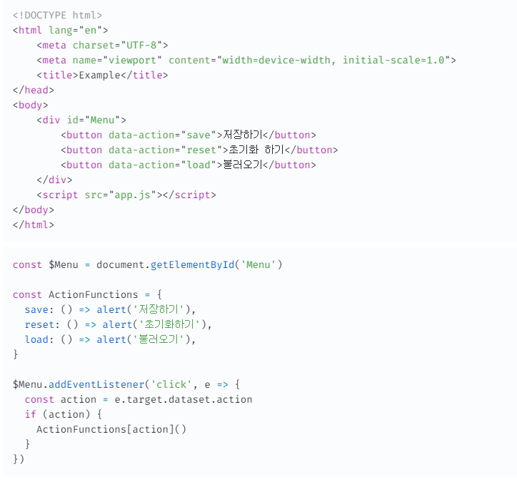

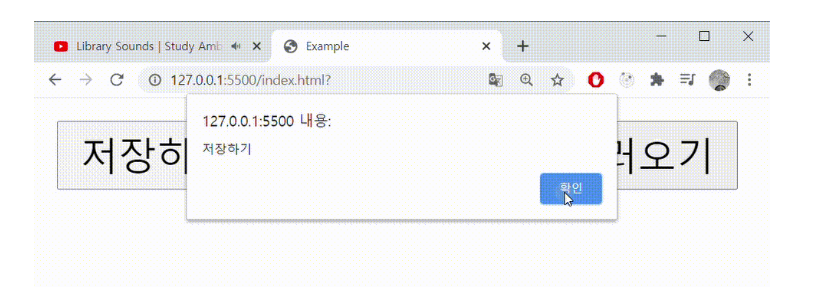

##### 동적 엘리먼트에 대한 이벤트 관리

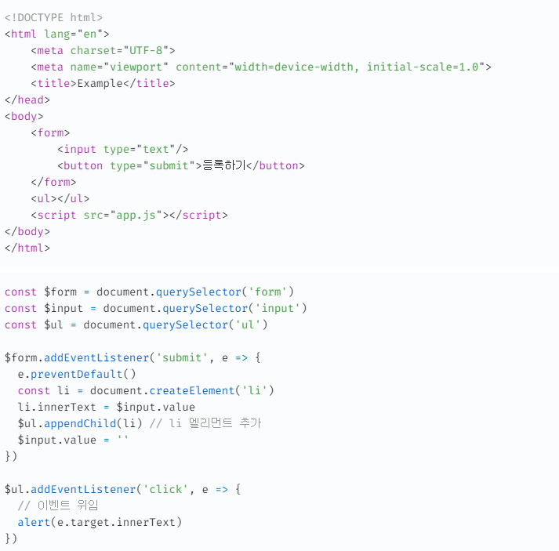

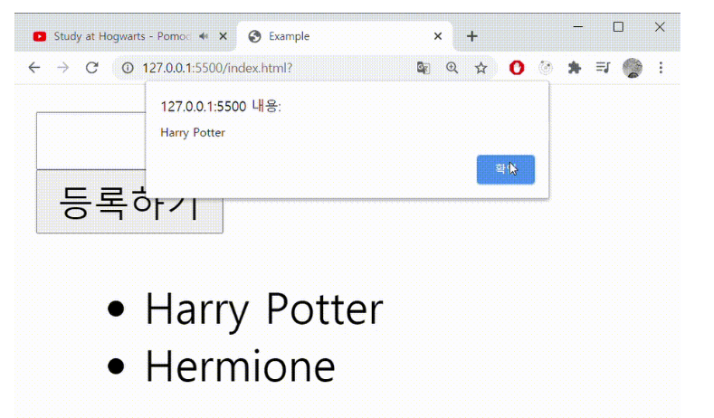
