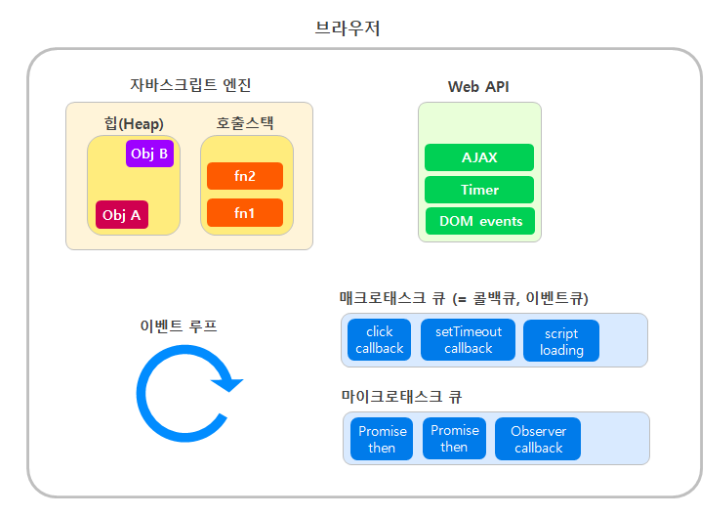

# 태스크 큐

자바스크립트는 싱글 스래드 언어이다.

하지만 web API의 도움으로 비동기 요청을 처리할 수 있고, 콜백 함수가 태스크 큐에 올라가 이벤트 루프에 의해 처리된다.

### 매크로 태스크 큐

일반적인 콜백 큐

우선순위가 낮다

setTimeout, setInterval, setImmediate 등의 작업을 수행

### 마이크로 태스크 큐

ECMA에선 PromiseJobs Queue 라고 부른다

우선순위가 높다

Promise callback, async/await,  Object.observe 등 비동기 작업을 수행

