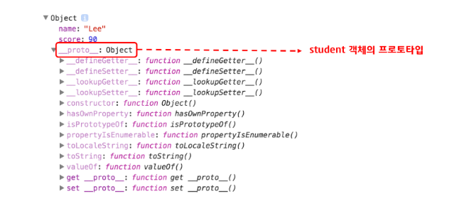
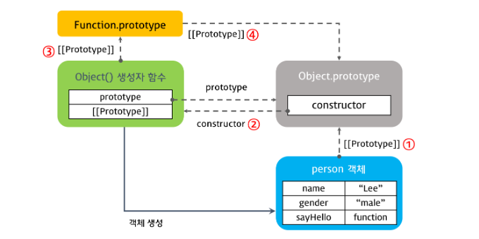
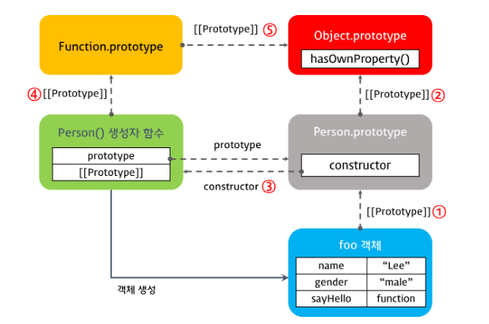
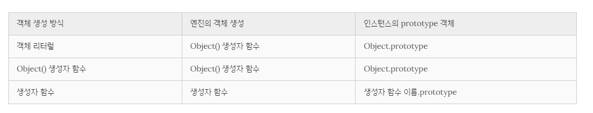
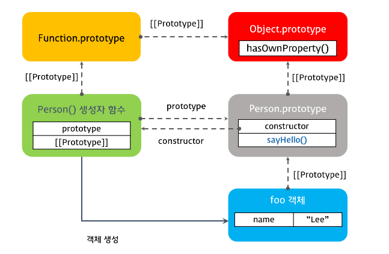
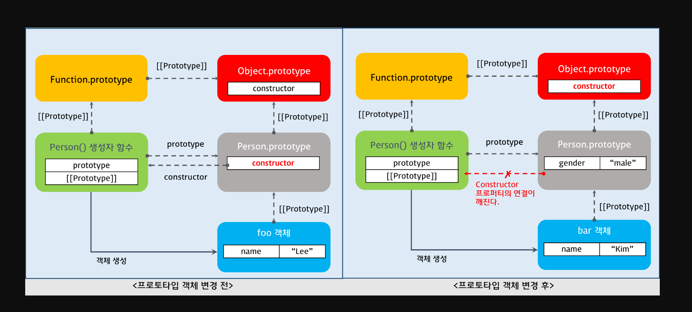
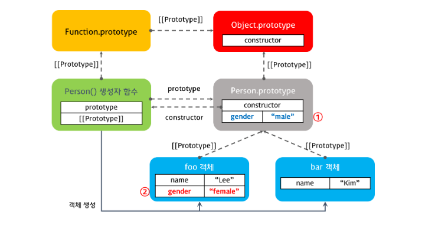

# 프로토타입

ES6 이전에는 클래스가 없었다. 하지만 자바스크립트는 프로토타입 기반 객체지향 프로그래밍 언어로 클래스 없이 객체를 생성할 수 있다.

자바스크립트의 모든 객체는 자신의 부모 역할을 담당하는 객체와 연결되어 있다. 그리고 이것은 마치 객체 지향의 상속 개념과 같이 부모 객체의 프로퍼티 또는 메소드를 상속받아 사용할 수 있게 한다. 이러한 부모 객체를 프로토타입이라 한다.

```js
const student = {
  name: 'Lee',
  score: 90
};

// student에는 hasOwnProperty 메소드가 없지만 아래 구문은 동작한다.
console.log(student.hasOwnProperty('name')); // true

console.dir(student);
```



자바스크립트의 모든 객체는 [[Prototype]]이라는 인터널 슬롯(internal slot)를 가진다. [[Prototype]]의 값은 null 또는 객체이며 상속을 구현하는데 사용된다. [[Prototype]] 객체의 데이터 프로퍼티는 get 액세스를 위해 상속되어 자식 객체의 프로퍼티처럼 사용할 수 있다. 하지만 set 액세스는 허용되지 않는다.

[[Prototype]]의 값은 Prototype(프로토타입) 객체이며 \__proto_\_ accessor property로 접근할 수 있다. \_\_proto__ 프로퍼티에 접근하면 내부적으로 Object.getPrototypeOf가 호출되어 프로토타입 객체를 반환한다.

student 객체는 \_\_proto__ 프로퍼티로 자신의 부모 객체(프로토타입 객체)인 Object.prototype을 가리키고 있다.

```js
var student = {
  name: 'Lee',
  score: 90
}
console.log(student.__proto__ === Object.prototype); // true
```

### [[Prototype]] vs prototype 프로퍼티

prototype 프로퍼티와 [[Prototype]]은 모두 프로토타입 객체를 가리키지만 관점의 차이가 있다.

- [[Prototype]]
  
  - 함수를 포함한 모든 객체가 가지고 있는 인터널 슬롯이다.
  
  - 객체의 입장에서 자신의 부모 역할을 하는 프로토타입 객체를 가리키며 함수 객체의 경우 Function.prototype를 가리킨다
  
  - ```js
    console.log(Person.__proto__ === Function.prototype);
    ```

- prototype 프로퍼티
  
  - 함수 객체만 가지고 있는 프로퍼티이다.
  
  - 함수 객체가 생성자로 사용될 때 이 함수를 통해 생성될 객체의 부모 역할을 하는 객체(프로토타입 객체)를 가리킨다.
  
  - ```js
    console.log(Person.prototype === foo.__proto__);
    ```

### constructor 프로퍼티

프로토타입 객체는 constructor 프로퍼티를 갖는다. 이 constructor 프로퍼티는 객체의 입장에서 자신을 생성한 객체를 가리킨다.

```js
function Person(name) {
  this.name = name;
}

var foo = new Person('Lee');

// Person() 생성자 함수에 의해 생성된 객체를 생성한 객체는 Person() 생성자 함수이다.
console.log(Person.prototype.constructor === Person);

// foo 객체를 생성한 객체는 Person() 생성자 함수이다.
console.log(foo.constructor === Person);

// Person() 생성자 함수를 생성한 객체는 Function() 생성자 함수이다.
console.log(Person.constructor === Function);
```

### Prototype chain

자바스크립트는 특정 객체의 프로퍼티나 메소드에 접근하려고 할 때 해당 객체에 접근하려는 프로퍼티 또는 메소드가 없다면 [[Prototype]]이 가리키는 링크를 따라 자신의 부모 역할을 하는 프로토타입 객체의 프로퍼티나 메소드를 차례대로 검색한다. 이것을 프로토타입 체인이라 한다.

```js
var student = {
  name: 'Lee',
  score: 90
}

// Object.prototype.hasOwnProperty()
console.log(student.hasOwnProperty('name')); // true
```

student 객체는 hasOwnProperty 메소드를 가지고 있지 않으므로 에러가 발생하여야 하나 정상적으로 결과가 출력되었다. 이는 student 객체의 [[Prototype]]이 가리키는 링크를 따라가서 student 객체의 부모 역할을 하는 프로토타입 객체(Object.prototype)의 메소드 hasOwnProperty를 호출하였기 때문에 가능한 것이다.

##### 객체 리터럴 방식으로 생성된 객체의 프로토타입 체인

객체 리터럴 방식으로 생성된 객체는 결국 내장 함수(Built-in)인 Object() 생성자 함수로 객체를 생성하는 것을 단순화시킨 것이다. 자바스크립트 엔진은 객체 리터럴로 객체를 생성하는 코드를 만나면 내부적으로 Object() 생성자 함수를 사용하여 객체를 생성한다.

```js
var person = {
  name: 'Lee',
  gender: 'male',
  sayHello: function(){
    console.log('Hi! my name is ' + this.name);
  }
};

console.dir(person);

console.log(person.__proto__ === Object.prototype);   // ① true
console.log(Object.prototype.constructor === Object); // ② true
console.log(Object.__proto__ === Function.prototype); // ③ true
console.log(Function.prototype.__proto__ === Object.prototype); // ④ true
```



##### 생성자 함수로 생성된 객체의 프로토타입 체인

```js
function Person(name, gender) {
  this.name = name;
  this.gender = gender;
  this.sayHello = function(){
    console.log('Hi! my name is ' + this.name);
  };
}

var foo = new Person('Lee', 'male');

console.dir(Person);
console.dir(foo);

console.log(foo.__proto__ === Person.prototype);                // ① true
console.log(Person.prototype.__proto__ === Object.prototype);   // ② true
console.log(Person.prototype.constructor === Person);           // ③ true
console.log(Person.__proto__ === Function.prototype);           // ④ true
console.log(Function.prototype.__proto__ === Object.prototype); // ⑤ true
```



foo 객체의 프로토타입 객체 Person.prototype 객체와 Person() 생성자 함수의 프로토타입 객체인 Function.prototype의 프로토타입 객체는 Object.prototype 객체이다.

이는 객체 리터럴 방식이나 생성자 함수 방식이나 결국은 모든 객체의 부모 객체인 Object.prototype 객체에서 프로토타입 체인이 끝나기 때문이다. 이때 Object.prototype 객체를 프로토타입 체인의 종점(End of prototype chain)이라 한다.



### 프로토타입 객체의 확장

프로토타입 객체도 객체이므로 일반 객체와 같이 프로퍼티를 추가/삭제할 수 있다. 그리고 이렇게 추가/삭제된 프로퍼티는 즉시 프로토타입 체인에 반영된다.

```js
function Person(name) {
  this.name = name;
}

var foo = new Person('Lee');

Person.prototype.sayHello = function(){
  console.log('Hi! my name is ' + this.name);
};

// 이거도 동작
Object.prototype.sayHello = function(){
  console.log('Hi! my name is ' + this.name);
};

foo.sayHello(); // Hi! my name is Lee
```

Person.prototype 객체에 메소드 sayHello를 추가하였다. 이때 sayHello 메소드는 프로토타입 체인에 반영된다. 따라서 생성자 함수 Person에 의해 생성된 모든 객체는 프로토타입 체인에 의해 부모객체인 Person.prototype의 메소드를 사용할 수 있게 되었다.



### 원시타입의 확장

자바스크립트에서 원시 타입(숫자, 문자열, boolean, null, undefined)을 제외한 모든것은 객체이다. 그런데 아래 예제를 살펴보면 원시 타입인 문자열이 객체와 유사하게 동작한다.

```js
var str = 'test';
console.log(typeof str);                 // string
console.log(str.constructor === String); // true
console.dir(str);                        // test

var strObj = new String('test');
console.log(typeof strObj);                 // object
console.log(strObj.constructor === String); // true
console.dir(strObj);
// {0: "t", 1: "e", 2: "s", 3: "t", length: 4, __proto__: String, [[PrimitiveValue]]: "test" }

console.log(str.toUpperCase());    // TEST
console.log(strObj.toUpperCase()); // TEST
```

원시 타입 문자열과 String() 생성자 함수로 생성한 문자열 객체의 타입은 분명이 다르다. 원시 타입은 객체가 아니므로 프로퍼티나 메소드를 가질수 없다. 하지만 원시 타입으로 프로퍼티나 메소드를 호출할 때 원시 타입과 연관된 객체로 일시적으로 변환되어 프로토타입 객체를 공유하게 된다.

원시 타입은 객체가 아니므로 프로퍼티나 메소드를 직접 추가할 수 없다.

```js
var str = 'test';

// 에러가 발생하지 않는다.
str.myMethod = function () {
  console.log('str.myMethod');
};

str.myMethod(); // Uncaught TypeError: str.myMethod is not a function
```

하지만 String 객체의 프로토타입 객체 String.prototype에 메소드를 추가하면 원시 타입, 객체 모두 메소드를 사용할 수 있다.

```js
var str = 'test';

String.prototype.myMethod = function () {
  return 'myMethod';
};

console.log(str.myMethod());      // myMethod
console.log('string'.myMethod()); // myMethod
console.dir(String.prototype);
```

### 프로토타입 객체의 변경

객체를 생성할 때 프로토타입은 결정된다. 결정된 프로토타입 객체는 다른 임의의 객체로 변경할 수 있다. 이것은 부모 객체인 프로토타입을 동적으로 변경할 수 있다는 것을 의미한다. 이러한 특징을 활용하여 객체의 상속을 구현할 수 있다.

프로토타입 객체를 변경하면

- 프로토타입 객체 변경 시점 이전에 생성된 객체
  
  기존 프로토타입 객체를 [[Prototype]]에 바인딩한다.

- 프로토타입 객체 변경 시점 이후에 생성된 객체
  
  변경된 프로토타입 객체를 [[Prototype]]에 바인딩한다.

```js
function Person(name) {
  this.name = name;
}

var foo = new Person('Lee');

// 프로토타입 객체의 변경
Person.prototype = { gender: 'male' };

var bar = new Person('Kim');

console.log(foo.gender); // undefined
console.log(bar.gender); // 'male'

console.log(foo.constructor); // ① Person(name)
console.log(bar.constructor); // ② Object()
```



1. constructor 프로퍼티는 Person() 생성자 함수를 가리킨다.

2. 프로토타입 객체 변경 후, Person() 생성자 함수의 Prototype 프로퍼티가 가리키는 프로토타입 객체를 일반 객체로 변경하면서 Person.prototype.constructor 프로퍼티도 삭제되었다. 따라서 프로토타입 체인에 의해 bar.constructor의 값은 프로토타입 체이닝에 의해 Object.prototype.constructor 즉 Object() 생성자 함수가 된다.

### 프로토타입 체인 동작 조건

객체의 프로퍼티를 참조하는 경우, 해당 객체에 프로퍼티가 없는 경우, 프로토타입 체인이 동작한다.

객체의 프로퍼티에 값을 할당하는 경우, 프로토타입 체인이 동작하지 않는다. 이는 객체에 해당 프로퍼티가 있는 경우, 값을 재할당하고 해당 프로퍼티가 없는 경우는 해당 객체에 프로퍼티를 동적으로 추가하기 때문이다. (오버라이딩 느낌?)

```js
function Person(name) {
  this.name = name;
}

Person.prototype.gender = 'male'; // ①

var foo = new Person('Lee');
var bar = new Person('Kim');

console.log(foo.gender); // ① 'male'
console.log(bar.gender); // ① 'male'

// 1. foo 객체에 gender 프로퍼티가 없으면 프로퍼티 동적 추가
// 2. foo 객체에 gender 프로퍼티가 있으면 해당 프로퍼티에 값 할당
foo.gender = 'female';   // ②

console.log(foo.gender); // ② 'female'
console.log(bar.gender); // ① 'male'
```


