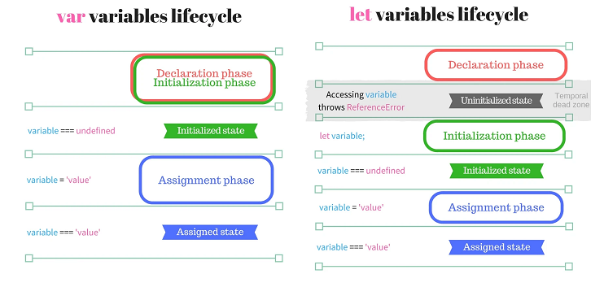

# 호이스팅

스코프 안에 있는 선언들을 모두 스코프의 최상위로 끌어올리는 것

이는 자바스크립트 인터프리터가 선언, 할당, 실행을 나눠서 처리하기 때문

##### 선언

변수의 선언은 var, const, let으로 할 수 있다.

선언 -> 초기화 단계를 거쳐 수행된다.

- 선언 : 변수명을 등록하여 자바스크립트 엔진에 변수의 존재를 알린다.

- 초기화 : 값을 저장하기 위한 메모리 공간을 확보하고 암묵적으로 undefined를 할당해 초기화한다.

### var let const

###### var

변수 중복 선언이 가능하며, 예기치 못한 값을 반환한다.

함수 레벨 스코프로 인해 함수 외부에서 선언한 변수는 모두 전역 변수로 된다.

변수 선언문 이전에 변수를 참조하면 언제나 undefined를 반환한다.

##### let

변수 중복 선언 불가능

재할당 가능

선언 단계와 초기화 단계가 분리되어 진행되기 때문에 선언이 되고 초기화가 되지 않았을 때 변수에 접근하면 참조 에러가 뜬다. 일시적 사각지대(TDZ)에 존재

###### const

변수 중복 선언 불가능

재할당 불가능

초기화와 동시에 선언과 할당이 이루어져야 한다. (신택스 에러가 뜸)



### 함수 호이스팅

```javascript
// 1. 함수 선언문
// 함수 이름 생략 불가능
function add(x, y) {
  return x + y
}

// 2. 함수 표현식
// 함수 이름 생략 가능
var add = function(x, y) {
  return x + y
}
// 함수 이름 작성 시,
// var add = function plus(x, y) {
//   return x + y
// }

// 3. Function 생성자 함수
var add = new Function('x', 'y', 'return x+ y')

// 4. 화살표 함수
var add = (x, y) => x + y
```

```javascript
// 함수 참조
console.dir(add) // output: f add(x, y)
console.dir(sub) // output: undefined

// 함수 호출
console.log(add(2, 5)) // output: 7
console.log(sub(2, 5)) // output: Uncaught TypeError: sub is not a function

// 함수 선언문
function add(x, y) {
  return x + y
}

// 함수 표현식
var sub = function(x, y) {
  return x + y
}
```

함수 선언문 : 런타임 이전에 자바스크립트 엔진에서 먼저 실행되어 함수 호이스팅 가능

함수 표현식 : 런타임 이전에 해당 값을 undefined로 초기화 시키고 런타임에서 함수가 할당되어 객체가 됨
